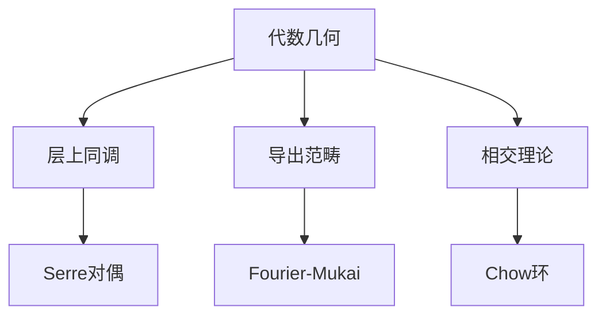

# 代数几何应用

**同调代数的几何实践 — 从概形到不变量理论**

---

## 1. 概念深度解析

### 1.1 层上同调

设 $X$ 为概形（或更一般的环化空间），$\mathcal{F}$ 为 $X$ 上的 Abel 群层（或 $\mathcal{O}_X$-模层）。整体截面函子
$$\Gamma(X, -): \operatorname{Sh}(X) \longrightarrow \mathbf{Ab}$$
是左正合的，但一般不正合。其右导出函子
$$H^i(X, \mathcal{F}) := R^i\Gamma(X, \mathcal{F})$$
称为 **$\mathcal{F}$ 的第 $i$ 个层上同调群**。几何上，$H^1(X, \mathcal{F})$ 通常度量“局部截面粘合为整体截面的阻碍”，而高阶上同调则反映更复杂的整体几何约束。当 $X$ 是复流形、$\mathcal{F}$ 为全纯向量丛的芽层时，层上同调与 Dolbeault 上同调通过 Dolbeault 定理同构：
$$H^i(X, \mathcal{E}^{p,q}) \cong H^{p,q}_{\overline{\partial}}(X).$$

在代数几何中，若 $X$ 是诺特分离概形，且 $\mathcal{F}$ 是拟凝聚层，则可用 Čech 上同调计算：取 $X$ 的一个仿射开覆盖 $\mathfrak{U}=\{U_i\}$，则
$$\check{H}^i(\mathfrak{U}, \mathcal{F}) \cong H^i(X, \mathcal{F}).$$
这一计算工具是具体例子的基础。

### 1.2 Serre 对偶

**定理 1.1（Serre 对偶）**。设 $X$ 为域 $k$ 上 $n$ 维光滑射影簇，$\omega_X = \bigwedge^n \Omega_{X/k}^1$ 为其典则层。对任意局部自由层（更一般地，任意凝聚层）$\mathcal{F}$，存在自然同构
$$H^i(X, \mathcal{F})^\vee \cong \operatorname{Ext}_X^{n-i}(\mathcal{F}, \omega_X).$$
特别地，当 $\mathcal{F}$ 局部自由时，右端可写为 $H^{n-i}(X, \mathcal{F}^\vee \otimes \omega_X)$。

Serre 对偶是代数几何版本的 Poincaré 对偶。它将上同调群的“对偶配对”精确化，使得在计算层的上同调时只需算一半度数。

### 1.3 Grothendieck 对偶

**定理 1.2（Grothendieck 对偶）**。设 $f: X \to Y$ 为诺特概形间的真（proper）态射。则对 $X$ 上的复形 $\mathcal{F}^\bullet$ 与 $Y$ 上的复形 $\mathcal{G}^\bullet$，有自然同构
$$Rf_* R\mathcal{H}om_X(\mathcal{F}^\bullet, f^!\mathcal{G}^\bullet) \cong R\mathcal{H}om_Y(Rf_*\mathcal{F}^\bullet, \mathcal{G}^\bullet).$$
其中 $f^!$ 为 **扭曲逆像函子**（twisted inverse image functor），它是 Grothendieck 对偶理论的核心。当 $f$ 为光滑态射时，$f^!\mathcal{G}^\bullet \cong f^*\mathcal{G}^\bullet \otimes \omega_{X/Y}[\dim f]$；当 $f$ 为闭浸入时，$f^!$ 对应局部对偶中的局部上同调函子。

Grothendieck 对偶将 Serre 对偶从簇推广到任意真态射，是相交理论、剩余理论（residue theory）与算术几何的基本工具。

### 1.4 Hirzebruch–Riemann–Roch 定理

**定理 1.3（HRR）**。设 $X$ 为域上光滑射影簇，$E$ 为 $X$ 上的向量丛。则 Euler 示性数
$$\chi(X, E) := \sum_{i=0}^{\dim X} (-1)^i \dim H^i(X, E)$$
可由陈特征（Chern character）与 Todd 类（Todd class）的乘积在 $X$ 上的积分给出：
$$\chi(X, E) = \int_X \operatorname{ch}(E) \cdot \operatorname{td}(TX) \in \mathbb{Z}.$$
这里 $\operatorname{ch}(E)$ 是 $E$ 的陈特征，$\operatorname{td}(TX)$ 是切丛的 Todd 类，积分指取 Chow 群（或上同调群）中最高次项的系数。

HRR 定理将拓扑不变量（陈类、Todd 类）与代数不变量（层的上同调维数）统一在一个公式中，是指标定理与代数 K-理论的起点。

---

## 2. 核心定理的证明思路与具体计算

### 2.1 Serre 对偶在 $\mathbb{P}^1$ 上的显式验证

取 $X = \mathbb{P}^1_k = \operatorname{Proj}\,k[x_0, x_1]$，覆盖 $\mathfrak{U}=\{U_0, U_1\}$，其中
$$U_0 = \{x_0 \neq 0\} = \operatorname{Spec}\,k[t], \quad t = \frac{x_1}{x_0},$$
$$U_1 = \{x_1 \neq 0\} = \operatorname{Spec}\,k[t^{-1}].$$

线丛 $\mathcal{O}(d)$ 在两坐标卡上平凡化，转移函数为 $t^{-d}$。Čech 复形为
$$\mathcal{O}(d)(U_0) \oplus \mathcal{O}(d)(U_1) \longrightarrow \mathcal{O}(d)(U_0 \cap U_1),$$
$$(f(t),\, g(t^{-1})) \longmapsto t^{-d}f(t) - g(t^{-1}).$$

**$H^0$ 的计算**：核由满足 $t^{-d}f(t)=g(t^{-1})$ 的多项式对构成。若 $d \ge 0$，则 $f$ 必须是次数 $\le d$ 的多项式，此时 $g$ 被唯一确定；若 $d < 0$，仅有零解。故
$$\dim H^0(\mathbb{P}^1, \mathcal{O}(d)) = \max\{0, d+1\}.$$

**$H^1$ 的计算**：余核为 $k[t,t^{-1}] / (t^{-d}k[t] + k[t^{-1}])$。

- 当 $d \ge -1$ 时，$t^{-d}k[t]$ 与 $k[t^{-1}]$ 的并集已覆盖所有单项式 $t^m$（$m \in \mathbb{Z}$），故 $H^1 = 0$。
- 当 $d = -m$（$m \ge 2$）时，缺失的单项式为 $t^1, t^2, \dots, t^{m-1}$，共 $m-1 = -d-1$ 个。故
$$\dim H^1(\mathbb{P}^1, \mathcal{O}(d)) = \max\{0, -d-1\}.$$

**验证对偶**：Serre 对偶断言 $H^1(\mathbb{P}^1, \mathcal{O}(d)) \cong H^0(\mathbb{P}^1, \mathcal{O}(-d-2))^\vee$。比较维数：
$$\max\{0, -d-1\} = \max\{0, (-d-2)+1\},$$
两边恒等。进一步，可通过对次数的显式配对（将 $t^i \in H^1$ 与 $t^{-i-d-2} \in H^0$ 配对）构造自然的完美配对，从而完整验证 Serre 对偶。$\square$

### 2.2 Riemann–Roch 在 $\mathbb{P}^2$ 上的显式计算

取 $X = \mathbb{P}^2_k$，$E = \mathcal{O}(d)$。由 Euler 正合列
$$0 \longrightarrow \mathcal{O} \longrightarrow \mathcal{O}(1)^{\oplus 3} \longrightarrow T\mathbb{P}^2 \longrightarrow 0$$
得全陈类 $c(T\mathbb{P}^2) = (1+H)^3 = 1 + 3H + 3H^2$，其中 $H = c_1(\mathcal{O}(1))$ 为超平面类，$H^3 = 0$。于是
$$\operatorname{td}(T\mathbb{P}^2) = 1 + \frac{1}{2}c_1 + \frac{1}{12}(c_1^2 + c_2) = 1 + \frac{3}{2}H + H^2.$$

陈特征 $\operatorname{ch}(\mathcal{O}(d)) = e^{dH} = 1 + dH + \dfrac{d^2}{2}H^2$。

乘积的最高次项（$H^2$ 的系数）为
$$1 \cdot H^2 + dH \cdot \frac{3}{2}H + \frac{d^2}{2}H^2 \cdot 1 = 1 + \frac{3}{2}d + \frac{d^2}{2} = \frac{(d+1)(d+2)}{2}.$$

因此
$$\chi(\mathbb{P}^2, \mathcal{O}(d)) = \frac{(d+1)(d+2)}{2}.$$

这与直接计算一致：当 $d \ge 0$ 时 $H^i = 0$（$i>0$），$H^0$ 的维数恰为二元 $d$ 次齐次多项式空间的维数 $\binom{d+2}{2} = \frac{(d+1)(d+2)}{2}$。$\square$

---

## 3. 示例与习题

### 3.1 习题

#### 习题 1

用 Serre 对偶证明 $H^n(X, \omega_X) \cong k$，并解释其几何意义（典则层的最高阶整体截面与体积形式的联系）。

#### 习题 2

计算 $\mathbb{P}^n$ 上 $\mathcal{O}(d)$ 的 Hilbert 多项式，并验证其与 HRR 公式的一致性。

#### 习题 3

设 $X$ 为光滑射影曲线，$L$ 为线丛。利用 Riemann–Roch 公式
$$\chi(L) = \deg L + 1 - g$$
证明：若 $\deg L > 2g-2$，则 $H^1(X, L) = 0$（Kodaira 消没定理的曲线版本）。

#### 习题 4（导出范畴视角）

用导出范畴的语言重新表述 Serre 对偶：证明 $R\mathcal{H}om_X(\mathcal{F}, \omega_X[n]) \cong R\mathcal{H}om_k(R\Gamma(X, \mathcal{F}), k)$ 在 $D^b(X)$ 中成立。

---

## 4. 思维表征

---

## 5. 与其他分支的联系

- **复几何与 Hodge 理论**：层上同调是 Hodge 分解的代数载体。对紧 Kähler 流形，$H^q(X, \Omega_X^p) \cong H^{p,q}_{\overline{\partial}}(X)$ 将代数不变量与调和形式联系起来，而 Serre 对偶对应 Hodge 星算子的代数版本。
- **数论与算术几何**：在有限型 $\mathbb{Z}$-概形上，étale 上同调 $H^i_{\text{ét}}(X, \mathbb{Q}_\ell)$ 满足类似的 Poincaré 对偶与迹公式。Grothendieck 对偶为证明 Weil 猜想中的函数方程提供了形式框架。
- **表示论与 D-模**：导出范畴中的 **Fourier–Mukai 变换** 与表示论中的 **BGG 对应**、代数几何中的 **D-模理论** 共享同调代数结构。反常层（perverse sheaf）的构造直接依赖于导出范畴的 t-结构。
- **数学物理**：弦论中的 **镜面对称**（mirror symmetry）预言两个 Calabi–Yau 三维簇的导出范畴等价与它们的 Gromov–Witten 理论等价；HRR 定理则是指标定理在代数几何中的特例，与 Atiyah–Singer 指标定理一脉相承。

---

## 参考文献

1. R. Hartshorne, *Algebraic Geometry*, Springer, 1977. (Ch. III, IV)
2. P. Griffiths and J. Harris, *Principles of Algebraic Geometry*, Wiley, 1978. (Ch. 0, 1)
3. J.-P. Serre, "Faisceaux algébriques cohérents", *Ann. of Math.*, 1955.
4. A. Grothendieck, "Théorèmes de dualité pour les faisceaux algébriques cohérents", *Séminaire Bourbaki*, 1957.
5. The Stacks Project, Tags [0BFS](https://stacks.math.columbia.edu/tag/0BFS) (Serre duality), [0FD1](https://stacks.math.columbia.edu/tag/0FD1) (Grothendieck duality).

---

**维护者**: FormalMath项目组
**创建日期**: 2026年4月8日
**难度等级**: ⭐⭐⭐⭐⭐
