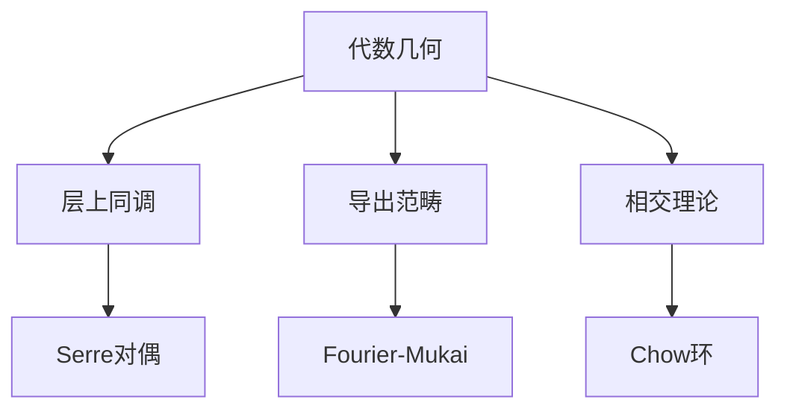

# 代数几何应用

**同调代数的几何实践 — 从概形到不变量理论**

---

## 1. 概念深度解析

### 1.1 代数直观

同调代数是代数几何的基础工具：

- 层上同调：相干层的整体性质
- Serre对偶：紧复形的基本定理
- 导出范畴：D-模与反常层

### 1.2 主要应用

- 曲线的Riemann-Roch定理
- 相交理论
- motive理论

---

## 2. 主要定理

### 2.1 Serre对偶

**定理 2.1 (Serre)**
设X是n维光滑射影簇，$\omega_X$ 是典则层。
$$H^i(X, \mathcal{F})^* \cong \text{Ext}^{n-i}(\mathcal{F}, \omega_X)$$

### 2.2 Grothendieck对偶

**定理 2.2 (Grothendieck)**
对真态射 $f: X \to Y$：
$$Rf_* R\mathcal{H}om_X(\mathcal{F}, f^!\mathcal{G}) \cong R\mathcal{H}om_Y(Rf_*\mathcal{F}, \mathcal{G})$$

### 2.3 Riemann-Roch定理

**定理 2.3 (Hirzebruch-Riemann-Roch)**
对向量丛E在光滑射影簇X上：
$$\chi(E) = \int_X \text{ch}(E) \cdot \text{td}(X)$$

---

## 3. 示例与习题

### 3.1 习题

#### 习题 1

用Serre对偶证明 $H^n(X, \omega_X) \cong k$。

#### 习题 2

计算 $\mathbb{P}^n$ 的Hilbert多项式。

#### 习题 3

用导出范畴描述Fourier-Mukai变换。

---

## 4. 思维表征

---

**维护者**: FormalMath项目组
**创建日期**: 2026年4月8日
**难度等级**: ⭐⭐⭐⭐⭐
