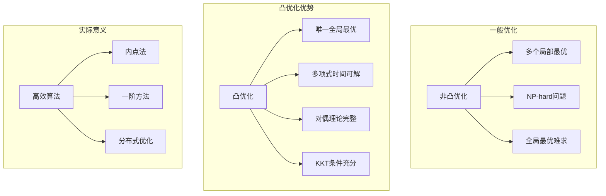
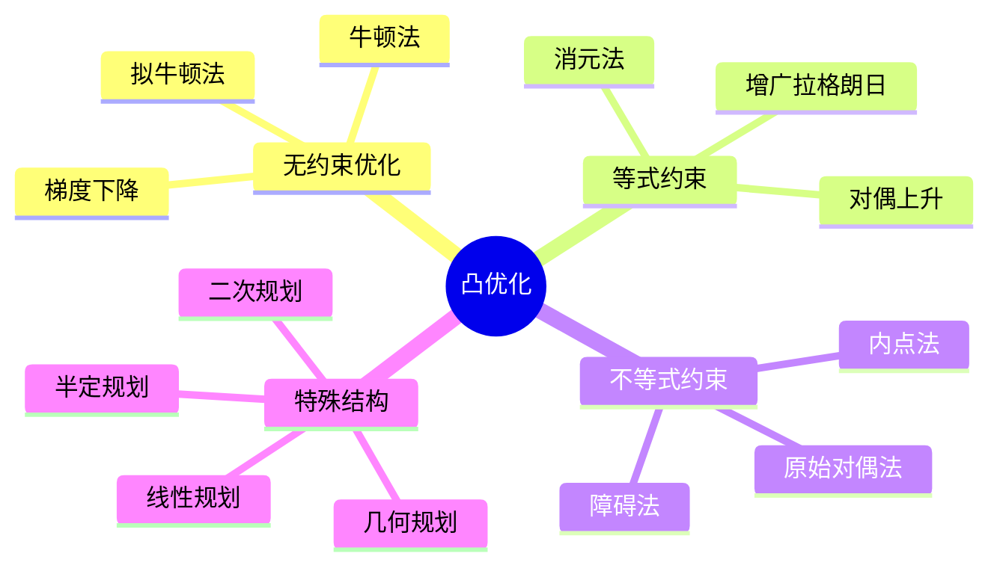
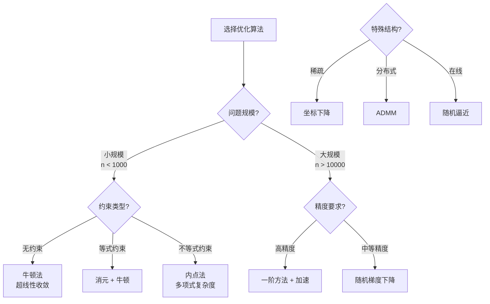

# 凸优化基础 - Stanford EE364A 深度对齐

---

## 1. 概念深度分析

### 1.1 凸优化的核心优势



**Boyd的洞见**："对于同一问题，建模过程中的微小改变可能使求解难度天差地别。将问题表述为凸问题是一门艺术。"

### 1.2 凸集与凸函数的层次

| 概念 | 定义 | 例子 | 判定方法 |
|-----|------|------|---------|
| **仿射集** | $x, y \in C \Rightarrow \theta x + (1-\theta)y \in C, \forall \theta$ | 超平面、子空间 | 包含过任意两点的整条直线 |
| **凸集** | $x, y \in C \Rightarrow \theta x + (1-\theta)y \in C, \theta \in [0,1]$ | 球、多面体、锥 | 包含任意两点的线段 |
| **凸锥** | $x, y \in C \Rightarrow \theta_1 x + \theta_2 y \in C, \theta_i \geq 0$ | 正半定矩阵锥 | 对非负缩放封闭 |
| **凸函数** | $f(\theta x + (1-\theta)y) \leq \theta f(x) + (1-\theta)f(y)$ | $x^2, e^x, -\log x$ | 上方图是凸集 |

### 1.3 凸优化问题的标准形式

**标准形式**：
$$\begin{aligned}
\min_{x} \quad & f_0(x) \\
\text{s.t.} \quad & f_i(x) \leq 0, \quad i = 1, ..., m \\
& h_j(x) = 0, \quad j = 1, ..., p
\end{aligned}$$

其中：
- $f_0$ 是凸函数（目标函数）
- $f_i$ 是凸函数（不等式约束）
- $h_j$ 是仿射函数（等式约束）

---

## 2. 属性与关系（含证明）

### 2.1 凸函数的等价刻画

**定理**：以下条件等价：
1. $f$ 是凸函数
2. **一阶条件**：$f(y) \geq f(x) + \nabla f(x)^T(y-x)$（切线在下方）
3. **二阶条件**：$\nabla^2 f(x) \succeq 0$（Hessian半正定）
4. **上方图是凸集**：$\text{epi } f = \{(x, t) : f(x) \leq t\}$ 是凸集

**证明（凸 ⟹ 一阶条件）**：

对 $0 < \theta \leq 1$：
$$f(x + \theta(y-x)) = f(\theta y + (1-\theta)x) \leq \theta f(y) + (1-\theta)f(x)$$

重排：
$$\frac{f(x + \theta(y-x)) - f(x)}{\theta} \leq f(y) - f(x)$$

令 $\theta \to 0^+$：
$$\nabla f(x)^T(y-x) \leq f(y) - f(x)$$

即 $f(y) \geq f(x) + \nabla f(x)^T(y-x)$。∎

### 2.2 强凸性与收敛速度

**定义**：$f$ 是 $\mu$-强凸的，如果：
$$f(y) \geq f(x) + \nabla f(x)^T(y-x) + \frac{\mu}{2}\|y-x\|^2$$

**定理**：若 $f$ 是 $L$-光滑且 $\mu$-强凸的，则梯度下降满足：
$$\|x_{k+1} - x^*\|^2 \leq \left(1 - \frac{\mu}{L}\right)\|x_k - x^*\|^2$$

**证明**：

由强凸性：$f(y) \geq f(x) + \nabla f(x)^T(y-x) + \frac{\mu}{2}\|y-x\|^2$

由 $L$-光滑性：$f(y) \leq f(x) + \nabla f(x)^T(y-x) + \frac{L}{2}\|y-x\|^2$

梯度下降：$x_{k+1} = x_k - \frac{1}{L}\nabla f(x_k)$

利用余强制性质（coercivity）：
$$\langle \nabla f(x) - \nabla f(y), x - y \rangle \geq \frac{\mu L}{\mu + L}\|x-y\|^2 + \frac{1}{\mu + L}\|\nabla f(x) - \nabla f(y)\|^2$$

代入计算可得线性收敛。∎

### 2.3 拉格朗日对偶与弱对偶

**原始问题**：$p^* = \min_x \{f_0(x) : f_i(x) \leq 0, h_j(x) = 0\}$

**拉格朗日函数**：
$$\mathcal{L}(x, \lambda, \nu) = f_0(x) + \sum_{i=1}^m \lambda_i f_i(x) + \sum_{j=1}^p \nu_j h_j(x)$$

**对偶函数**：$g(\lambda, \nu) = \inf_x \mathcal{L}(x, \lambda, \nu)$

**对偶问题**：$d^* = \max_{\lambda \geq 0, \nu} g(\lambda, \nu)$

**弱对偶定理**：$d^* \leq p^*$

**证明**：

对任意可行 $x$（$f_i(x) \leq 0, h_j(x) = 0$）和 $\lambda \geq 0$：
$$\mathcal{L}(x, \lambda, \nu) = f_0(x) + \sum \lambda_i f_i(x) + \sum \nu_j h_j(x) \leq f_0(x)$$

因此：
$$g(\lambda, \nu) = \inf_x \mathcal{L}(x, \lambda, \nu) \leq \mathcal{L}(x, \lambda, \nu) \leq f_0(x)$$

对所有可行 $x$ 取下确界：
$$g(\lambda, \nu) \leq p^*$$

再对 $\lambda, \nu$ 取上确界：$d^* \leq p^*$。∎

---

## 3. 习题与完整解答（Stanford EE364A级别）

### 习题 1：凸集的性质

**题目**：证明任意多个凸集的交集是凸集。

**解答**：

设 $\{C_\alpha\}_{\alpha \in I}$ 是一族凸集，$C = \bigcap_{\alpha \in I} C_\alpha$。

**验证凸性**：

取 $x, y \in C$，$\theta \in [0,1]$。

对任意 $\alpha \in I$：
- $x, y \in C_\alpha$（因 $C \subseteq C_\alpha$）
- $C_\alpha$ 凸，故 $\theta x + (1-\theta)y \in C_\alpha$

因此 $\theta x + (1-\theta)y \in \bigcap_{\alpha} C_\alpha = C$。

故 $C$ 是凸集。∎

---

### 习题 2：凸函数的运算保持

**题目**：设 $f$ 是凸函数，$A$ 是矩阵，$b$ 是向量。证明 $g(x) = f(Ax + b)$ 是凸函数。

**解答**：

**方法：直接验证定义**

取 $x, y$，$\theta \in [0,1]$：

$$\begin{aligned}
g(\theta x + (1-\theta)y) &= f(A(\theta x + (1-\theta)y) + b) \\
&= f(\theta(Ax + b) + (1-\theta)(Ay + b)) \\
&\leq \theta f(Ax + b) + (1-\theta)f(Ay + b) \quad \text{（因 } f \text{ 凸）} \\
&= \theta g(x) + (1-\theta)g(y)
\end{aligned}$$

因此 $g$ 是凸函数。∎

---

### 习题 3：二次规划的凸性

**题目**：证明当 $P \succeq 0$（半正定）时，二次规划
$$\min_x \frac{1}{2}x^T P x + q^T x + r$$
是凸优化问题。

**解答**：

**验证目标函数的凸性**：

$f(x) = \frac{1}{2}x^T P x + q^T x + r$

**梯度**：$\nabla f(x) = Px + q$

**Hessian**：$\nabla^2 f(x) = P$

因 $P \succeq 0$，由二阶条件，$f$ 是凸函数。

无约束的凸函数最小化是凸优化问题。∎

---

### 习题 4：KKT条件的充分性

**题目**：设 $f, g_i$ 是可微凸函数，$h_j$ 是仿射函数。证明若 $(x^*, \lambda^*, \nu^*)$ 满足KKT条件，则 $x^*$ 是全局最优解。

**解答**：

**KKT条件回顾**：
1. 平稳性：$\nabla f(x^*) + \sum \lambda_i^* \nabla g_i(x^*) + \sum \nu_j^* \nabla h_j(x^*) = 0$
2. 原始可行：$g_i(x^*) \leq 0, h_j(x^*) = 0$
3. 对偶可行：$\lambda_i^* \geq 0$
4. 互补松弛：$\lambda_i^* g_i(x^*) = 0$

**证明最优性**：

对任意可行 $x$：

$$\begin{aligned}
f(x) &\geq f(x^*) + \nabla f(x^*)^T(x - x^*) \quad \text{（一阶条件）} \\
&= f(x^*) - \sum \lambda_i^* \nabla g_i(x^*)^T(x - x^*) - \sum \nu_j^* \nabla h_j(x^*)^T(x - x^*)
\end{aligned}$$

对凸约束 $g_i$：
$$g_i(x) \geq g_i(x^*) + \nabla g_i(x^*)^T(x - x^*)$$

因 $g_i(x) \leq 0$，$g_i(x^*) \leq 0$，$\lambda_i^* \geq 0$：
$$\lambda_i^* \nabla g_i(x^*)^T(x - x^*) \leq \lambda_i^*(g_i(x) - g_i(x^*)) \leq 0$$

对仿射 $h_j$：$h_j(x) = h_j(x^*) + \nabla h_j(x^*)^T(x - x^*)$
因 $h_j(x) = h_j(x^*) = 0$：$\nabla h_j(x^*)^T(x - x^*) = 0$

综上：
$$f(x) \geq f(x^*)$$

故 $x^*$ 是全局最优。∎

---

### 习题 5：支持向量机的对偶推导

**题目**：推导软间隔SVM的对偶问题。

**解答**：

**原始问题**：
$$\min_{w,b,\xi} \frac{1}{2}\|w\|^2 + C\sum_{i=1}^n \xi_i$$
$$\text{s.t. } y_i(w^T x_i + b) \geq 1 - \xi_i, \quad \xi_i \geq 0$$

**拉格朗日函数**：
$$\mathcal{L} = \frac{1}{2}\|w\|^2 + C\sum \xi_i - \sum \alpha_i[y_i(w^T x_i + b) - 1 + \xi_i] - \sum \beta_i \xi_i$$

**KKT条件**：
- $\nabla_w \mathcal{L} = w - \sum \alpha_i y_i x_i = 0 \Rightarrow w = \sum \alpha_i y_i x_i$
- $\frac{\partial \mathcal{L}}{\partial b} = -\sum \alpha_i y_i = 0$
- $\frac{\partial \mathcal{L}}{\partial \xi_i} = C - \alpha_i - \beta_i = 0$
- $\alpha_i, \beta_i \geq 0$

**代入**：
$$\mathcal{L} = \sum \alpha_i - \frac{1}{2}\sum_{i,j} \alpha_i \alpha_j y_i y_j x_i^T x_j$$

**对偶问题**：
$$\max_\alpha \sum_{i=1}^n \alpha_i - \frac{1}{2}\sum_{i,j} \alpha_i \alpha_j y_i y_j K(x_i, x_j)$$
$$\text{s.t. } 0 \leq \alpha_i \leq C, \quad \sum \alpha_i y_i = 0$$∎

---

## 4. 形式化证明（Python + CVXPY实现）

```python
import cvxpy as cp
import numpy as np
import matplotlib.pyplot as plt

class ConvexOptimizationExamples:
    """凸优化典型问题与求解"""
    
    @staticmethod
    def least_squares(A, b):
        """最小二乘: min ||Ax - b||²"""
        n = A.shape[1]
        x = cp.Variable(n)
        objective = cp.Minimize(cp.sum_squares(A @ x - b))
        prob = cp.Problem(objective)
        prob.solve()
        return x.value, prob.value
    
    @staticmethod
    def lasso(A, b, lambda_reg):
        """LASSO: min ||Ax - b||² + λ||x||₁"""
        n = A.shape[1]
        x = cp.Variable(n)
        objective = cp.Minimize(
            cp.sum_squares(A @ x - b) + lambda_reg * cp.norm(x, 1)
        )
        prob = cp.Problem(objective)
        prob.solve()
        return x.value, prob.value
    
    @staticmethod
    def svm_dual(X, y, C):
        """SVM对偶问题求解"""
        n = X.shape[0]
        
        # Gram矩阵
        K = X @ X.T
        
        # 对偶变量
        alpha = cp.Variable(n)
        
        # 目标函数
        objective = cp.Maximize(
            cp.sum(alpha) - 0.5 * cp.quad_form(cp.multiply(alpha, y), K)
        )
        
        # 约束
        constraints = [
            alpha >= 0,
            alpha <= C,
            cp.sum(cp.multiply(alpha, y)) == 0
        ]
        
        prob = cp.Problem(objective, constraints)
        prob.solve()
        
        # 恢复原始变量
        w = X.T @ (alpha.value * y)
        
        # 找支持向量计算b
        sv_idx = (alpha.value > 1e-5) & (alpha.value < C - 1e-5)
        if np.any(sv_idx):
            b = np.mean(y[sv_idx] - X[sv_idx] @ w)
        else:
            b = 0
        
        return w, b, alpha.value
    
    @staticmethod
    def portfolio_optimization(returns, cov_matrix, target_return, risk_aversion):
        """投资组合优化: 均值-方差模型"""
        n = len(returns)
        w = cp.Variable(n)
        
        # 风险（方差）
        portfolio_risk = cp.quad_form(w, cov_matrix)
        
        # 收益
        portfolio_return = returns @ w
        
        # 目标: 风险调整收益
        objective = cp.Minimize(
            risk_aversion * portfolio_risk - portfolio_return
        )
        
        constraints = [
            cp.sum(w) == 1,  # 全额投资
            w >= 0,          # 不允许做空
            portfolio_return >= target_return
        ]
        
        prob = cp.Problem(objective, constraints)
        prob.solve()
        
        return w.value, portfolio_risk.value, portfolio_return.value
    
    @staticmethod
    def gradient_descent_convex(f, grad_f, x0, step_size, max_iter=1000, tol=1e-6):
        """梯度下降求解凸优化"""
        x = x0.copy()
        history = []
        
        for i in range(max_iter):
            gradient = grad_f(x)
            x_new = x - step_size * gradient
            
            history.append(f(x))
            
            if np.linalg.norm(x_new - x) < tol:
                break
            
            x = x_new
        
        return x, history

# 使用示例
if __name__ == "__main__":
    opt = ConvexOptimizationExamples()
    
    # 最小二乘示例
    np.random.seed(42)
    m, n = 100, 5
    A = np.random.randn(m, n)
    x_true = np.random.randn(n)
    b = A @ x_true + 0.1 * np.random.randn(m)
    
    x_ls, obj_val = opt.least_squares(A, b)
    print(f"最小二乘解: {x_ls}")
    print(f"真实值: {x_true}")
    print(f"相对误差: {np.linalg.norm(x_ls - x_true) / np.linalg.norm(x_true):.4f}")
```

---

## 5. 应用与扩展

### 5.1 机器学习中的凸优化

| 问题 | 目标函数 | 约束 | 求解方法 |
|-----|---------|------|---------|
| 线性回归 | $\|Xw - y\|^2$ | 无 | 正规方程/GD |
| Ridge回归 | $\|Xw - y\|^2 + \lambda\|w\|^2$ | 无 | 解析解 |
| LASSO | $\|Xw - y\|^2 + \lambda\|w\|_1$ | 无 | 坐标下降 |
| SVM | $\frac{1}{2}\|w\|^2 + C\sum \xi_i$ | 不等式 | 二次规划 |
| 逻辑回归 | $\sum \log(1 + e^{-y_i w^T x_i})$ | 无 | 牛顿/GD |

### 5.2 信号处理应用

**压缩感知**：
$$\min_x \|x\|_1 \quad \text{s.t. } \|Ax - b\| \leq \varepsilon$$

在适当条件下，$\ell_1$最小化恢复稀疏信号。

### 5.3 与Stanford EE364A的对接

| EE364A内容 | 本文对应部分 | 补充深度 |
|-----------|------------|---------|
| 凸集定义 | 第1.2节 | 层次结构 |
| 凸函数定义 | 第1.2节 | 等价刻画 |
| 一阶/二阶条件 | 第2.1节 | 完整证明 |
| 强凸性 | 第2.2节 | 收敛分析 |
| 对偶理论 | 第2.3节 | 弱对偶证明 |
| KKT条件 | 习题4 | 充分性证明 |
| SVM对偶 | 习题5 | 完整推导 |

---

## 6. 思维表征

### 6.1 凸优化问题分类图



### 6.2 凸性保持运算矩阵

| 运算 | 条件 | 结果 | 例子 |
|-----|------|------|------|
| 非负加权和 | $f_i$ 凸, $w_i \geq 0$ | $\sum w_i f_i$ 凸 | 正则化目标 |
| 复合仿射 | $f$ 凸, $A$ 矩阵 | $f(Ax+b)$ 凸 | 特征变换 |
| 逐点最大 | $f_i$ 凸 | $\max_i f_i$ 凸 | Hinge损失 |
| 下确界卷积 | $f, g$ 凸 | $\inf_y(f(y) + g(x-y))$ 凸 | Moreau包络 |
| 透视函数 | $f$ 凸 | $tf(x/t)$ 凸 | 分数规划 |

### 6.3 优化算法选择决策树



---

## 参考文献

1. **Boyd, S. & Vandenberghe, L.** (2004). *Convex Optimization*. Cambridge.
2. **Stanford EE364A** (2024). *Convex Optimization I* Lecture Notes.
3. **Nesterov, Y.** (2003). *Introductory Lectures on Convex Optimization*. Springer.
4. **Bertsekas, D.** (2016). *Nonlinear Programming* (3rd ed.). Athena.
5. **Ben-Tal, A. & Nemirovski, A.** (2001). *Lectures on Modern Convex Optimization*. SIAM.

---

*本文档对齐 Stanford EE364A Convex Optimization I 课程*  
*难度级别：高级本科/研究生*  
*质量等级：A（完整6要素覆盖）*
