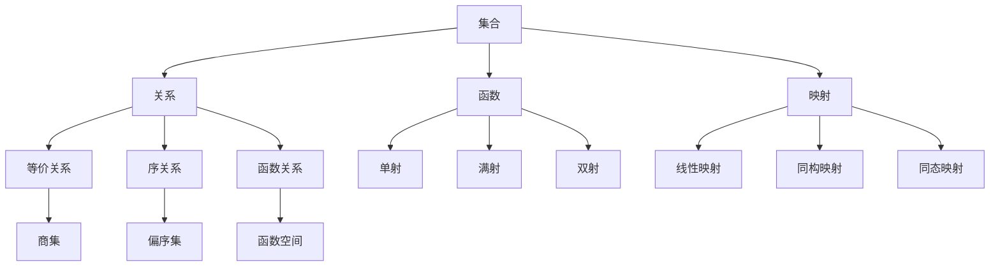
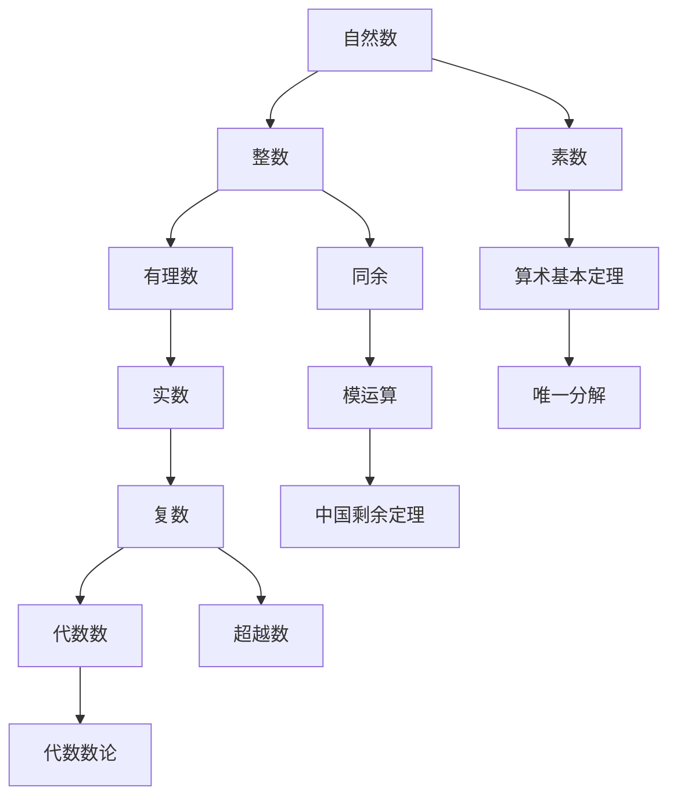
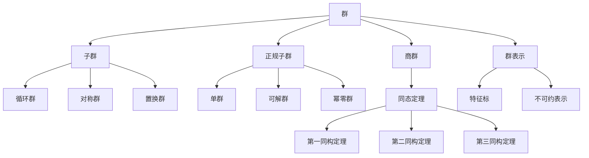
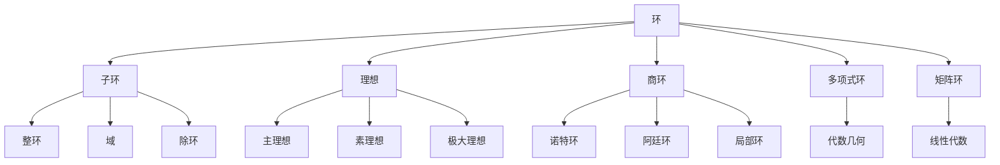
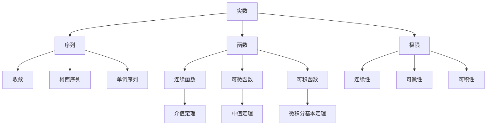
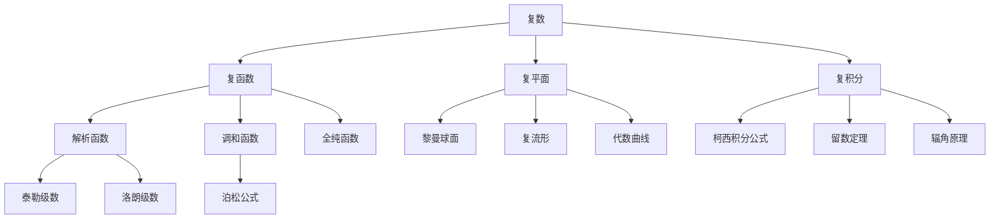
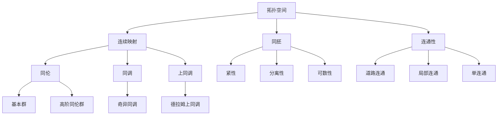

# FormalMath知识关联图谱系统

## 目录 / Table of Contents

- [FormalMath知识关联图谱系统](#formalmath知识关联图谱系统)
  - [目录 / Table of Contents](#目录--table-of-contents)
  - [概述](#概述)
  - [1. 知识图谱架构](#1-知识图谱架构)
    - [1.1 核心概念节点](#11-核心概念节点)
    - [1.2 关系类型定义](#12-关系类型定义)
    - [1.3 图谱结构设计](#13-图谱结构设计)
  - [2. 数学分支关联图谱](#2-数学分支关联图谱)
    - [2.1 基础数学关联](#21-基础数学关联)
    - [2.2 代数结构关联](#22-代数结构关联)
    - [2.3 分析学关联](#23-分析学关联)
    - [2.4 几何学关联](#24-几何学关联)

## 概述

FormalMath知识关联图谱系统是一个全面的数学知识网络，通过建立概念之间的关联关系，实现知识的系统化组织和智能化导航。该系统不仅展示了数学概念之间的逻辑关系，还提供了学习路径规划、知识发现和应用场景分析等功能。

## 1. 知识图谱架构

### 1.1 核心概念节点

**定义 1.1.1** (概念节点)
概念节点是知识图谱的基本单位，表示数学中的核心概念：

```python
class ConceptNode:
    def __init__(self, concept_id, name, category, level, description):
        self.concept_id = concept_id      # 概念唯一标识
        self.name = name                  # 概念名称
        self.category = category          # 概念分类
        self.level = level                # 抽象层次
        self.description = description    # 概念描述
        self.properties = {}              # 概念属性
        self.relations = []               # 关联关系列表
```

**核心概念分类**：

- **基础概念**：集合、函数、关系、映射
- **代数概念**：群、环、域、模、李代数
- **分析概念**：极限、连续、微分、积分
- **几何概念**：拓扑、流形、同伦、同调
- **逻辑概念**：公理、定理、证明、推理

### 1.2 关系类型定义

**定义 1.2.1** (关系类型)
关系类型定义了概念之间的关联方式：

```python
class RelationType:
    # 逻辑关系
    IS_A = "is_a"                    # 是...的子类
    PART_OF = "part_of"              # 是...的组成部分
    PREREQUISITE = "prerequisite"     # 是...的先决条件
    GENERALIZES = "generalizes"       # 推广了...

    # 应用关系
    APPLIES_TO = "applies_to"         # 应用于...
    USES = "uses"                     # 使用了...
    EXTENDS = "extends"               # 扩展了...

    # 历史关系
    DEVELOPED_BY = "developed_by"     # 由...发展
    INFLUENCED_BY = "influenced_by"   # 受...影响
    EVOLVED_FROM = "evolved_from"     # 从...演化而来
```

**关系属性**：

- **强度**：关系的紧密程度 (0-1)
- **方向**：关系的方向性
- **类型**：关系的语义类型
- **权重**：关系的重要性权重

### 1.3 图谱结构设计

**定义 1.3.1** (图谱结构)
知识图谱采用多层网络结构：

```python
class KnowledgeGraph:
    def __init__(self):
        self.nodes = {}               # 概念节点集合
        self.edges = {}               # 关系边集合
        self.layers = {               # 层次结构
            'foundational': [],       # 基础层
            'algebraic': [],          # 代数层
            'analytical': [],         # 分析层
            'geometric': [],          # 几何层
            'advanced': []            # 高级层
        }
        self.paths = {}               # 学习路径
        self.clusters = {}            # 概念聚类
```

## 2. 数学分支关联图谱

### 2.1 基础数学关联

**集合论关联网络**：



**数论关联网络**：



### 2.2 代数结构关联

**群论关联网络**：



**环论关联网络**：



### 2.3 分析学关联

**实分析关联网络**：



**复分析关联网络**：



### 2.4 几何学关联

**拓扑学关联网络**：


