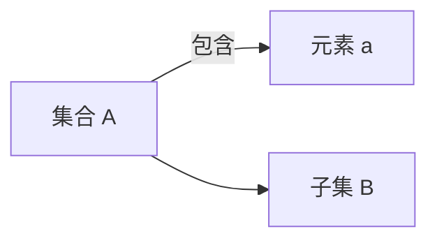

# 可视化片段样例库（MVE）

用法：在正文中插入如下短代码占位，构建脚本将替换为对应渲染组件。

示例：

```mermaid
graph LR
  A[集合 A] -->|包含| B[元素 a]
  A --> C[子集 B]
```

短代码：

- {{snippet:set-theory-venn}}  集合并/交/差维恩图
- {{snippet:group-subgroup-lattice}}  子群格关系图
- {{snippet:real-analysis-limit}}  极限过程示意
