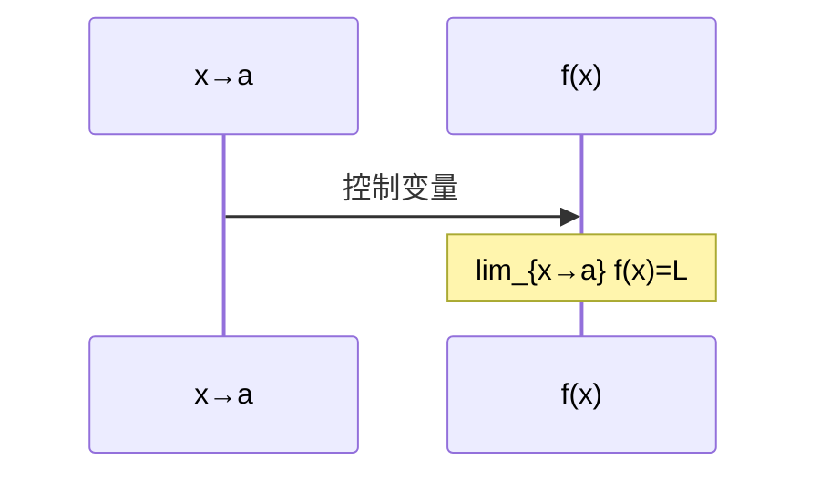

极限过程示意 / Limit process (schematic)

用法：在正文中插入 `{{snippet:real-analysis-limit}}`

```mermaid
sequenceDiagram
  participant x as x→a
  participant f as f(x)
  x->>f: 控制变量
  Note over f: lim_{x→a} f(x)=L
```
