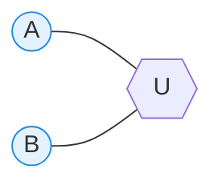

集合并/交/差维恩图（示意） / Venn diagram (schematic)

用法：在正文中插入 `{{snippet:set-theory-venn}}`

```mermaid
flowchart LR
  A((A)):::set --- U{{U}}
  B((B)):::set --- U
  classDef set fill:#e3f2fd,stroke:#1e88e5
```
