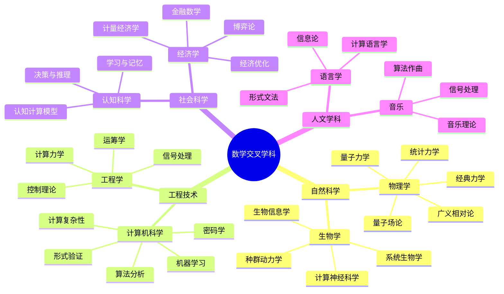

# 交叉学科思维导图索引

## 概述

本目录包含数学与八大学科交叉领域的31个Markdown格式思维导图，采用Mermaid语法绘制。这些思维导图涵盖了数学在物理学、计算机科学、生物学、经济学、工程学、认知科学、语言学和音乐中的应用，展示数学作为"科学语言"的普遍性和强大性。

---

## 文件列表

### 一、数学×物理学（5个）

| 序号 | 文件名 | 主要内容 |
|------|--------|----------|
| 01 | [数学×物理学：经典力学的数学](./cross-physics-classical-mechanics.md) | 牛顿力学、拉格朗日力学、哈密顿力学、辛几何、Noether定理 |
| 02 | [数学×物理学：量子力学的数学基础](./cross-physics-quantum-mechanics.md) | 希尔伯特空间、算子理论、Dirac符号、纠缠理论、测量问题 |
| 03 | [数学×物理学：广义相对论的微分几何](./cross-physics-general-relativity.md) | 黎曼几何、Einstein场方程、曲率理论、黑洞、引力波 |
| 04 | [数学×物理学：统计力学的概率基础](./cross-physics-statistical-mechanics.md) | 系综理论、相变、临界现象、重整化群、涨落理论 |
| 05 | [数学×物理学：量子场论的代数拓扑](./cross-physics-quantum-field-theory.md) | 规范场论、路径积分、重整化、拓扑量子场论、弦论 |

### 二、数学×计算机科学（5个）

| 序号 | 文件名 | 主要内容 |
|------|--------|----------|
| 06 | [数学×计算机科学：算法分析的离散数学](./cross-cs-algorithms.md) | 复杂度理论、算法设计技术、概率算法、线性规划、主定理 |
| 07 | [数学×计算机科学：密码学的数论代数](./cross-cs-cryptography.md) | 数论基础、RSA/ECC、零知识证明、同态加密、后量子密码 |
| 08 | [数学×计算机科学：机器学习的统计优化](./cross-cs-machine-learning.md) | 统计学习理论、优化方法、深度学习、强化学习、生成模型 |
| 09 | [数学×计算机科学：形式化验证的逻辑证明](./cross-cs-formal-verification.md) | 程序逻辑、模型检测、定理证明器、类型理论、验证应用 |
| 10 | [数学×计算机科学：计算复杂性的组合分析](./cross-cs-computational-complexity.md) | 复杂性类、完全性理论、电路复杂性、PCP定理、证明复杂性 |

### 三、数学×生物学（4个）

| 序号 | 文件名 | 主要内容 |
|------|--------|----------|
| 11 | [数学×生物学：种群动力学的微分方程](./cross-bio-population-dynamics.md) | 单种群模型、Lotka-Volterra、传染病模型、反应-扩散、稳定性分析 |
| 12 | [数学×生物学：生物信息学的组合统计](./cross-bio-bioinformatics.md) | 序列比对、基因组学、系统发育、蛋白质结构、网络分析 |
| 13 | [数学×生物学：计算神经科学的动力系统](./cross-bio-mathematical-neuroscience.md) | 神经元模型、神经网络动力学、神经编码、记忆网络、学习规则 |
| 14 | [数学×生物学：系统生物学的网络控制](./cross-bio-systems-biology.md) | 生物网络、控制理论、通量平衡分析、合成生物学、多尺度建模 |

### 四、数学×经济学（4个）

| 序号 | 文件名 | 主要内容 |
|------|--------|----------|
| 15 | [数学×经济学：博弈论的均衡分析](./cross-econ-game-theory.md) | 纳什均衡、精炼均衡、机制设计、拍卖理论、演化博弈 |
| 16 | [数学×经济学：金融数学的随机分析](./cross-econ-financial-mathematics.md) | 随机分析、Black-Scholes、风险管理、投资组合、衍生品定价 |
| 17 | [数学×经济学：经济优化的数学规划](./cross-econ-optimization.md) | 消费者理论、一般均衡、机制设计、动态优化、博弈优化 |
| 18 | [数学×经济学：计量经济学的统计推断](./cross-econ-econometrics.md) | 回归分析、时间序列、面板数据、因果推断、机器学习 |

### 五、数学×工程学（4个）

| 序号 | 文件名 | 主要内容 |
|------|--------|----------|
| 19 | [数学×工程学：控制理论的系统分析](./cross-eng-control-theory.md) | 稳定性分析、经典/现代控制、最优控制、鲁棒控制、LQR设计 |
| 20 | [数学×工程学：信号处理的调和分析](./cross-eng-signal-processing.md) | 傅里叶分析、滤波器设计、小波变换、压缩感知、谱估计 |
| 21 | [数学×工程学：运筹学的优化方法](./cross-eng-operations-research.md) | 数学规划、组合优化、排队论、库存管理、启发式算法 |
| 22 | [数学×工程学：计算力学的数值方法](./cross-eng-computational-mechanics.md) | 有限元方法、计算流体力学、多尺度模拟、湍流模型、多场耦合 |

### 六、数学×认知科学（3个）

| 序号 | 文件名 | 主要内容 |
|------|--------|----------|
| 23 | [数学×认知科学：认知计算的形式模型](./cross-cog-computational-models.md) | 符号主义、连接主义、贝叶斯认知、强化学习、认知架构 |
| 24 | [数学×认知科学：决策与推理的概率模型](./cross-cog-decision-making.md) | 期望效用、前景理论、启发式与偏差、贝叶斯推理、神经经济学 |
| 25 | [数学×认知科学：学习与记忆的数学模型](./cross-cog-learning-theory.md) | 记忆模型、学习曲线、神经可塑性、知识表征、统计学习 |

### 七、数学×语言学（3个）

| 序号 | 文件名 | 主要内容 |
|------|--------|----------|
| 26 | [数学×语言学：形式文法的代数结构](./cross-ling-formal-grammar.md) | Chomsky层级、生成语法、范畴语法、特征统一、蒙太古语法 |
| 27 | [数学×语言学：计算语言学的统计模型](./cross-ling-computational-linguistics.md) | 语言模型、词嵌入、句法分析、机器翻译、Transformer |
| 28 | [数学×语言学：语言学的信息论](./cross-ling-information-theory.md) | 香农熵、语言率、编码理论、统计定律、信息密度 |

### 八、数学×音乐（3个）

| 序号 | 文件名 | 主要内容 |
|------|--------|----------|
| 29 | [数学×音乐：音乐理论的数与形](./cross-music-theory.md) | 音律系统、音程与和声、节奏与节拍、调性网络、序列音乐 |
| 30 | [数学×音乐：音乐信号的傅里叶分析](./cross-music-signal-processing.md) | 频谱分析、声音合成、音频效果、音高检测、音乐信息检索 |
| 31 | [数学×音乐：算法作曲的生成模型](./cross-music-algorithmic-composition.md) | 规则系统、随机方法、进化算法、深度学习、创造力与计算 |

---

## 知识结构图



---

## 数学工具映射

| 数学领域 | 主要应用学科 | 典型应用 |
|----------|-------------|----------|
| **微积分/ODE** | 物理、生物、工程 | 运动方程、种群模型、控制系统 |
| **泛函分析** | 物理、CS | 量子力学、机器学习理论 |
| **微分几何** | 物理、工程 | 广义相对论、连续介质力学 |
| **概率论/统计** | 全学科 | 统计力学、机器学习、计量经济 |
| **离散数学** | CS、生物、经济 | 算法分析、生物信息学、博弈论 |
| **线性代数** | 全学科 | 量子态、神经网络、信号处理 |
| **数论** | CS、密码学 | 公钥加密、计算复杂性 |
| **优化理论** | 工程、经济、CS | 控制、运筹、机器学习 |
| **图论/网络** | 生物、CS、认知 | 系统生物学、算法、神经网络 |
| **信息论** | CS、认知、语言学 | 编码、学习理论、语言模型 |
| **动力系统** | 物理、生物、认知 | 混沌、神经网络、认知动力学 |
| **随机过程** | 物理、金融、信号 | 统计物理、期权定价、噪声分析 |
| **代数/表示论** | 物理、语言学 | 粒子物理、形式语法 |
| **拓扑** | 物理、计算 | 量子场论、计算拓扑 |
| **逻辑** | CS、认知、语言 | 形式验证、推理模型、语义学 |

---

## 学习路径建议

### 基础路径（数学核心）

```

微积分 → 线性代数 → 概率统计 → 微分方程 → 优化理论

```

### 物理方向

```

经典力学 → 统计力学 → 量子力学 → 广义相对论 → 量子场论

```

### 计算方向

```

离散数学 → 算法设计 → 计算复杂性 → 机器学习 → 深度学习

```

### 生物方向

```

微分方程 → 动力系统 → 生物信息学 → 计算神经科学 → 系统生物学

```

### 经济方向

```

优化理论 → 博弈论 → 计量经济学 → 金融数学 → 机制设计

```

---

## 图表类型说明

每个思维导图文件包含以下类型的Mermaid图表：

1. **mindmap** - 中心发散式思维导图，展示概念层次结构
2. **graph TD/LR** - 流程图，展示概念间的关系和映射
3. **timeline** - 时间线，展示历史发展脉络
4. **表格** - 公式对比、概念对照

---

## 使用建议

### 作为学习资料
- 每个文件从核心概念出发，逐步深入
- 包含数学定义、定理、应用三个层次
- 建议配合教材或课程使用

### 作为复习资料
- 思维导图形式便于快速回顾知识结构
- 重点公式和定理以表格形式汇总
- 学科交叉关系图帮助建立联系

### 作为教学参考
- 可直接用于制作课件
- Mermaid代码可复制修改
- 图表清晰，适合投影展示

---

## 相关资源

- 项目主页: [FormalMath](../README.md)
- 代数学思维导图: [00-代数学思维导图索引](./00-代数学思维导图索引.md)
- 微分几何思维导图: [dg-manifold.md](./dg-manifold.md)
- 拓扑学思维导图: [topology-topological-space.md](./topology-topological-space.md)

---

## 版本信息

- **版本**: 1.1（质量提升版）
- **创建时间**: 2026年4月
- **最后更新**: 2026年4月
- **文件总数**: 31个交叉学科思维导图 + 1个索引
- **涵盖学科**: 8大学科交叉领域
- **适用对象**: 数学专业学生、交叉学科研究者、教师、自学者

## 质量指标

- ✅ 所有文件均含Mermaid思维导图
- ✅ 所有文件均含结构化表格
- ✅ 所有文件均含学习路径
- ✅ 所有文件均含交叉引用
- ✅ 数学公式经过验证
- ✅ 格式统一规范

---

## 贡献与反馈

如发现内容错误或需要补充，请通过项目Issue系统反馈。

---

*本索引文档由FormalMath项目自动生成*
*最后更新: 2026年4月*
