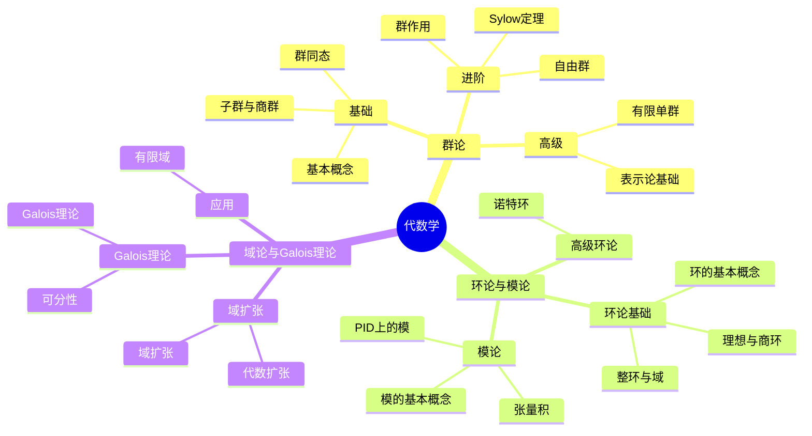

# 代数学思维导图索引

## 概述

本目录包含代数学核心概念的20个Markdown格式思维导图，采用Mermaid语法绘制。这些思维导图涵盖了群论、环论与模论、域论与Galois理论三大分支，适合用于学习、复习和教学参考。

---

## 文件列表

### 一、群论思维导图（8个）

| 序号 | 文件名 | 主要内容 |
|------|--------|----------|
| 01 | [01-群的基本概念-思维导图](./01-群的基本概念-思维导图.md) | 群的定义、公理、分类、典型例子、元素的阶 |
| 02 | [02-子群与商群-思维导图](./02-子群与商群-思维导图.md) | 子群、正规子群、陪集、商群、同构定理 |
| 03 | [03-群同态-思维导图](./03-群同态-思维导图.md) | 同态定义、核与像、同态定理、自同构群 |
| 04 | [04-群作用-思维导图](./04-群作用-思维导图.md) | 群作用定义、轨道-稳定子定理、Burnside引理 |
| 05 | [05-Sylow定理-思维导图](./05-Sylow定理-思维导图.md) | Sylow三大定理、nₚ计算、群分类应用 |
| 06 | [06-有限单群-思维导图](./06-有限单群-思维导图.md) | 单群分类定理、18个无限族、26个散在单群 |
| 07 | [07-自由群-思维导图](./07-自由群-思维导图.md) | 自由群定义、泛性质、Nielsen-Schreier定理 |
| 08 | [08-表示论基础-思维导图](./08-表示论基础-思维导图.md) | 表示定义、特征标、Maschke定理、正则表示 |

### 二、环论与模论思维导图（7个）

| 序号 | 文件名 | 主要内容 |
|------|--------|----------|
| 09 | [09-环的基本概念-思维导图](./09-环的基本概念-思维导图.md) | 环定义、零因子、单位、特征、典型例子 |
| 10 | [10-理想与商环-思维导图](./10-理想与商环-思维导图.md) | 理想、素理想、极大理想、商环、同态定理 |
| 11 | [11-整环与域-思维导图](./11-整环与域-思维导图.md) | PID、UFD、欧几里得整环、分式域、域扩张 |
| 12 | [12-模的基本概念-思维导图](./12-模的基本概念-思维导图.md) | 模定义、子模、商模、模同态、自由模 |
| 13 | [13-主理想整环上的模-思维导图](./13-主理想整环上的模-思维导图.md) | 结构定理、不变因子、Jordan标准形、有理标准形 |
| 14 | [14-诺特环-思维导图](./14-诺特环-思维导图.md) | ACC条件、Hilbert基定理、准素分解、Artin环 |
| 15 | [15-张量积-思维导图](./15-张量积-思维导图.md) | 张量积定义、泛性质、平坦性、代数构造 |

### 三、域论与Galois理论思维导图（5个）

| 序号 | 文件名 | 主要内容 |
|------|--------|----------|
| 16 | [16-域扩张-思维导图](./16-域扩张-思维导图.md) | 域扩张定义、代数元、超越元、塔定律、本原元定理 |
| 17 | [17-代数扩张-思维导图](./17-代数扩张-思维导图.md) | 代数扩张性质、分裂域、代数闭包、代数数域 |
| 18 | [18-Galois理论-思维导图](./18-Galois理论-思维导图.md) | Galois对应、方程可解性、尺规作图、典型Galois群 |
| 19 | [19-可分性-思维导图](./19-可分性-思维导图.md) | 可分元、完美域、纯不可分扩张、本原元定理 |
| 20 | [20-有限域-思维导图](./20-有限域-思维导图.md) | 有限域结构、Frobenius、子域格、编码与密码应用 |

---

## 学习路径建议

### 入门路径（基础概念）

```

群的基本概念 → 子群与商群 → 群同态 → 环的基本概念 → 整环与域 → 域扩张

```

### 核心路径（结构理论）

```

群作用 → Sylow定理 → 理想与商环 → 模的基本概念 → PID上的模 → Galois理论

```

### 进阶路径（高级主题）

```

有限单群 → 表示论基础 → 诺特环 → 张量积 → 可分性 → 有限域应用

```

---

## 知识结构图



---

## 图表类型说明

每个思维导图文件包含以下类型的Mermaid图表：

1. **mindmap** - 中心发散式思维导图，展示概念层次
2. **graph TD/LR** - 流程图，展示概念间的关系
3. **flowchart** - 流程图，展示判定流程和算法
4. **timeline** - 时间线，展示历史发展

---

## 使用建议

### 作为学习资料
- 每个文件从核心概念出发，逐步深入
- 包含定义、定理、例子、应用四个层次
- 建议配合教材或课程使用

### 作为复习资料
- 思维导图形式便于快速回顾知识结构
- 重点公式和定理以表格形式汇总
- 学习路径图帮助定位知识点

### 作为教学参考
- 可直接用于制作课件
- Mermaid代码可复制修改
- 图表清晰，适合投影展示

---

## 相关资源

- 项目主页: [FormalMath](../README.md)
- 代数结构文档: ../02-代数结构
- 知识层次体系: ../00-知识层次体系
- 概念关联图谱: ../00-概念关联图谱

---

## 版本信息

- **版本**: 1.1（质量提升版）
- **创建时间**: 2026年4月
- **最后更新**: 2026年4月
- **文件总数**: 20个思维导图 + 1个索引
- **总页数**: 约200+页内容
- **适用对象**: 数学专业学生、教师、自学者

## 质量指标

- ✅ 所有文件均含Mermaid思维导图
- ✅ 所有文件均含结构化表格
- ✅ 所有文件均含学习路径
- ✅ 所有文件均含交叉引用
- ✅ 数学公式经过验证
- ✅ 格式统一规范

---

## 贡献与反馈

如发现内容错误或需要补充，请通过项目Issue系统反馈。

---

*本索引文档由FormalMath项目自动生成*
*最后更新: 2026年4月*
