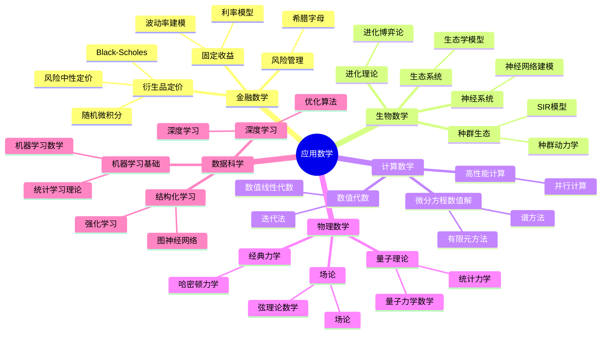

# 应用数学思维导图索引

## 概述

本目录包含应用数学核心概念的27个Markdown格式思维导图，涵盖金融数学、生物数学、计算数学、物理数学和数据科学五大应用领域。这些思维导图采用Mermaid语法绘制，适合用于学习、复习和教学参考。

---

## 文件列表

### 一、金融数学（6个）

| 序号 | 文件名 | 主要内容 |
|------|--------|----------|
| 01 | [app-fin-01-随机微积分](./app-fin-01-随机微积分.md) | Itô积分、SDE、Girsanov定理、风险中性定价 |
| 02 | [app-fin-02-Black-Scholes模型](./app-fin-02-Black-Scholes模型.md) | BS公式、PDE推导、希腊字母、波动率微笑 |
| 03 | [app-fin-03-风险中性定价](./app-fin-03-风险中性定价.md) | 鞅测度、等价鞅测度、资产定价基本定理 |
| 04 | [app-fin-04-希腊字母](./app-fin-04-希腊字母.md) | Delta、Gamma、Theta、Vega、对冲策略 |
| 05 | [app-fin-05-利率模型](./app-fin-05-利率模型.md) | Vasicek、CIR、HJM、LIBOR市场模型 |
| 06 | [app-fin-06-波动率建模](./app-fin-06-波动率建模.md) | 随机波动率、Heston、GARCH、波动率曲面 |

### 二、生物数学（5个）

| 序号 | 文件名 | 主要内容 |
|------|--------|----------|
| 07 | [app-bio-01-种群动力学](./app-bio-01-种群动力学.md) | 逻辑增长、Lotka-Volterra、空间模型 |
| 08 | [app-bio-02-SIR模型](./app-bio-02-SIR模型.md) | SIR/SEIR模型、R₀、流行病动力学 |
| 09 | [app-bio-03-进化博弈论](./app-bio-03-进化博弈论.md) | ESS、复制动力学、进化稳定策略 |
| 10 | [app-bio-04-神经网络建模](./app-bio-04-神经网络建模.md) | Hodgkin-Huxley、突触可塑性、神经振荡 |
| 11 | [app-bio-05-生态学模型](./app-bio-05-生态学模型.md) | 食物网、生物多样性、保护生态学 |

### 三、计算数学（5个）

| 序号 | 文件名 | 主要内容 |
|------|--------|----------|
| 12 | [app-comp-01-数值线性代数](./app-comp-01-数值线性代数.md) | LU/SVD、CG/GMRES、特征值算法 |
| 13 | [app-comp-02-有限元方法](./app-comp-02-有限元方法.md) | 变分形式、误差分析、自适应FEM |
| 14 | [app-comp-03-谱方法](./app-comp-03-谱方法.md) | Fourier/Chebyshev、伪谱方法、谱元法 |
| 15 | [app-comp-04-迭代法](./app-comp-04-迭代法.md) | Krylov子空间、Newton法、预处理技术 |
| 16 | [app-comp-05-并行计算](./app-comp-05-并行计算.md) | MPI/OpenMP、GPU加速、可扩展性 |

### 四、物理数学（5个）

| 序号 | 文件名 | 主要内容 |
|------|--------|----------|
| 17 | [app-phys-01-哈密顿力学](./app-phys-01-哈密顿力学.md) | 正则方程、辛几何、KAM理论 |
| 18 | [app-phys-02-量子力学数学](./app-phys-02-量子力学数学.md) | Hilbert空间、自伴算子、谱理论 |
| 19 | [app-phys-03-统计力学](./app-phys-03-统计力学.md) | 系综理论、相变、重正化群 |
| 20 | [app-phys-04-场论](./app-phys-04-场论.md) | 拉格朗日场论、规范场、标准模型 |
| 21 | [app-phys-05-弦理论数学](./app-phys-05-弦理论数学.md) | 超弦理论、Calabi-Yau、镜像对称 |

### 五、数据科学（6个）

| 序号 | 文件名 | 主要内容 |
|------|--------|----------|
| 22 | [app-ds-01-机器学习数学](./app-ds-01-机器学习数学.md) | 监督学习、核方法、泛化理论 |
| 23 | [app-ds-02-深度学习](./app-ds-02-深度学习.md) | CNN/RNN/Transformer、训练技术 |
| 24 | [app-ds-03-统计学习理论](./app-ds-03-统计学习理论.md) | VC维、Rademacher复杂度、泛化界 |
| 25 | [app-ds-04-优化算法](./app-ds-04-优化算法.md) | SGD/Adam、凸优化、分布式优化 |
| 26 | [app-ds-05-图神经网络](./app-ds-05-图神经网络.md) | GCN/GAT/GIN、谱图理论、图池化 |
| 27 | [app-ds-06-强化学习](./app-ds-06-强化学习.md) | MDP、Q-Learning、策略梯度、PPO |

### 六、随机过程（7个）

| 序号 | 文件名 | 主要内容 |
|------|--------|----------|
| 28 | [sp-01-布朗运动](./sp-01-布朗运动.md) | Wiener过程、路径性质、二次变差、重对数律 |
| 29 | [sp-02-泊松过程](./sp-02-泊松过程.md) | 计数过程、独立增量、复合泊松、应用 |
| 30 | [sp-03-马尔可夫链](./sp-03-马尔可夫链.md) | Markov性、状态分类、平稳分布、MCMC |
| 31 | [sp-04-鞅论](./sp-04-鞅论.md) | 鞅定义、停时、收敛定理、Doob不等式 |
| 32 | [sp-05-随机微分方程](./sp-05-随机微分方程.md) | Itô积分、SDE、存在唯一性、数值方法 |
| 33 | [sp-06-Levy过程](./sp-06-Levy过程.md) | Lévy-Itô分解、无穷可分、稳定过程、跳跃扩散 |
| 34 | [sp-07-高斯过程](./sp-07-高斯过程.md) | 核函数、GP回归、贝叶斯非参数、谱方法 |

---

## 知识结构图



---

## 学习路径建议

### 金融数学路径

```
随机微积分 → Black-Scholes模型 → 风险中性定价 → 希腊字母 → 利率模型 → 波动率建模
```

### 生物数学路径

```
种群动力学 → SIR模型 → 进化博弈论 → 神经网络建模 → 生态学模型
```

### 计算数学路径

```
数值线性代数 → 迭代法 → 有限元方法 → 谱方法 → 并行计算
```

### 物理数学路径

```
哈密顿力学 → 量子力学数学 → 统计力学 → 场论 → 弦理论数学
```

### 数据科学路径

```
机器学习数学 → 统计学习理论 → 优化算法 → 深度学习 → 图神经网络 → 强化学习
```

---

## 图表类型说明

每个思维导图文件包含以下类型的Mermaid图表：

1. **mindmap** - 中心发散式思维导图，展示概念层次
2. **graph TD/LR** - 流程图，展示概念间的关系
3. **flowchart** - 流程图，展示学习路径
4. **表格** - 公式速查和模型对比

---

## 使用建议

### 作为学习资料

- 每个文件从核心概念出发，逐步深入
- 包含定义、定理、公式、应用四个层次
- 建议配合教材或课程使用

### 作为复习资料

- 思维导图形式便于快速回顾知识结构
- 重点公式以表格形式汇总
- 学习路径图帮助定位知识点

### 作为教学参考

- 可直接用于制作课件
- Mermaid代码可复制修改
- 图表清晰，适合投影展示

---

## 相关资源

- 项目主页: [FormalMath](../../README.md)
- 其他思维导图: [代数学](./00-代数学思维导图索引.md)
- 概念文档: [docs](../../docs)

---

## 版本信息

- **版本**: 1.0
- **创建时间**: 2026年4月
- **文件总数**: 34个思维导图 + 1个索引
- **适用对象**: 数学专业学生、数据科学家、金融工程师、研究人员

---

## 贡献与反馈

如发现内容错误或需要补充，请通过项目Issue系统反馈。

---

*本索引文档由FormalMath项目自动生成*
*最后更新: 2026年4月*
