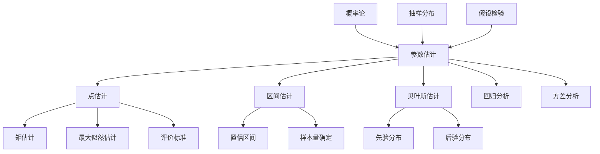
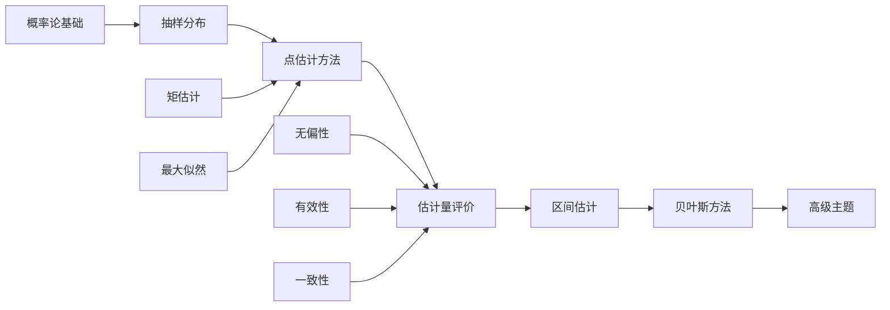

# 参数估计思维导图 / Parameter Estimation Mind Map

**主题编号**: MM.STAT.01
**创建日期**: 2026年4月4日
**最后更新**: 2026年4月4日

---

## 思维导图 / Mind Map

```mermaid
mindmap
  root((参数估计<br/>Parameter<br/>Estimation))
    点估计
      矩估计法
        样本矩
        总体矩
        矩方程
        求解过程
      最大似然估计
        似然函数
          L(θ|x) = ∏f(xi|θ)

        对数似然
        求导求解
        渐近性质
          一致性
          渐近正态性
          渐近有效性
      估计量评价标准
        无偏性
          E[θ̂] = θ
        有效性
          方差最小
        一致性
          θ̂ → θ (n→∞)
        充分性
          包含全部信息
    区间估计
      置信区间
        构造方法
          枢轴量法
          正态近似
        单侧区间
        双侧区间
      正态总体
        均值估计
          σ²已知
            x̄ ± z(α/2)·σ/√n
          σ²未知
            x̄ ± t(α/2,n-1)·s/√n
        方差估计
          [(n-1)s²/χ²(α/2), (n-1)s²/χ²(1-α/2)]
      样本量确定
        精度要求
        置信水平
        方差估计
    贝叶斯估计
      先验分布
        共轭先验
        无信息先验
        主观先验
      后验分布
        π(θ|x) ∝ L(x|θ)π(θ)

      估计方法
        后验均值
        后验中位数
        最大后验
    应用实例
      民意调查
      医学试验
      质量控制
      金融风险

```

---

## 核心概念详解 / Core Concepts

### 1. 点估计 / Point Estimation

#### 矩估计法 / Method of Moments

**基本思想**: 用样本矩估计总体矩，通过矩方程求解参数估计值。

**步骤**:
1. 计算总体前k阶矩（含未知参数）
2. 计算样本前k阶矩
3. 建立矩方程并求解

**优点**: 计算简单，直观易懂
**缺点**: 效率可能不如MLE

#### 最大似然估计 / Maximum Likelihood Estimation

**定义**: 使似然函数达到最大值的参数值

$$\hat{\theta}_{MLE} = \arg\max_{\theta} L(\theta|x) = \arg\max_{\theta} \prod_{i=1}^{n} f(x_i|\theta)$$

**性质**:
- **一致性**: $\hat{\theta}_n \xrightarrow{P} \theta_0$
- **渐近正态性**: $\sqrt{n}(\hat{\theta}_n - \theta_0) \xrightarrow{d} N(0, I(\theta_0)^{-1})$
- **渐近有效性**: 达到Cramér-Rao下界

### 2. 区间估计 / Interval Estimation

#### 置信区间构造

**枢轴量法**:
1. 构造包含参数和估计量的统计量
2. 确定枢轴量的分布
3. 根据置信水平确定分位数
4. 反解得到参数的置信区间

**常用枢轴量**:

| 参数 | 条件 | 枢轴量 | 分布 |
|------|------|--------|------|
| μ | σ²已知 | $(\bar{X}-\mu)/(\sigma/\sqrt{n})$ | N(0,1) |
| μ | σ²未知 | $(\bar{X}-\mu)/(S/\sqrt{n})$ | t(n-1) |
| σ² | μ未知 | $(n-1)S^2/\sigma^2$ | χ²(n-1) |

### 3. 估计量评价标准 / Estimator Criteria

#### 无偏性 / Unbiasedness

$$E[\hat{\theta}] = \theta$$

**注意**: 
- 样本方差 $S^2 = \frac{1}{n-1}\sum(X_i-\bar{X})^2$ 是σ²的无偏估计
- $S$ 不是σ的无偏估计

#### 有效性 / Efficiency

$$\text{Var}(\hat{\theta}_1) < \text{Var}(\hat{\theta}_2)$$

**Cramér-Rao下界**:
$$\text{Var}(\hat{\theta}) \geq \frac{1}{nI(\theta)}$$

其中 $I(\theta) = E[(\frac{\partial}{\partial\theta}\ln f(X|\theta))^2]$ 是Fisher信息量

---

## 知识体系关联 / Knowledge Connections



---

## 学习路径 / Learning Path



---

## 关键公式速查 / Quick Reference

### 常用点估计

| 参数 | 估计方法 | 估计量 |
|------|----------|--------|
| μ (正态) | MLE/矩估计 | $\hat{\mu} = \bar{X}$ |
| σ² (正态) | MLE | $\hat{\sigma}^2 = \frac{1}{n}\sum(X_i-\bar{X})^2$ |
| σ² (正态) | 无偏估计 | $S^2 = \frac{1}{n-1}\sum(X_i-\bar{X})^2$ |
| p (二项) | MLE/矩估计 | $\hat{p} = \bar{X}$ |
| λ (泊松) | MLE/矩估计 | $\hat{\lambda} = \bar{X}$ |

### 常用置信区间

| 参数 | 置信区间公式 |
|------|-------------|
| μ (σ²已知) | $\bar{X} \pm z_{\alpha/2}\frac{\sigma}{\sqrt{n}}$ |
| μ (σ²未知) | $\bar{X} \pm t_{\alpha/2,n-1}\frac{S}{\sqrt{n}}$ |
| σ² | $[\frac{(n-1)S^2}{\chi^2_{\alpha/2}}, \frac{(n-1)S^2}{\chi^2_{1-\alpha/2}}]$ |
| p | $\hat{p} \pm z_{\alpha/2}\sqrt{\frac{\hat{p}(1-\hat{p})}{n}}$ |

---

## 应用案例 / Application Cases

### 案例1: 产品质量参数估计

**背景**: 某工厂生产零件，测量其直径，估计总体均值和方差

**数据**: 样本量n=50，样本均值x̄=10.05mm，样本标准差s=0.08mm

**估计结果**:
- 点估计: $\hat{\mu} = 10.05$, $\hat{\sigma}^2 = 0.0064$
- 95%置信区间: $10.05 \pm 1.96 \times \frac{0.08}{\sqrt{50}} = [10.028, 10.072]$

### 案例2: 市场调查比例估计

**背景**: 估计某产品市场占有率

**数据**: 调查1000人，其中280人使用该产品

**估计结果**:
- 点估计: $\hat{p} = 0.28$
- 95%置信区间: $0.28 \pm 1.96\sqrt{\frac{0.28 \times 0.72}{1000}} = [0.252, 0.308]$

---

## 相关文档 / Related Documents

- [统计学](./../10-应用数学/02-统计学.md)
- [概率论](./../10-应用数学/01-概率论.md)
- [假设检验思维导图](./02-假设检验-思维导图.md)
- [回归分析思维导图](./03-回归分析-思维导图.md)

---

**参考文献 / References**:

1. Casella, G. and Berger, R.L. "Statistical Inference". 2002.
2. Lehmann, E.L. and Casella, G. "Theory of Point Estimation". 1998.
3. Efron, B. and Hastie, T. "Computer Age Statistical Inference". 2016.
