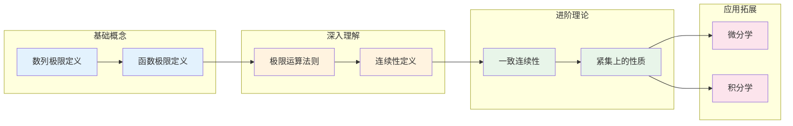

# 极限与连续性思维导图

## 概述

极限与连续性是实分析的基石，为微积分奠定严格基础。极限概念描述了数学对象（数列、函数）在某种趋势下的终极行为，而连续性则是函数光滑性的基本表现。

---

## 核心思维导图

```mermaid
mindmap
  root((极限与连续性<br/>Limits & Continuity))
    核心概念
      数列极限
        ε-N定义
        收敛性判定
        单调有界定理
        柯西收敛准则
      函数极限
        ε-δ定义
        单侧极限
        无穷远处的极限
        夹逼定理
      连续性
        点连续
        区间连续
        一致连续
        利普希茨连续
      无穷小与无穷大
        高阶无穷小
        等价无穷小
        渐近分析
    关键定理
      极限运算定理
        四则运算
        复合函数极限
        保号性
      连续性定理
        最值定理
        介值定理
        零点定理
        康托尔定理
      重要极限
        sinx/x → 1
        (1+1/n)^n → e
        自然对数底
    前置知识
      实数理论
        戴德金分割
        确界原理
        阿基米德性质
      集合论基础
      不等式技巧
    应用领域
      微积分基础
      数值分析
      物理学建模
      经济学边际分析

```

---

## 极限理论体系

```mermaid
graph TD
    subgraph 极限定义
        A[数列极限<br/>lim aₙ = L] --> B[函数极限<br/>lim f(x) = L]
        B --> C[单侧极限<br/>左/右极限]
        C --> D[无穷极限<br/>lim = ±∞]
    end
    
    subgraph 收敛性质
        E[唯一性] --> F[有界性]
        F --> G[保号性]
        G --> H[夹逼性]
    end
    
    subgraph 判定方法
        I[定义法<br/>ε-N/ε-δ] --> J[运算性质]
        J --> K[单调有界]
        K --> L[柯西准则]
    end
    
    A --> E
    B --> F
    D --> J

```

---

## 连续性层次结构


---

## 重要极限公式速查

| 极限类型 | 公式 | 条件 |
|---------|------|------|
| 基本三角 | $\lim_{x\to 0}\frac{\sin x}{x} = 1$ | $x$ 为弧度 |
| 自然对数底 | $\lim_{n\to\infty}(1+\frac{1}{n})^n = e$ | $n \in \mathbb{N}$ |
| 指数形式 | $\lim_{x\to 0}(1+x)^{1/x} = e$ | $x \in \mathbb{R}$ |
| 对数极限 | $\lim_{x\to 0}\frac{\ln(1+x)}{x} = 1$ | - |
| 幂指函数 | $\lim_{x\to 0}\frac{a^x - 1}{x} = \ln a$ | $a > 0$ |
| 阶的比较 | $\lim_{x\to\infty}\frac{x^a}{b^x} = 0$ | $a>0, b>1$ |

---

## 连续性等价条件

| 条件 | 描述 | 符号表示 |
|------|------|----------|
| ε-δ定义 | ∀ε>0, ∃δ>0 | $\|x-x_0\|<\delta \Rightarrow \|f(x)-f(x_0)\|<\varepsilon$ |
| 序列定义 | 对任意收敛序列 | $x_n \to x_0 \Rightarrow f(x_n) \to f(x_0)$ |
| 拓扑定义 | 开集的原像 | $f^{-1}(U)$ 为开集 |
| 增量形式 | 无穷小增量 | $\Delta x \to 0 \Rightarrow \Delta f \to 0$ |

---

## 闭区间连续函数性质

```mermaid
mindmap
  root((闭区间[a,b]<br/>连续函数))
    有界性定理
      f在[a,b]有界
    最值定理
      存在最大值M
      存在最小值m
    介值定理
      ∀c∈[m,M]
      ∃ξ: f(ξ)=c
    零点定理
      f(a)f(b)<0
      ⇒ ∃ξ: f(ξ)=0
    一致连续性
      康托尔定理
      [a,b]上连续
      ⇒ 一致连续

```

---

## 无穷小的比较

```mermaid
graph TD
    A[无穷小比较] --> B[高阶无穷小<br/>o(g(x))]
    A --> C[同阶无穷小<br/>O(g(x))]
    A --> D[等价无穷小<br/>~ g(x)]
    
    B --> E[lim = 0]
    C --> F[lim = C≠0]
    D --> G[lim = 1]
    
    style A fill:#e3f2fd
    style D fill:#c8e6c9

```

### 常用等价无穷小 (x→0)

| 无穷小 | 等价形式 |
|--------|----------|
| $\sin x$ | $x$ |
| $\tan x$ | $x$ |
| $\arcsin x$ | $x$ |
| $\arctan x$ | $x$ |
| $e^x - 1$ | $x$ |
| $\ln(1+x)$ | $x$ |
| $(1+x)^a - 1$ | $ax$ |
| $1 - \cos x$ | $\frac{x^2}{2}$ |

---

## 学习路径



---

## 与其他概念的联系

- **微分学**: 可导必连续，连续不一定可导
- **积分学**: 连续函数必可积
- **级数理论**: 级数收敛是数列极限的特例
- **拓扑学**: 连续性可用开集刻画
- **泛函分析**: 一致连续在紧集上的推广

---

## 典型证明技巧

1. **ε-N 法**: 对数列极限，从不等式反解 N
2. **ε-δ 法**: 对函数极限，通过放技巧找 δ
3. **夹逼定理**: 寻找上下界函数
4. **单调有界**: 证明单调性和有界性
5. **柯西准则**: 不依赖极限值的收敛判定

---

## 参考

- 《数学分析原理》Rudin
- 《实变函数论》周民强
- 《数学分析》陈纪修

---

*文档版本：1.1（质量提升版）*
*最后更新：2026年4月*
*分类：数学分析 / 实分析 / 思维导图*
