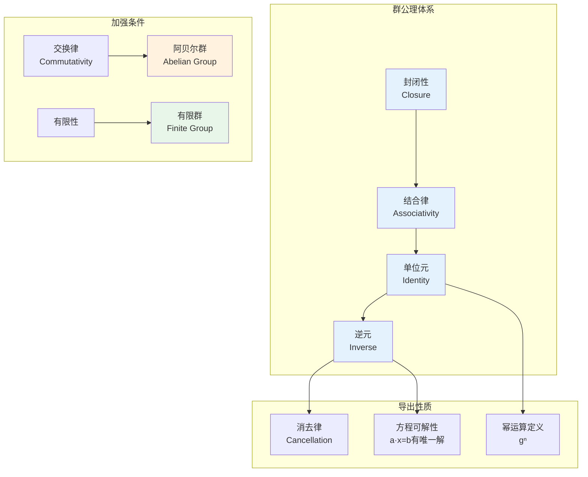
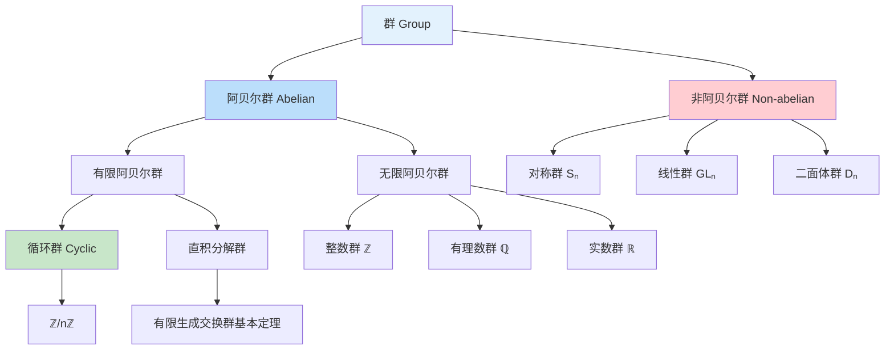
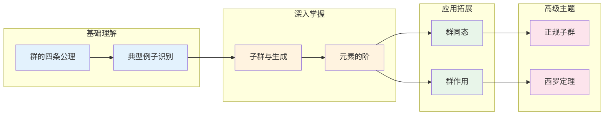

# 群的基本概念 - 思维导图

## 概述

群是代数学中最基本的代数结构之一，它抽象地描述了"对称性"的数学本质。群的四个公理——封闭性、结合律、单位元、逆元——完整刻画了一类可逆变换的代数性质。

---

## 核心思维导图

```mermaid
mindmap
  root((群的基本概念<br/>Group Fundamentals))
    定义与公理
      封闭性
        ∀a,b∈G: a·b∈G
      结合律
        (a·b)·c = a·(b·c)
      单位元
        ∃e: e·a = a·e = a
      逆元
        ∀a, ∃a⁻¹: a·a⁻¹ = e
    基本分类
      有限群
        |G| < ∞
        例子: S₃, ℤ/nℤ
      无限群
        |G| = ∞
        例子: ℤ, ℝ, GLₙ(ℂ)
      阿贝尔群
        a·b = b·a
        例子: (ℤ,+), (ℚ*,×)
      非阿贝尔群
        ∃a,b: a·b ≠ b·a
        例子: S₃, GL₂(ℝ)
    典型例子
      数群
        (ℤ,+) 整数加法群
        (ℚ*,×) 非零有理数乘法群
        (ℝ,+) 实数加法群
      矩阵群
        GLₙ(F) 一般线性群
        SLₙ(F) 特殊线性群
        Oₙ 正交群
      置换群
        Sₙ 对称群
        Aₙ 交错群
      几何群
        Dₙ 二面体群
        循环群 Cₙ
    元素的阶
      定义
        ord(g) = min{n>0: gⁿ=e}
      性质
        gᵐ = e ⇔ ord(g)|m
        ord(gᵏ) = ord(g)/gcd(ord(g),k)
      应用
        拉格朗日定理
        群的结构分析
    子群概念
      定义
        H⊆G, 对运算封闭
      平凡子群
        {e} 和 G
      真子群
        H ≠ G
      生成子群
        ⟨S⟩ = ∩{H≤G: S⊆H}
    基本定理
      单位元唯一性
      逆元唯一性
      消去律
        ab=ac ⇒ b=c
      穿脱原理
        (ab)⁻¹ = b⁻¹a⁻¹
```

---

## 群公理体系



---

## 群的分类层次



---

## 典型群例子详解

| 群名称 | 符号 | 运算 | 阶 | 性质 |
|--------|------|------|-----|------|
| 整数加法群 | (ℤ, +) | 加法 | ∞ | 无限循环群，阿贝尔 |
| 模n整数群 | (ℤ/nℤ, +) | 模n加法 | n | 有限循环群 |
| 对称群 | Sₙ | 置换复合 | n! | n≥3时非阿贝尔 |
| 交错群 | Aₙ | 偶置换复合 | n!/2 | Sₙ的正规子群 |
| 一般线性群 | GLₙ(F) | 矩阵乘法 | ∞(F无限) | 可逆n×n矩阵 |
| 特殊线性群 | SLₙ(F) | 矩阵乘法 | ∞ | 行列式为1的矩阵 |
| 二面体群 | Dₙ | 对称变换 | 2n | 正n边形对称群 |
| 四元数群 | Q₈ | 四元数乘法 | 8 | 非阿贝尔，每个子群正规 |

---

## 元素阶的性质网络

```mermaid
mindmap
  root((元素阶<br/>Element Order))
    定义
      ord(g) = min{n>0 : gⁿ=e}
      若不存在则为∞
    基本性质
      gᵐ = e ⇔ ord(g) | m
      ord(gᵏ) = ord(g)/gcd(ord(g),k)
      ord(g) = ord(g⁻¹)
    拉格朗日定理
      ord(g) 整除 |G|
      推论: g^|G| = e
    循环群生成
      ⟨g⟩ = {e, g, g², ..., g^(ord(g)-1)}
      |⟨g⟩| = ord(g)
    应用
      费马小定理
      欧拉定理
      原根存在性
```

---

## 学习路径



---

## 关键公式速查

| 公式 | 说明 |
|------|------|
| $(ab)^{-1} = b^{-1}a^{-1}$ | 乘积的逆 |
| $(a^{-1})^{-1} = a$ | 逆的逆 |
| $a^m \cdot a^n = a^{m+n}$ | 幂的加法 |
| $(a^m)^n = a^{mn}$ | 幂的乘法 |
| $g^{|G|} = e$ | 拉格朗日推论 |
| $|\langle g \rangle| = \text{ord}(g)$ | 循环子群的阶 |

---

## 与其他概念的联系

- **环论**: 环的加法群是阿贝尔群；环的单位群是群
- **域论**: 域的乘法群（非零元）是阿贝尔群
- **线性代数**: 矩阵群是群论的重要例子
- **拓扑学**: 拓扑群、李群结合代数与几何
- **密码学**: 离散对数问题基于循环群

---

*文档版本：1.0*
*创建时间：2026年4月*
*分类：代数学 / 群论 / 思维导图*
