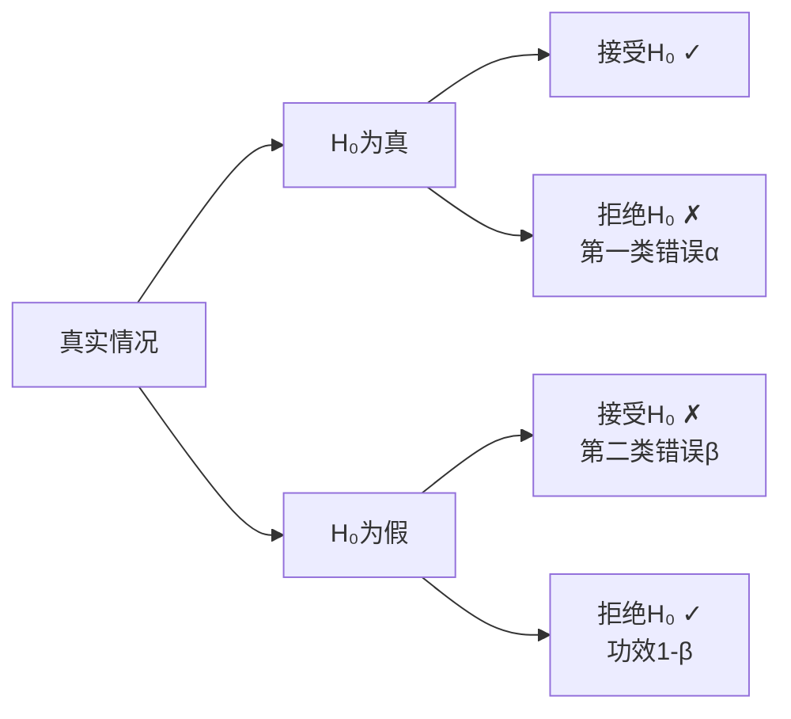
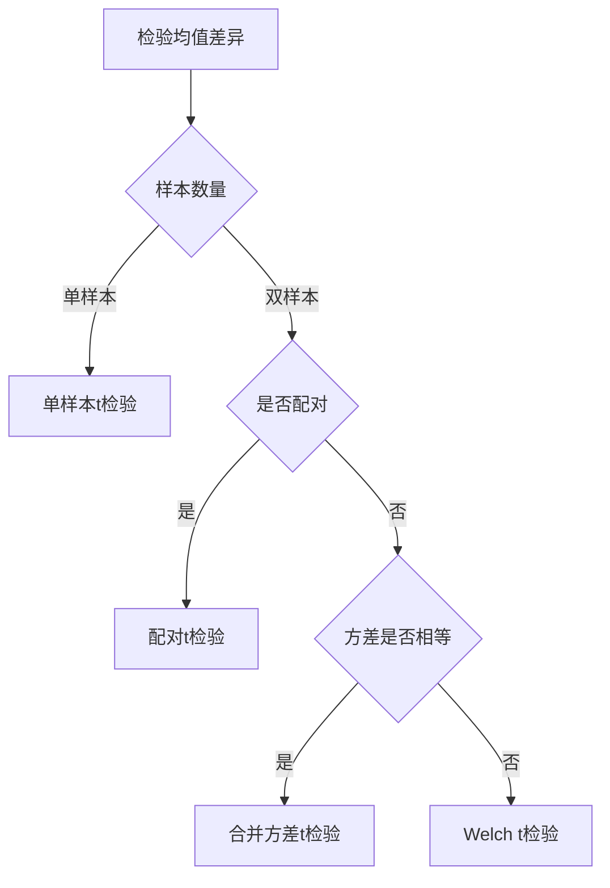
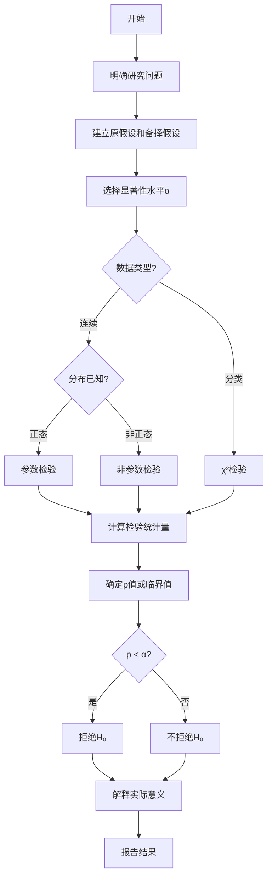

# 假设检验思维导图 / Hypothesis Testing Mind Map

**主题编号**: MM.STAT.02
**创建日期**: 2026年4月4日
**最后更新**: 2026年4月4日

---

## 思维导图 / Mind Map

```mermaid
mindmap
  root((假设检验<br/>Hypothesis<br/>Testing))
    基本概念
      原假设H₀
        默认假设
        需要被检验
        通常含等号
      备择假设H₁
        研究者希望证实
        与原假设对立
        单侧/双侧
      两类错误
        第一类错误α
          拒真错误
          显著性水平
          通常取0.05
        第二类错误β
          取伪错误
          检验功效1-β
      检验统计量
        根据分布选择
        t统计量
        z统计量
        χ²统计量
        F统计量
    参数检验
      均值检验
        单样本t检验
          H₀: μ = μ₀
          t = (x̄-μ₀)/(s/√n)
        双样本t检验
          独立样本
          配对样本
        方差分析
          单因素ANOVA
          双因素ANOVA
      方差检验
        单样本χ²检验
        双样本F检验
        方差齐性检验
      比例检验
        单样本z检验
        双样本z检验
    非参数检验
      拟合优度检验
        χ²检验
        Kolmogorov-Smirnov
      独立性检验
        χ²列联表
        Fisher精确检验
      位置检验
        Wilcoxon符号秩
        Mann-Whitney U
        Kruskal-Wallis
    检验步骤
      建立假设
      选择统计量
      确定拒绝域
      计算统计量
      做出决策
      解释结果
    多重检验
      族错误率
      Bonferroni校正
      FDR控制
      Holm方法

```

---

## 核心概念详解 / Core Concepts

### 1. 假设检验基本原理 / Basic Principles

#### 假设设定

**原假设 (H₀)**:
- 默认成立的假设
- 通常表示"无差异"、"无效果"
- 必须包含等号

**备择假设 (H₁)**:
- 研究者希望证实的假设
- 表示"有差异"、"有效果"
- 可以是单侧或双侧

#### 两类错误



| 决策\真实 | H₀为真 | H₀为假 |
|-----------|--------|--------|
| 拒绝H₀ | 第一类错误 (α) | 正确决策 (功效) |
| 接受H₀ | 正确决策 | 第二类错误 (β) |

### 2. 常用参数检验 / Parametric Tests

#### t检验家族

**单样本t检验**:
$$t = \frac{\bar{X} - \mu_0}{S/\sqrt{n}} \sim t(n-1)$$

**独立样本t检验**:
$$t = \frac{\bar{X}_1 - \bar{X}_2}{S_p\sqrt{\frac{1}{n_1} + \frac{1}{n_2}}} \sim t(n_1+n_2-2)$$

其中 $S_p^2 = \frac{(n_1-1)S_1^2 + (n_2-1)S_2^2}{n_1+n_2-2}$

**配对样本t检验**:
$$t = \frac{\bar{D}}{S_D/\sqrt{n}} \sim t(n-1)$$

#### 检验选择决策树



### 3. 非参数检验 / Nonparametric Tests

#### 检验方法对比

| 参数检验 | 非参数替代 | 适用条件 |
|----------|-----------|----------|
| 单样本t检验 | Wilcoxon符号秩检验 | 非正态分布 |
| 独立样本t检验 | Mann-Whitney U检验 | 非正态、方差不齐 |
| 配对t检验 | 符号检验 | 非正态分布 |
| 单因素ANOVA | Kruskal-Wallis检验 | 非正态分布 |
| Pearson相关 | Spearman相关 | 非线性关系 |

### 4. 方差分析 / Analysis of Variance

#### 单因素ANOVA

**模型**: $Y_{ij} = \mu + \alpha_i + \epsilon_{ij}$

**假设**:
- H₀: $\mu_1 = \mu_2 = \cdots = \mu_k$
- H₁: 至少两个均值不等

**F统计量**:
$$F = \frac{MS_{between}}{MS_{within}} = \frac{SS_{between}/(k-1)}{SS_{within}/(N-k)}$$

**方差分析表**:

| 来源 | 平方和 | 自由度 | 均方 | F值 |
|------|--------|--------|------|-----|
| 组间 | SSB | k-1 | MSB=SSB/(k-1) | F=MSB/MSW |
| 组内 | SSW | N-k | MSW=SSW/(N-k) | |
| 总计 | SST | N-1 | | |

---

## 检验功效与样本量 / Power and Sample Size

### 功效分析

**功效 (Power)**: $1 - \beta = P(\text{拒绝} H_0 | H_1 \text{为真})$

**影响因素**:
1. **效应大小**: 效应越大，功效越高
2. **样本量**: 样本越大，功效越高
3. **显著性水平**: α越大，功效越高
4. **检验类型**: 单侧检验功效高于双侧

### 样本量计算

**两样本均值比较**:
$$n = \frac{2(z_{1-\alpha/2} + z_{1-\beta})^2\sigma^2}{\delta^2}$$

其中δ为期望检测的最小差异

---

## 多重检验校正 / Multiple Testing Correction

### 问题背景

进行m次独立检验时，
$$P(\text{至少一次第一类错误}) = 1 - (1-\alpha)^m$$

当m=20, α=0.05时，族错误率≈64%

### 常用校正方法

| 方法 | 公式 | 特点 |
|------|------|------|
| Bonferroni | $\alpha^* = \alpha/m$ | 保守，控制族错误率 |
| Holm | 逐步校正 | 比Bonferroni更有功效 |
| FDR | 控制期望错误发现率 | 适用于大规模检验 |
| Tukey HSD | 事后多重比较 | 适用于ANOVA |

---

## 实际应用案例 / Application Cases

### 案例1: 药物疗效检验

**研究问题**: 新药是否比标准药物更有效

**假设**:
- H₀: μ_new = μ_standard
- H₁: μ_new > μ_standard

**数据**:
- 新药组: n=50, x̄=85.2, s=10.5
- 标准组: n=50, x̄=80.1, s=9.8

**检验结果**:
- t = 2.51
- p-value = 0.007 < 0.05
- **结论**: 拒绝H₀，新药显著更有效

### 案例2: A/B测试

**研究问题**: 网页改版是否提高转化率

**假设**:
- H₀: p_A = p_B
- H₁: p_A ≠ p_B

**数据**:
- 版本A: 1000访问，120转化，转化率12%
- 版本B: 1000访问，156转化，转化率15.6%

**检验结果**:
- z = 2.12
- p-value = 0.034 < 0.05
- **结论**: 版本B转化率显著更高

---

## 检验流程图 / Testing Flowchart



---

## 相关文档 / Related Documents

- [统计学](./../10-应用数学/02-统计学.md)
- [参数估计思维导图](./01-参数估计-思维导图.md)
- [回归分析思维导图](./03-回归分析-思维导图.md)
- [非参数统计思维导图](./06-非参数统计-思维导图.md)

---

**参考文献 / References**:

1. Lehmann, E.L. and Romano, J.P. "Testing Statistical Hypotheses". 2005.
2. Wasserman, L. "All of Statistics". 2004.
3. Benjamini, Y. and Hochberg, Y. "Controlling the False Discovery Rate". 1995.
