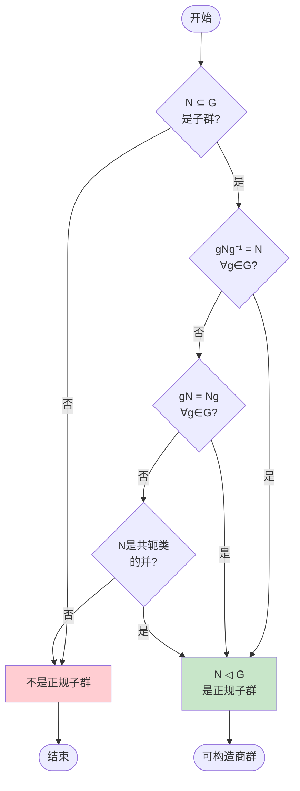
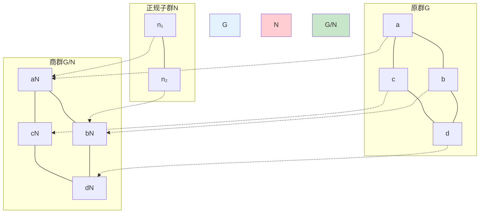
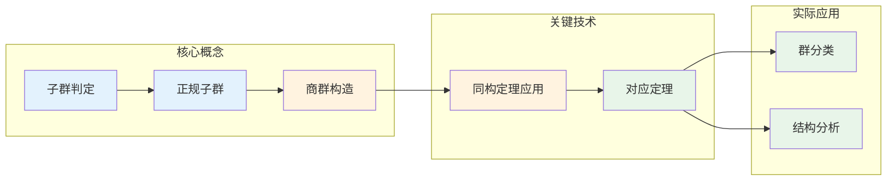

# 子群与商群 - 思维导图

## 概述

子群与商群是研究群结构的基本工具。子群让我们理解群的内部层次结构，而商群则提供了一种"压缩"群信息的手段，将群按照某种等价关系进行划分。

---

## 核心思维导图

```mermaid
mindmap
  root((子群与商群<br/>Subgroups & Quotient Groups))
    子群基础
      定义
        H⊆G, 非空
        对运算封闭
        对逆元封闭
      判别法
        单步判别: a,b∈H ⇒ ab⁻¹∈H
        两步判别: 封闭且含逆元
      平凡子群
        {e} 单位子群
        G 本身
      真子群
        H ≠ G
    生成子群
      定义
        ⟨S⟩ = ∩{H≤G: S⊆H}
        包含S的最小子群
      循环群
        S = {g} 单元素
        ⟨g⟩ = {gⁿ : n∈ℤ}
      生成集
        若⟨S⟩=G, S称为生成集
        极小生成集
    陪集与指数
      左陪集
        gH = {gh : h∈H}
      右陪集
        Hg = {hg : h∈H}
      指数
        [G:H] = |G/H| 陪集个数

      拉格朗日定理

        |G| = |H|·[G:H]
        |H| 整除 |G|

    正规子群
      定义
        gN = Ng, ∀g∈G
        N◁G
      等价条件
        gNg⁻¹ = N
        N是共轭类的并
      重要性
        定义商群的前提
        同态的核总是正规
    商群构造
      定义
        G/N = {gN : g∈G}
        运算: (aN)(bN) = (ab)N
      良定义性
        需N正规保证
      自然投影
        π: G → G/N, π(g)=gN
        ker(π) = N
    同构定理
      第一同构定理
        G/ker(φ) ≅ im(φ)
      第二同构定理
        HN/N ≅ H/(H∩N)
      第三同构定理
        (G/N)/(K/N) ≅ G/K

```

---

## 子群结构层次

```mermaid
graph TD
    G[群 G] --> T[{e}]" title="平凡子群"]
    G --> H1[H₁]
    G --> H2[H₂]
    G --> H3[H₃]
    
    H1 --> K1[K₁₁]
    H1 --> K2[K₁₂]
    H2 --> K3[K₂₁]
    
    K1 --> T
    K2 --> T
    K3 --> T
    
    H3 --> G
    
    subgraph 子群格 Subgroup Lattice
        G
        H1
        H2
        H3
        K1
        K2
        K3
        T
    end
    
    style G fill:#e3f2fd
    style T fill:#c8e6c9
    style H1 fill:#fff3e0
    style H2 fill:#fff3e0
    style H3 fill:#fff3e0

```

---

## 正规子群判定流程



---

## 陪集结构可视化

```mermaid
graph LR
    subgraph 群G的划分
        subgraph 子群H
            e[e]
            h1[h₁]
            h2[h₂]
            dot1[...]
        end
        
        subgraph 陪集g₁H
            g1[g₁]
            g1h1[g₁h₁]
            g1h2[g₁h₂]
            dot2[...]
        end
        
        subgraph 陪集g₂H
            g2[g₂]
            g2h1[g₂h₁]
            g2h2[g₂h₂]
            dot3[...]
        end
        
        subgraph 陪集gₙH
            gn[gₙ]
            gnh1[gₙh₁]
            gnh2[gₙh₂]
            dot4[...]
        end
    end
    
    e -.-> g1
    h1 -.-> g1h1
    h2 -.-> g1h2
    
    style H fill:#e3f2fd
    style g1H fill:#fff3e0
    style g2H fill:#e8f5e9
    style gnH fill:#fce4ec

```

---

## 商群构造原理



---

## 同构定理关系图

```mermaid
mindmap
  root((同构定理<br/>Isomorphism Theorems))
    第一同构定理
      陈述
        G/ker(φ) ≅ im(φ)
      几何意义
        商去核 = 像
      应用
        证明群同构
        计算商群结构
    第二同构定理
      陈述
        HN/N ≅ H/(H∩N)
      钻石定理
        子群与正规子群的关系
      应用
        分析复合结构
    第三同构定理
      陈述
        (G/N)/(K/N) ≅ G/K
      对应定理
        子群 ↔ 商群子群
      应用
        层次化商群
    对应定理
      陈述
        {H: N≤H≤G} ↔ {H̄ ≤ G/N}
      保持性质
        正规性
        指数关系

```

---

## 重要定理总结

| 定理 | 陈述 | 关键应用 |
|------|------|----------|
| **拉格朗日定理** | $H \leq G$ 有限 $\Rightarrow |H|$ 整除 $|G|$ | 确定子群可能阶数 |
| **第一同构定理** | $G/\ker(\varphi) \cong \text{im}(\varphi)$ | 证明群同构 |
| **第二同构定理** | $HN/N \cong H/(H \cap N)$ | 分析积结构 |
| **第三同构定理** | $(G/N)/(K/N) \cong G/K$ | 商群的商群 |
| **对应定理** | $N \leq H \leq G \Leftrightarrow \bar{H} \leq G/N$ | 子群结构传递 |

---

## 典型例子分析

### 例子1：ℤ 的子群与商群

```mermaid
graph TD
    Z[ℤ 整数加法群] --> nZ[nℤ = {nk : k∈ℤ}]
    nZ --> Zn[ℤ/nℤ ≅ 循环群 Cₙ]
    
    Z --> mZ[mℤ]
    mZ --> Zm[ℤ/mℤ]
    
    nZ --> intersection[nℤ ∩ mℤ = lcm(n,m)ℤ]
    nZ --> sum[nℤ + mℤ = gcd(n,m)ℤ]
    
    style Z fill:#e3f2fd
    style nZ fill:#fff3e0
    style Zn fill:#c8e6c9

```

### 例子2：S₃ 的子群结构

```mermaid
graph TD
    S3[S₃ 阶6] --> A3[A₃ = {e, (123), (132)}<br/>阶3, 正规]
    S3 --> H1[H₁ = {e, (12)}<br/>阶2]
    S3 --> H2[H₂ = {e, (13)}<br/>阶2]
    S3 --> H3[H₃ = {e, (23)}<br/>阶2]
    
    A3 --> E[{e}]
    H1 --> E
    H2 --> E
    H3 --> E
    
    S3 -.-> S3/A3[≅ C₂]
    
    style S3 fill:#e3f2fd
    style A3 fill:#c8e6c9
    style H1 fill:#fff3e0
    style H2 fill:#fff3e0
    style H3 fill:#fff3e0

```

---

## 学习要点



---

## 常见误区与注意事项

1. **子群必须是子集且封闭**：不能只验证封闭性，还要验证逆元存在
2. **正规子群强于子群**：所有正规子群都是子群，但反之不成立
3. **商群需要正规性**：只有当 $N \trianglelefteq G$ 时，$G/N$ 才是群
4. **陪集不一定构成群**：只有正规子群的陪集才能形成群结构
5. **指数不一定是群的阶**：$[G:H]$ 是陪集个数，不是群的阶

---

*文档版本：1.0*
*创建时间：2026年4月*
*分类：代数学 / 群论 / 思维导图*
