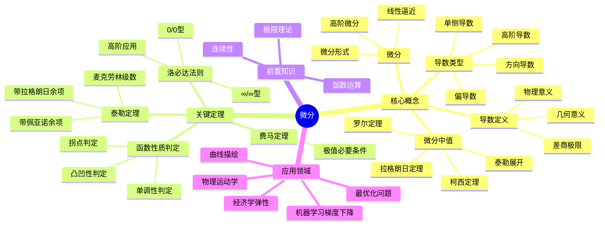

# 微分思维导图

## 概述
微分学研究函数的变化率，是分析学的核心工具。

## 核心要点

### 导数的本质
- **瞬时变化率**: Δy/Δx 当 Δx→0 的极限
- **局部线性化**: f(x+h) ≈ f(x) + f'(x)h

### 中值定理体系
1. **罗尔定理**: f(a)=f(b) ⇒ ∃ξ, f'(ξ)=0
2. **拉格朗日**: f(b)-f(a) = f'(ξ)(b-a)
3. **柯西定理**: 参数形式的推广

### 泰勒展开
$$f(x) = \sum_{n=0}^{\infty} \frac{f^{(n)}(a)}{n!}(x-a)^n$$

## 参考
- 《微积分学教程》菲赫金哥尔茨
- 《数学分析》卓里奇
