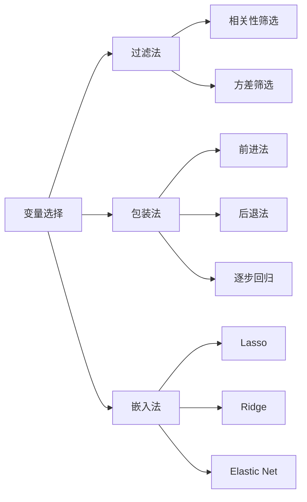
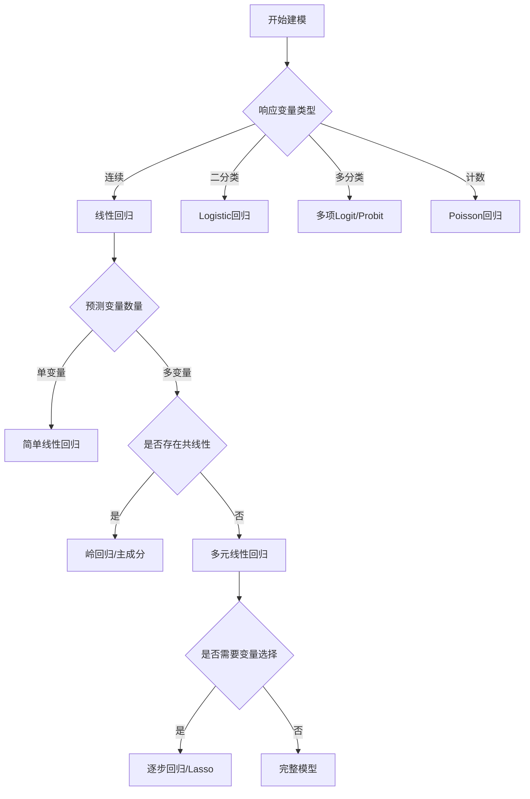

# 回归分析思维导图 / Regression Analysis Mind Map

**主题编号**: MM.STAT.03
**创建日期**: 2026年4月4日
**最后更新**: 2026年4月4日

---

## 思维导图 / Mind Map

```mermaid
mindmap
  root((回归分析<br/>Regression<br/>Analysis))
    简单线性回归
      模型设定
        Y = β₀ + β₁X + ε
        ε ~ N(0, σ²)
        独立同分布
      参数估计
        最小二乘法
          Σ(Yi - Ŷi)²最小
        估计公式
          β̂₁ = Sxy/Sxx
          β̂₀ = Ȳ - β̂₁X̄
      模型评价
        R²决定系数
          解释变异比例
        标准误差
          SEE = √[SSE/(n-2)]
        残差分析
      假设检验
        β₁显著性
          H₀: β₁ = 0
        整体显著性
        F检验
    多元线性回归
      模型扩展
        Y = Xβ + ε
        矩阵形式
        多重共线性
      变量选择
        前进法
        后退法
        逐步回归
        最优子集
      模型诊断
        残差图
        影响点分析
        方差齐性
        正态性
    广义线性模型
      Logistic回归
        二分类响应
        Logit链接
        概率预测
      Poisson回归
        计数数据
        对数链接
        比率模型
      多项Logit
        多分类响应
        基线类别
    正则化方法
      岭回归
        L2惩罚
        收缩估计
        处理共线性
      Lasso
        L1惩罚
        稀疏解
        变量选择
      Elastic Net
        L1+L2组合
        综合优势
    模型诊断
      残差分析
        正态QQ图
        残差vs拟合值
        残差vs预测变量
      影响度量
        杠杆值
        Cook距离
        DFFITS
      模型假设
        线性
        独立性
        同方差
        正态性

```

---

## 核心概念详解 / Core Concepts

### 1. 简单线性回归 / Simple Linear Regression

#### 模型设定

$$Y_i = \beta_0 + \beta_1 X_i + \epsilon_i, \quad \epsilon_i \overset{iid}{\sim} N(0, \sigma^2)$$

**基本假设**:
1. **线性关系**: E[Y|X]是X的线性函数

2. **独立性**: 观测值相互独立
3. **同方差性**: Var(ε) = σ²（常数）
4. **正态性**: ε ~ N(0, σ²)

#### 最小二乘估计

**目标函数**:
$$Q(\beta_0, \beta_1) = \sum_{i=1}^{n}(Y_i - \beta_0 - \beta_1 X_i)^2$$

**正规方程**:
$$\begin{cases}
\sum Y_i = n\hat{\beta}_0 + \hat{\beta}_1\sum X_i \\
\sum X_iY_i = \hat{\beta}_0\sum X_i + \hat{\beta}_1\sum X_i^2
\end{cases}$$

**估计公式**:
$$\hat{\beta}_1 = \frac{\sum(X_i - \bar{X})(Y_i - \bar{Y})}{\sum(X_i - \bar{X})^2} = \frac{S_{XY}}{S_{XX}}$$
$$\hat{\beta}_0 = \bar{Y} - \hat{\beta}_1\bar{X}$$

#### 模型评价指标

**决定系数 R²**:
$$R^2 = 1 - \frac{SSE}{SST} = \frac{SSR}{SST}$$

其中:
- SST = $\sum(Y_i - \bar{Y})^2$ (总平方和)
- SSR = $\sum(\hat{Y}_i - \bar{Y})^2$ (回归平方和)
- SSE = $\sum(Y_i - \hat{Y}_i)^2$ (残差平方和)

### 2. 多元线性回归 / Multiple Linear Regression

#### 矩阵形式

$$\mathbf{Y} = \mathbf{X}\boldsymbol{\beta} + \boldsymbol{\epsilon}$$

其中:
- Y: n×1 响应变量向量
- X: n×(p+1) 设计矩阵
- β: (p+1)×1 参数向量
- ε: n×1 误差向量

#### 最小二乘估计

$$\hat{\boldsymbol{\beta}} = (\mathbf{X}^T\mathbf{X})^{-1}\mathbf{X}^T\mathbf{Y}$$

**性质**:
- 无偏性: $E[\hat{\beta}] = \beta$
- 协方差: $\text{Cov}(\hat{\beta}) = \sigma^2(\mathbf{X}^T\mathbf{X})^{-1}$

#### 多重共线性问题

**诊断指标**:
- **方差膨胀因子 (VIF)**: $VIF_j = \frac{1}{1-R_j^2}$
- **条件数**: $\kappa = \sqrt{\frac{\lambda_{max}}{\lambda_{min}}}$

**解决方法**:
- 删除相关变量
- 主成分回归
- 岭回归

### 3. 变量选择方法



**选择准则**:
- **AIC**: $AIC = 2k - 2\ln(\hat{L})$
- **BIC**: $BIC = k\ln(n) - 2\ln(\hat{L})$
- **调整R²**: $R^2_{adj} = 1 - \frac{SSE/(n-k-1)}{SST/(n-1)}$

### 4. 广义线性模型 / Generalized Linear Models

#### Logistic回归

**模型**:
$$\ln\left(\frac{p}{1-p}\right) = \beta_0 + \beta_1 X_1 + \cdots + \beta_p X_p$$

**概率预测**:
$$p = \frac{1}{1 + e^{-(\mathbf{X}\boldsymbol{\beta})}}$$

**参数估计**: 最大似然估计

#### Poisson回归

**模型**:
$$\ln(\lambda) = \beta_0 + \beta_1 X_1 + \cdots + \beta_p X_p$$

**适用场景**: 计数数据、发生率数据

---

## 模型诊断 / Model Diagnostics

### 残差分析

**残差类型**:

| 类型 | 公式 | 用途 |
|------|------|------|
| 普通残差 | $e_i = Y_i - \hat{Y}_i$ | 基本诊断 |
| 标准化残差 | $r_i = \frac{e_i}{\hat{\sigma}\sqrt{1-h_{ii}}}$ | 比较 |
| 学生化残差 | $t_i = \frac{e_i}{\hat{\sigma}_{(i)}\sqrt{1-h_{ii}}}$ | 异常值检测 |

**诊断图**:
1. **残差vs拟合值图**: 检查同方差性和线性
2. **正态Q-Q图**: 检查正态性假设
3. **残差vs预测变量图**: 检查模型设定

### 影响分析

**杠杆值 (Leverage)**:
$$h_{ii} = \mathbf{x}_i^T(\mathbf{X}^T\mathbf{X})^{-1}\mathbf{x}_i$$
- 衡量观测点对拟合的影响程度
- $h_{ii} > 2(p+1)/n$ 为高杠杆点

**Cook距离**:
$$D_i = \frac{r_i^2}{p+1} \cdot \frac{h_{ii}}{1-h_{ii}}$$
- 衡量删除第i个观测对估计的影响
- $D_i > 4/n$ 或 $D_i > 1$ 需关注

---

## 正则化回归 / Regularized Regression

### 方法对比

| 方法 | 惩罚项 | 特点 | 适用场景 |
|------|--------|------|----------|
| 岭回归 | $\lambda\sum\beta_j^2$ | 系数收缩，不解雇变量 | 多重共线性 |
| Lasso | $\lambda\sum|\beta_j|$ | 稀疏解，自动变量选择 | 高维数据 |
| Elastic Net | $\lambda_1\sum|\beta_j| + \lambda_2\sum\beta_j^2$ | 结合两者优点 | 高维+共线性 |

### 交叉验证

**K折交叉验证**:
1. 将数据分成K个子集
2. 每次使用K-1个子集训练，剩余1个验证
3. 重复K次，计算平均验证误差
4. 选择使验证误差最小的λ

---

## 应用案例 / Application Cases

### 案例1: 房价预测模型

**响应变量**: 房价 (万元)

**预测变量**:
- 面积 (平方米)
- 房龄 (年)
- 距离市中心 (公里)
- 卧室数量

**模型结果**:
$$\text{Price} = 50.2 + 0.85\text{Area} - 2.1\text{Age} - 1.5\text{Dist} + 8.3\text{Bedrooms}$$

**模型评价**:
- R² = 0.87
- 调整R² = 0.86
- F统计量 = 245.3 (p < 0.001)

### 案例2: 客户流失预测

**响应变量**: 是否流失 (0/1)

**预测变量**:
- 客户 tenure
- 月消费金额
- 客服电话次数
- 合同类型

**Logistic回归结果**:

| 变量 | 系数 | 优势比 | p值 |
|------|------|--------|-----|
| Tenure | -0.35 | 0.70 | <0.001 |
| MonthlyCharge | 0.12 | 1.13 | <0.001 |
| SupportCalls | 0.45 | 1.57 | <0.001 |

---

## 模型选择决策树 / Model Selection Decision Tree



---

## 相关文档 / Related Documents

- [统计学](./../10-应用数学/02-统计学.md)
- [参数估计思维导图](./01-参数估计-思维导图.md)
- [假设检验思维导图](./02-假设检验-思维导图.md)
- [多元统计分析思维导图](./07-多元统计分析-思维导图.md)

---

**参考文献 / References**:

1. Kutner, M.H. et al. "Applied Linear Statistical Models". 2005.
2. Hastie, T., Tibshirani, R., and Friedman, J. "The Elements of Statistical Learning". 2009.
3. James, G. et al. "An Introduction to Statistical Learning". 2021.
