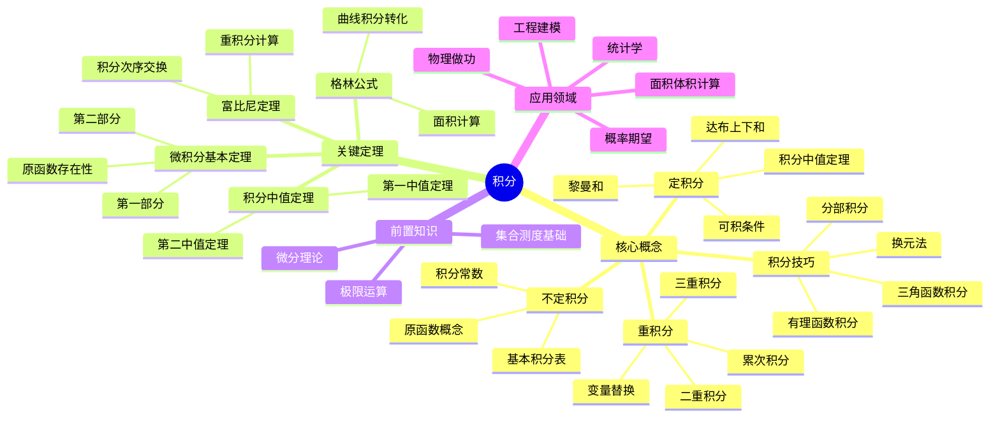

# 积分思维导图

## 概述
积分学是微分的逆运算，研究函数的累积效应。

## 核心要点

### 黎曼积分
- **分割**: 将区间细分为小区间
- **上和与下和**: 达布积分方法
- **可积条件**: 有界且间断点集测度为零

### 微积分基本定理
$$\frac{d}{dx}\int_a^x f(t)dt = f(x)$$
$$\int_a^b F'(x)dx = F(b) - F(a)$$

### 积分技巧
1. **换元法**: 变量替换简化被积函数
2. **分部积分**: ∫udv = uv - ∫vdu
3. **有理分解**: 部分分式展开

## 参考
- 《实分析》Royden
- 《数学分析》陈纪修
