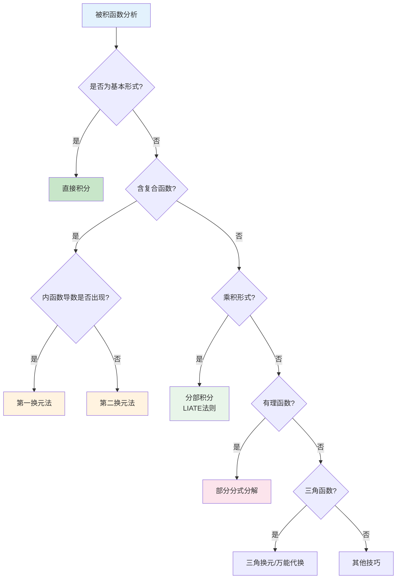
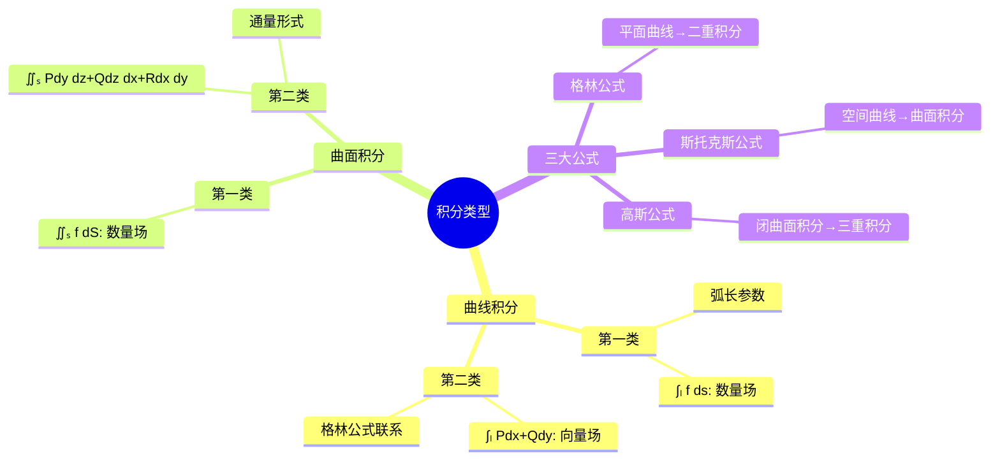
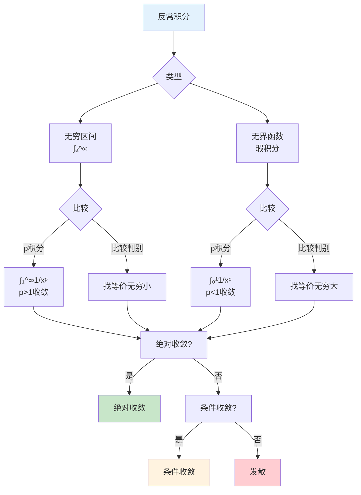
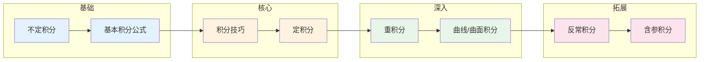

# 积分思维导图

## 概述

积分学是微分的逆运算，研究函数的累积效应。从黎曼积分到勒贝格积分，积分理论经历了严格化的发展历程，成为现代分析和概率论的基石。

---

## 核心思维导图

```mermaid
mindmap
  root((积分<br/>Integration))
    核心概念
      不定积分
        原函数概念
        F'(x) = f(x)
        基本积分表
        积分常数C
        通解与特解
      定积分
        黎曼和
        达布上和/下和
        可积条件
        积分中值定理
        牛顿-莱布尼兹公式
      积分技巧
        换元法
          第一换元
          第二换元
        分部积分
          ∫udv = uv - ∫vdu
          LIATE法则
        有理函数积分
          部分分式分解
        三角函数积分
          万能代换
          对称性利用
      重积分
        二重积分
        三重积分
        累次积分
        变量替换
        雅可比行列式
    关键定理
      微积分基本定理
        第一部分
        第二部分
        原函数存在性
      积分中值定理
        第一中值定理
        第二中值定理
        推广形式
      富比尼定理
        重积分计算
        积分次序交换
      格林公式
        曲线积分转化
        面积计算
        平面情形
    反常积分
      无穷区间积分
      瑕积分
      收敛判别法
      柯西主值
    前置知识
      微分理论
        导数计算
        中值定理
      极限运算
        无穷极限
        一致收敛
      集合测度基础
    应用领域
      面积体积计算
      物理做功
      质心计算
      概率期望
      统计学
      工程建模
      信号处理
```

---

## 积分理论体系

```mermaid
graph TD
    subgraph 不定积分
        A[原函数<br/>F'(x)=f(x)] --> B[基本积分公式]
        B --> C[积分技巧]
    end
    
    subgraph 定积分
        D[黎曼和<br/>Σf(ξᵢ)Δxᵢ] --> E[可积条件]
        E --> F[牛顿-莱布尼兹<br/>∫ₐᵇf = F(b)-F(a)]
    end
    
    subgraph 推广
        G[重积分] --> H[曲线/曲面积分]
        H --> I[反常积分]
    end
    
    C --> F
    F --> G
```

---

## 基本积分公式表

| 类型 | 公式 | 备注 |
|------|------|------|
| 幂函数 | $\int x^n dx = \frac{x^{n+1}}{n+1} + C$ | $n \neq -1$ |
| 倒数 | $\int \frac{1}{x} dx = \ln|x| + C$ | $x \neq 0$ |
| 指数 | $\int e^x dx = e^x + C$ | - |
| 指数(一般) | $\int a^x dx = \frac{a^x}{\ln a} + C$ | $a > 0, a \neq 1$ |
| 正弦 | $\int \sin x dx = -\cos x + C$ | - |
| 余弦 | $\int \cos x dx = \sin x + C$ | - |
| 正切 | $\int \tan x dx = -\ln|\cos x| + C$ | - |
| 正割平方 | $\int \sec^2 x dx = \tan x + C$ | - |

---

## 积分技巧决策树



---

## 微积分基本定理

```mermaid
graph LR
    subgraph FTC1
        A[变上限积分<br/>F(x)=∫ₐˣf(t)dt] --> B[F'(x)=f(x)<br/>原函数存在]
    end
    
    subgraph FTC2
        C[牛顿-莱布尼兹<br/>∫ₐᵇf(x)dx] --> D[F(b)-F(a)<br/>计算定积分]
    end
    
    subgraph 意义
        E[微分与积分<br/>互逆运算] --> F[分析学基石]
    end
    
    B --> E
    D --> E
```

---

## 重积分计算方法

| 积分类型 | 坐标系 | 公式 | 适用情形 |
|---------|--------|------|----------|
| 二重积分 | 直角 | $\iint_D f(x,y)dxdy$ | 矩形/一般区域 |
| 二重积分 | 极坐标 | $\iint_D f(r,θ)rdrdθ$ | 圆域/扇形 |
| 三重积分 | 直角 | $\iiint_V f(x,y,z)dxdydz$ | 长方体等 |
| 三重积分 | 柱坐标 | $\iiint_V f(r,θ,z)rdrdθdz$ | 柱形区域 |
| 三重积分 | 球坐标 | $\iiint_V f(ρ,φ,θ)ρ²sinφdρdφdθ$ | 球形区域 |

---

## 曲线与曲面积分



---

## 反常积分收敛判别



---

## 学习路径



---

## 与其他概念的联系

- **微分学**: 微积分基本定理连接微分与积分
- **测度论**: 勒贝格积分推广黎曼积分
- **概率论**: 期望、方差等概念的基础
- **物理学**: 功、能、通量等物理量的计算
- **几何学**: 弧长、面积、体积的计算

---

## 参考

- 《实分析》Royden
- 《数学分析》陈纪修
- 《微积分学教程》菲赫金哥尔茨

---

*文档版本：1.1（质量提升版）*
*最后更新：2026年4月*
*分类：数学分析 / 积分学 / 思维导图*
