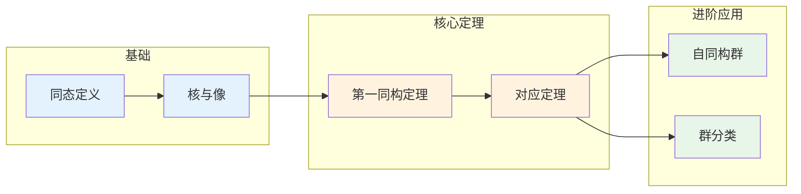

# 群同态 - 思维导图

## 概述

群同态是保持群结构的映射，它是研究群之间关系的根本工具。通过同态，我们可以比较不同群的代数结构，发现它们之间的内在联系。同态的核与像是理解群同态性质的核心概念。

---

## 核心思维导图

```mermaid
mindmap
  root((群同态<br/>Group Homomorphism))
    基本定义
      群同态
        φ: G → H
        φ(ab) = φ(a)φ(b)
      群同构
        双射同态
        G ≅ H
      群自同态
        φ: G → G
        End(G)
      群自同构
        双射自同态
        Aut(G)
    核与像
      核 Kernel
        ker(φ) = {g∈G: φ(g)=e}
        总是正规子群
      像 Image
        im(φ) = {φ(g): g∈G}
        H的子群
      基本关系
        G/ker(φ) ≅ im(φ)
    同态类型
      单同态 Monomorphism
        ker(φ) = {e}
        单射
      满同态 Epimorphism
        im(φ) = H
        满射
      同构 Isomorphism
        双射同态
        结构等价
    同态定理
      第一同构定理
        G/ker(φ) ≅ im(φ)
      对应定理
        子群对应
      同态复合
        ψ∘φ 仍是同态
    典型例子
      平凡同态
        φ(g) = e, ∀g
      嵌入映射
        H↪G, 子群嵌入
      投影映射
        G→G/N, 商群投影
      指数映射
        (ℝ,+)→(ℝ⁺,×)
```

---

## 同态结构图

```mermaid
graph TD
    subgraph 原群G
        G1[G]
        K[ker(φ)]
        G1 --- K
        a[a] --- b[b]
        a --- K
    end
    
    subgraph 同态映射
        phi[φ: G → H]
    end
    
    subgraph 目标群H
        H1[H]
        I[im(φ)]
        eH[e_H]
        H1 --- I
        I --- eH
        phia[φ(a)] --- phib[φ(b)]
    end
    
    a --> phi
    b --> phi
    K --> phi
    phi --> phia
    phi --> phib
    phi --> eH
    
    G1 -.->|商群| GmodK[G/ker(φ)]
    GmodK -.->|≅| I
    
    style K fill:#ffcdd2
    style I fill:#c8e6c9
    style GmodK fill:#fff3e0
```

---

## 同态分类

```mermaid
graph TD
    Hom[群同态<br/>φ: G→H] --> Mono[单同态<br/>Injective]
    Hom --> Epi[满同态<br/>Surjective]
    Hom --> Iso[同构<br/>Bijective]
    
    Mono --> M1[ker(φ)={e}]
    Mono --> M2[G嵌入H]
    Mono --> M3[G≅im(φ)≤H]
    
    Epi --> E1[im(φ)=H]
    Epi --> E2[G→H满射]
    Epi --> E3[H≅G/ker(φ)]
    
    Iso --> I1[ker(φ)={e}]
    Iso --> I2[im(φ)=H]
    Iso --> I3[G≅H]
    Iso --> I4[结构完全相同]
    
    style Hom fill:#e3f2fd
    style Mono fill:#fff3e0
    style Epi fill:#e8f5e9
    style Iso fill:#c8e6c9
```

---

## 核与像的性质

```mermaid
mindmap
  root((核与像<br/>Kernel & Image))
    核 ker(φ)
      定义
        {g∈G: φ(g)=e}
      性质
        总是正规子群
        ker(φ) ◁ G
      意义
        映射到单位元的元素
        信息丢失的部分
      应用
        判断单射
        构造商群
    像 im(φ)
      定义
        {φ(g)∈H: g∈G}
      性质
        H的子群
        im(φ) ≤ H
      意义
        同态能到达的范围
        信息保留的部分
      应用
        判断满射
        确定同态像结构
    基本定理
      第一同构定理
        G/ker(φ) ≅ im(φ)
      推论
        |G| = |ker(φ)|·|im(φ)|
        |im(φ)| = [G:ker(φ)]
```

---

## 同态定理体系

```mermaid
graph TD
    subgraph 同态基本定理
        F1[第一同构定理<br/>G/ker(φ) ≅ im(φ)]
        F2[对应定理<br/>子群 ↔ 商群子群]
        F3[同态分解定理<br/>φ = μ ∘ π ∘ ι]
    end
    
    subgraph 同态分解
        G[G] -->|π| GmodK[G/ker(φ)]
        GmodK -->|≅| I[im(φ)]
        I -->|ι| H[H]
    end
    
    F1 --> GmodK
    F1 --> I
    
    style F1 fill:#e3f2fd
    style F2 fill:#fff3e0
    style F3 fill:#e8f5e9
```

---

## 典型同态例子

```mermaid
graph LR
    subgraph 例子1: 行列式
        GLn[GLₙ(ℝ)] -->|det| Rstar[ℝ*]
        SLn[SLₙ(ℝ)] -->|ker(det)| e[1]
    end
    
    subgraph 例子2: 符号映射
        Sn[Sₙ] -->|sgn| C2[{±1} ≅ C₂]
        An[Aₙ] -->|ker(sgn)| 1[1]
    end
    
    subgraph 例子3: 指数映射
        R[(ℝ,+)] -->|exp| Rpos[(ℝ⁺,×)]
        ker[ker = {0}] --> e1[1]
    end
    
    subgraph 例子4: 模n投影
        Z[(ℤ,+)] -->|π| Zn[ℤ/nℤ]
        nZ[nℤ] -->|ker(π)| 0[0]
    end
    
    style GLn fill:#e3f2fd
    style SLn fill:#ffcdd2
    style Sn fill:#e3f2fd
    style An fill:#ffcdd2
```

---

## 同态例子详解表

| 同态 | 定义 | 核 | 像 | 类型 |
|------|------|-----|-----|------|
| **行列式** | $\det: GL_n(F) \to F^*$ | $SL_n(F)$ | $F^*$ | 满同态 |
| **符号映射** | $\text{sgn}: S_n \to \{\pm 1\}$ | $A_n$ | $\{\pm 1\} \cong C_2$ | 满同态 |
| **指数映射** | $\exp: (\mathbb{R},+) \to (\mathbb{R}^+, \times)$ | $\{0\}$ | $\mathbb{R}^+$ | 同构 |
| **模n投影** | $\pi: \mathbb{Z} \to \mathbb{Z}/n\mathbb{Z}$ | $n\mathbb{Z}$ | $\mathbb{Z}/n\mathbb{Z}$ | 满同态 |
| **平凡同态** | $\phi(g) = e$ | $G$ | $\{e\}$ | 同态 |
| **恒等同态** | $\text{id}_G: G \to G$ | $\{e\}$ | $G$ | 同构 |
| **共轭作用** | $\gamma_g(x) = gxg^{-1}$ | $\{e\}$ | 内自同构群 | 单同态 |
| **商投影** | $\pi: G \to G/N$ | $N$ | $G/N$ | 满同态 |

---

## 自同构群结构

```mermaid
mindmap
  root((自同构群<br/>Automorphism Group))
    内自同构
      定义
        γg(x) = gxg⁻¹
        Inn(G) = {γg : g∈G}
      性质
        Inn(G) ◁ Aut(G)
        Inn(G) ≅ G/Z(G)
      应用
        共轭类分析
        正规子群判定
    外自同构
      定义
        Out(G) = Aut(G)/Inn(G)
      意义
        非平凡对称性
        群的深层结构
    典型例子
      Aut(ℤ/nℤ)
        ≅ (ℤ/nℤ)*
        阶为φ(n)
      Aut(S₃)
        ≅ S₃
        Inn(S₃) = Aut(S₃)
      Aut(ℤ)
        ≅ C₂
        {id, x↦-x}
```

---

## 同态合成与分解

```mermaid
flowchart TD
    subgraph 同态合成
        A[G] -->|φ| B[H]
        B -->|ψ| C[K]
        A -->|ψ∘φ| C
    end
    
    subgraph 同态分解
        D[G] -->|π| E[G/ker(φ)]
        E -->|≅| F[im(φ)]
        F -->|ι| H[H]
        D -->|φ| H
    end
    
    subgraph 核与像关系
        ker[ker(ψ∘φ)] -->|包含| kerφ[ker(φ)]
        im[im(ψ∘φ)] -->|包含于| imψ[im(ψ)]
    end
    
    style A fill:#e3f2fd
    style B fill:#fff3e0
    style C fill:#e8f5e9
    style E fill:#c8e6c9
    style F fill:#c8e6c9
```

---

## 同态判定流程

```mermaid
flowchart TD
    Start([定义映射 φ:G→H]) --> Check1{φ(ab)=φ(a)φ(b)?}
    Check1 -->|否| NotHom[不是同态]
    Check1 -->|是| Hom[是同态]
    
    Hom --> Check2{ker(φ)={e}?}
    Check2 -->|是| Mono[单同态]
    Check2 -->|否| NotMono[非单同态]
    
    Hom --> Check3{im(φ)=H?}
    Check3 -->|是| Epi[满同态]
    Check3 -->|否| NotEpi[非满同态]
    
    Mono --> Check4{Epi?}
    Epi --> Check5{Mono?}
    Check4 -->|是| Iso[同构]
    Check5 -->|是| Iso
    
    style Hom fill:#fff3e0
    style Mono fill:#c8e6c9
    style Epi fill:#c8e6c9
    style Iso fill:#a5d6a7
    style NotHom fill:#ffcdd2
```

---

## 学习路径



---

## 重要公式速查

| 公式/性质 | 说明 |
|-----------|------|
| $\varphi(e_G) = e_H$ | 同态保持单位元 |
| $\varphi(g^{-1}) = \varphi(g)^{-1}$ | 同态保持逆元 |
| $\varphi(g^n) = \varphi(g)^n$ | 同态保持幂运算 |
| $|\text{im}(\varphi)| = [G : \ker(\varphi)]$ | 像的阶公式 |
| $\varphi$ 单射 $\Leftrightarrow \ker(\varphi) = \{e\}$ | 单射判定 |
| $\varphi$ 满射 $\Leftrightarrow \text{im}(\varphi) = H$ | 满射判定 |

---

## 与后续概念的联系

- **群作用**: 群到对称群的同态
- **表示论**: 群到矩阵群的同态
- **范畴论**: 群范畴中的态射
- **同调代数**: 链复形之间的同态

---

*文档版本：1.0*
*创建时间：2026年4月*
*分类：代数学 / 群论 / 思维导图*
