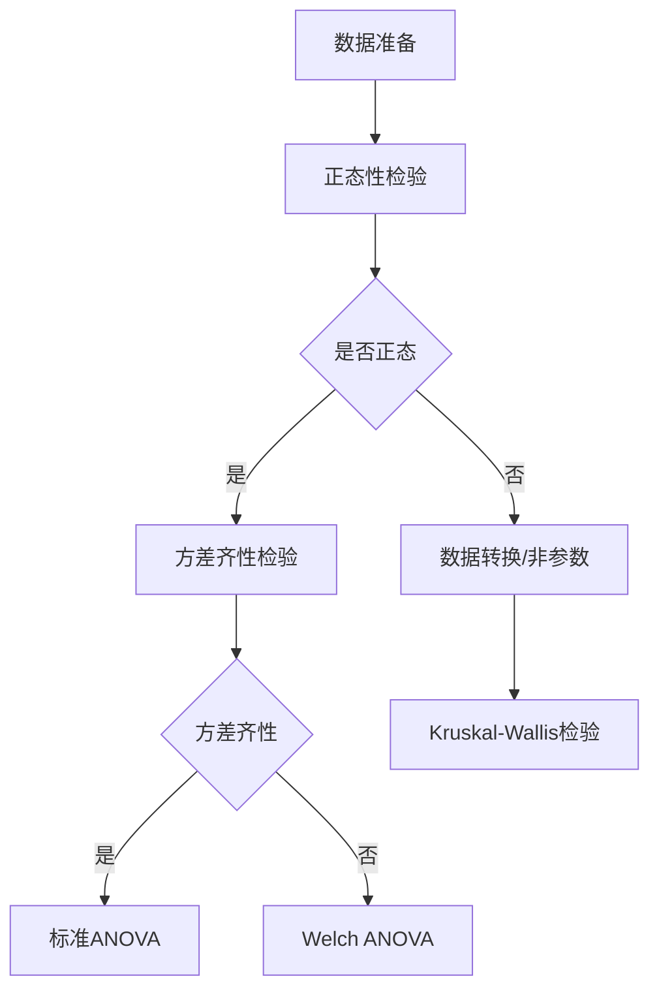
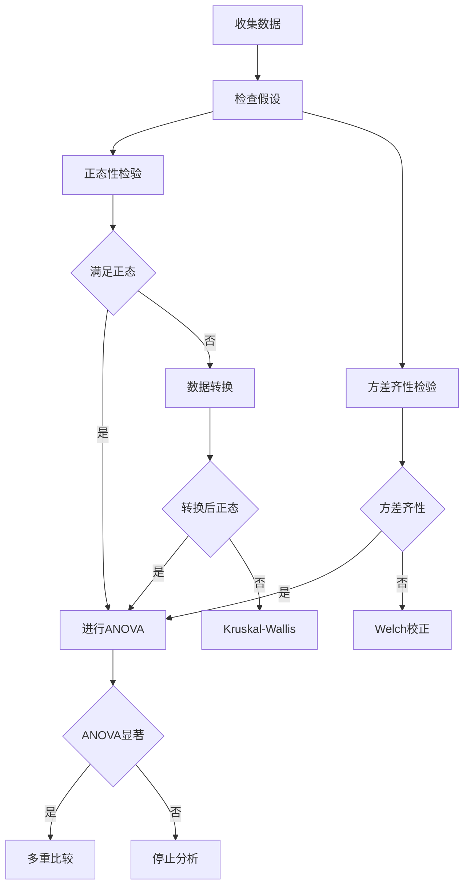

# 方差分析思维导图 / Analysis of Variance Mind Map

**主题编号**: MM.STAT.04
**创建日期**: 2026年4月4日
**最后更新**: 2026年4月4日

---

## 思维导图 / Mind Map

```mermaid
mindmap
  root((方差分析<br/>ANOVA))
    单因素方差分析
      基本模型
        Yij = μ + αi + εij
        约束条件
          Σαi = 0
        假设检验
          H₀: μ₁=μ₂=...=μk
          H₁: 至少两均值不等
      平方和分解
        总平方和SST
        组间平方和SSB
        组内平方和SSW
        SST = SSB + SSW
      F检验
        F = MSB/MSW
        拒绝域: F > Fα
      事后检验
        Tukey HSD
        Bonferroni
        Scheffé
    双因素方差分析
      无交互效应
        Yijk = μ + αi + βj + εijk
        主效应检验
      有交互效应
        Yijk = μ + αi + βj + (αβ)ij + εijk
        交互效应检验
        简单效应分析
      因素类型
        固定效应
        随机效应
        混合模型
    多重比较
      族错误率控制
        αFW = 1-(1-α)^c
      常用方法
        LSD
        Tukey
        Bonferroni
        Holm
        FDR
    方差分析假设
      正态性
        QQ图
        Shapiro检验
      方差齐性
        Levene检验
        Bartlett检验
      独立性
        实验设计保证
    实验设计
      完全随机设计
        CRD
        随机分组
      随机区组设计
        RCBD
        控制混杂因素
      拉丁方设计
        控制两个混杂
      析因设计
        多因素组合

```

---

## 核心概念详解 / Core Concepts

### 1. 单因素方差分析 / One-Way ANOVA

#### 模型设定

$$Y_{ij} = \mu + \alpha_i + \epsilon_{ij}, \quad i = 1,2,\ldots,k; \quad j = 1,2,\ldots,n_i$$

其中:
- μ: 总体均值
- αᵢ: 第i组的处理效应，满足 $\sum_{i=1}^{k} n_i\alpha_i = 0$ 或 $\sum_{i=1}^{k} \alpha_i = 0$
- εᵢⱼ ~ N(0, σ²): 随机误差

#### 假设检验

**原假设**: H₀: μ₁ = μ₂ = … = μₖ (所有组均值相等)

**备择假设**: H₁: 至少存在一对(i,j)，使得 μᵢ ≠ μⱼ

#### 平方和分解

```

┌─────────────────────────────────────────────────────────┐
│                    总变异 SST                            │
│              ΣᵢΣⱼ(Yᵢⱼ - Ȳ)²                              │
├─────────────────────────┬───────────────────────────────┤
│      组间变异 SSB        │        组内变异 SSW            │
│   Σᵢnᵢ(Ȳᵢ - Ȳ)²         │     ΣᵢΣⱼ(Yᵢⱼ - Ȳᵢ)²           │
│   (处理效应)             │       (随机误差)              │
└─────────────────────────┴───────────────────────────────┘

```

**方差分析表**:

| 来源 | 平方和 | 自由度 | 均方 | F值 |
|------|--------|--------|------|-----|
| 组间 | $SSB = \sum_i n_i(\bar{Y}_i - \bar{Y})^2$ | k-1 | $MSB = \frac{SSB}{k-1}$ | $\frac{MSB}{MSW}$ |
| 组内 | $SSW = \sum_i\sum_j(Y_{ij} - \bar{Y}_i)^2$ | N-k | $MSW = \frac{SSW}{N-k}$ | |
| 总计 | $SST = \sum_i\sum_j(Y_{ij} - \bar{Y})^2$ | N-1 | | |

**决策规则**:
- 若 F > Fₐ(k-1, N-k)，拒绝H₀
- p-value = P(F(k-1, N-k) > F观察值)

### 2. 双因素方差分析 / Two-Way ANOVA

#### 无交互效应模型

$$Y_{ijk} = \mu + \alpha_i + \beta_j + \epsilon_{ijk}$$

**假设检验**:
- H₀ₐ: α₁ = α₂ = … = αₐ = 0 (因素A无效应)
- H₀ᵦ: β₁ = β₂ = … = βᵦ = 0 (因素B无效应)

#### 有交互效应模型

$$Y_{ijk} = \mu + \alpha_i + \beta_j + (\alpha\beta)_{ij} + \epsilon_{ijk}$$

**额外假设检验**:
- H₀ₐᵦ: 所有(αβ)ᵢⱼ = 0 (无交互效应)

#### 方差分析表 (含交互)

| 来源 | 平方和 | 自由度 | 均方 | F值 |
|------|--------|--------|------|-----|
| 因素A | SSA | a-1 | MSA | MSA/MSE |
| 因素B | SSB | b-1 | MSB | MSB/MSE |
| 交互AB | SSAB | (a-1)(b-1) | MSAB | MSAB/MSE |
| 误差 | SSE | ab(n-1) | MSE | |
| 总计 | SST | abn-1 | | |

### 3. 多重比较 / Multiple Comparisons

#### 问题背景

进行c次两两比较时，族错误率:
$$\alpha_{FW} = 1 - (1-\alpha)^c$$

当k=5组时，c=C(5,2)=10，若α=0.05，则αFW≈40%

#### 常用方法对比

| 方法 | 公式/原理 | 适用场景 | 保守程度 |
|------|-----------|----------|----------|
| **LSD** | t检验 | 仅当ANOVA显著 | 最不保守 |
| **Tukey HSD** | $q_{\alpha,k,N-k}\sqrt{\frac{MSE}{n}}$ | 所有两两比较 | 中等 |
| **Bonferroni** | $\alpha^* = \alpha/c$ | 计划好的比较 | 较保守 |
| **Scheffé** | $\sqrt{(k-1)F_{\alpha,k-1,N-k}}$ | 所有可能对比 | 最保守 |
| **FDR** | 控制期望错误率 | 大规模比较 | 适中 |

#### Tukey HSD方法

**置信区间**:
$$(\bar{Y}_i - \bar{Y}_j) \pm q_{\alpha,k,N-k}\sqrt{\frac{MSE}{n}}$$

其中q是Studentized极差分布的分位数

---

## 方差分析假设检验 / Assumption Checking

### 假设条件

1. **独立性**: 观测值相互独立
2. **正态性**: 每组内数据来自正态分布
3. **方差齐性**: 各组方差相等

### 检验方法



#### 正态性检验

- **Shapiro-Wilk检验**: 小样本(n<50)，功效高
- **Kolmogorov-Smirnov检验**: 大样本
- **正态Q-Q图**: 直观判断

#### 方差齐性检验

- **Levene检验**: 对非正态稳健
- **Bartlett检验**: 正态假设下功效高

---

## 实验设计 / Experimental Design

### 常用设计类型

| 设计类型 | 特点 | 适用场景 | 优点 |
|----------|------|----------|------|
| **完全随机设计(CRD)** | 完全随机分组 | 实验单位同质 | 最简单 |
| **随机区组设计(RCBD)** | 区组内随机 | 存在已知混杂 | 提高精度 |
| **拉丁方设计** | 控制两个混杂 | 两个方向变异 | 高效 |
| **析因设计** | 多因素组合 | 研究交互效应 | 全面 |

### 区组设计示例

**模型**:
$$Y_{ij} = \mu + \tau_i + \beta_j + \epsilon_{ij}$$

其中:
- τᵢ: 处理效应
- βⱼ: 区组效应

---

## 应用案例 / Application Cases

### 案例1: 教学方法效果比较

**研究问题**: 三种教学方法对学生成绩的影响

**数据**:

| 方法 | 样本量 | 均值 | 标准差 |
|------|--------|------|--------|
| 传统 | 20 | 75.2 | 8.5 |
| 讨论 | 20 | 82.1 | 7.2 |
| 项目 | 20 | 85.6 | 6.8 |

**ANOVA结果**:
- F(2, 57) = 12.35, p < 0.001
- **结论**: 三种方法效果有显著差异

**Tukey HSD事后检验**:
- 传统 vs 讨论: p = 0.023
- 传统 vs 项目: p < 0.001
- 讨论 vs 项目: p = 0.245

### 案例2: 双因素实验

**因素**:
- A: 肥料类型(3种)
- B: 灌溉量(2种)

**结果**: 发现显著的交互效应

**简单效应分析**:
- 在低灌溉下，肥料效应不显著
- 在高灌溉下，肥料类型3显著优于其他

---

## 分析流程图 / Analysis Workflow



---

## 相关文档 / Related Documents

- [统计学](../12-应用数学/02-统计学.md)
- [假设检验思维导图](./02-假设检验-思维导图.md)
- [非参数统计思维导图](./06-非参数统计-思维导图.md)
- [多元统计分析思维导图](./07-多元统计分析-思维导图.md)

---

**参考文献 / References**:

1. Montgomery, D.C. "Design and Analysis of Experiments". 2017.
2. Kuehl, R.O. "Design of Experiments: Statistical Principles of Research Design and Analysis". 2000.
3. Maxwell, S.E. and Delaney, H.D. "Designing Experiments and Analyzing Data". 2004.
