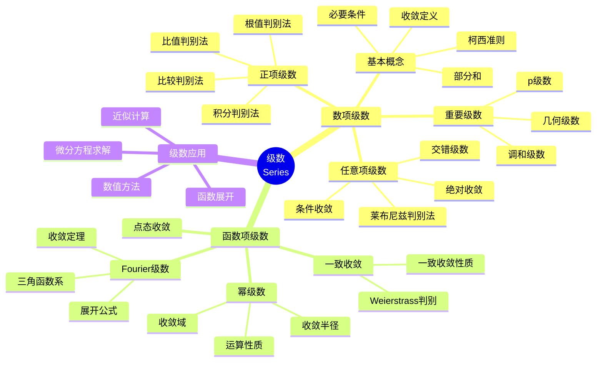
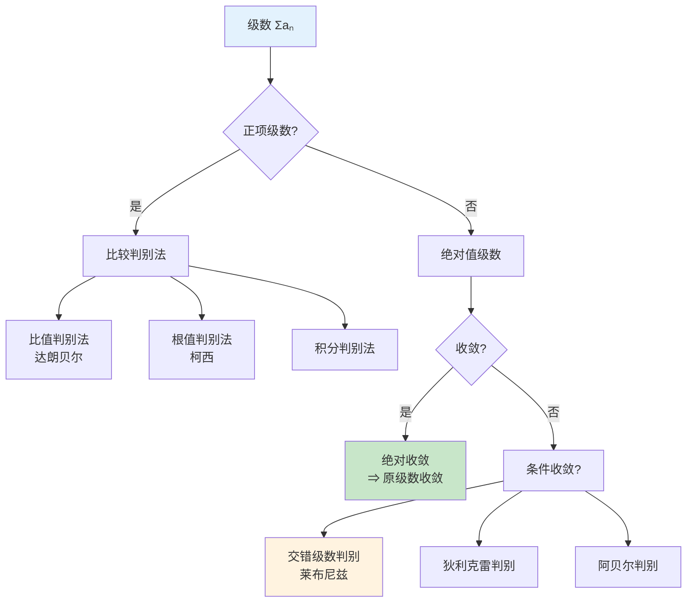
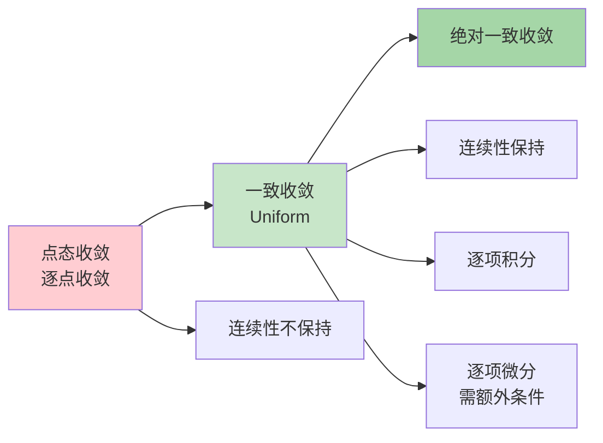
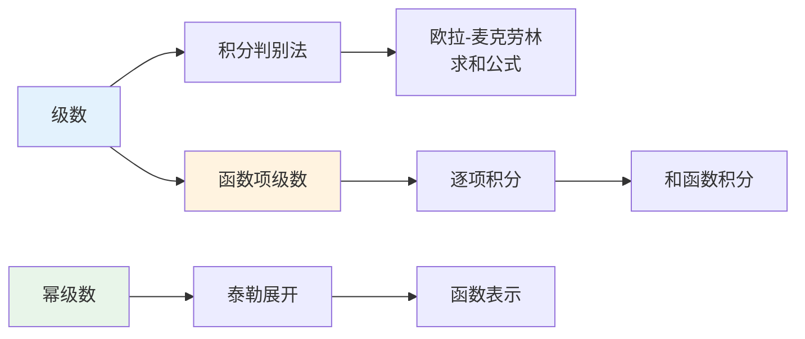

# 级数思维导图

## 概述

级数理论研究无穷多项求和的收敛性及其性质。从数项级数到函数项级数，级数是表示函数、求解微分方程和数值计算的重要工具。

---

## 核心思维导图



---

## 级数收敛判别体系



---

## 重要级数性质

| 级数类型 | 通项 | 收敛性 | 和（若收敛） |
|---------|------|--------|-------------|
| 几何级数 | $ar^{n-1}$ | $\|r\| < 1$ | $\frac{a}{1-r}$ |
| p级数 | $\frac{1}{n^p}$ | $p > 1$ | ζ(p) |
| 调和级数 | $\frac{1}{n}$ | 发散 | - |
| 交错调和 | $\frac{(-1)^{n-1}}{n}$ | 条件收敛 | $\ln 2$ |
| 指数级数 | $\frac{x^n}{n!}$ | 绝对收敛 ∀x | $e^x$ |
| 对数级数 | $\frac{(-1)^{n-1}x^n}{n}$ | $-1 < x \leq 1$ | $\ln(1+x)$ |

---

## 函数项级数收敛类型



---

## 幂级数理论

```mermaid
mindmap
  root((幂级数<br/>Σaₙxⁿ))
    收敛性质
      收敛半径R
        柯西-阿达马公式
        比值法求R
      收敛区间
        (-R,R)内绝对收敛
        端点单独判别
      一致收敛
        内闭一致收敛
    运算性质
      四则运算
      逐项求导
        导级数收敛半径相同
      逐项积分
        积分级数收敛半径相同
    和函数性质
      连续性
      可微性
      可积性
    泰勒展开
      展开条件
      唯一性
      应用
```

---

## 收敛半径计算公式

| 方法 | 公式 | 适用情形 |
|------|------|----------|
| 柯西-阿达马 | $R = \frac{1}{\limsup_{n\to\infty} \sqrt[n]{\|a_n\|}}$ | 通用 |
| 比值法 | $R = \lim_{n\to\infty} \|\frac{a_n}{a_{n+1}}\|$ | 极限存在 |
| 根值法 | $R = \lim_{n\to\infty} \frac{1}{\sqrt[n]{\|a_n\|}}$ | 极限存在 |

---

## Fourier级数

```mermaid
graph TD
    A[周期函数f(x)] --> B[Fourier展开]
    B --> C[正弦/余弦级数]
    
    C --> D[傅里叶系数]
    D --> E[a₀ = (1/π)∫f(x)dx]
    D --> F[aₙ = (1/π)∫f(x)cos(nx)dx]
    D --> G[bₙ = (1/π)∫f(x)sin(nx)dx]
    
    B --> H[收敛定理]
    H --> I[Dirichlet条件]
    H --> J[L²收敛]
    
    style A fill:#e3f2fd
    style B fill:#fff3e0
    style H fill:#e8f5e9
```

### Fourier级数形式

| 形式 | 公式 |
|------|------|
| 一般形式 | $f(x) \sim \frac{a_0}{2} + \sum_{n=1}^{\infty}(a_n\cos nx + b_n\sin nx)$ |
| 复数形式 | $f(x) \sim \sum_{n=-\infty}^{\infty} c_n e^{inx}$ |
| 余弦级数 | 偶延拓，$b_n = 0$ |
| 正弦级数 | 奇延拓，$a_n = 0$ |

---

## 级数与积分关系



---

## 学习路径


---

## 与其他概念的联系

- **微积分**: 级数展开是函数的解析表示
- **复分析**: 洛朗级数、留数计算的基础
- **微分方程**: 幂级数解法
- **数值分析**: 数值逼近和迭代方法
- **泛函分析**: 函数空间的正交展开

---

## 参考

- 《数学分析》陈纪修
- 《实分析与复分析》Rudin
- 《Fourier分析》Stein

---

*文档版本：1.1（质量提升版）*
*最后更新：2026年4月*
*分类：数学分析 / 级数理论 / 思维导图*
