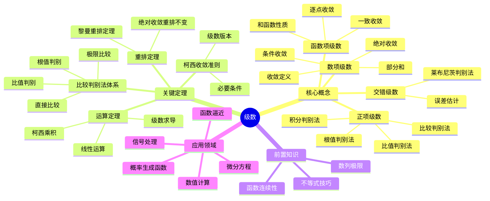

# 级数思维导图

## 概述
级数理论研究无穷多项求和，是分析学的重要工具。

## 核心要点

### 收敛类型
- **绝对收敛**: Σ|aₙ| 收敛 ⇒ Σaₙ 收敛
- **条件收敛**: Σaₙ 收敛但 Σ|aₙ| 发散
- **发散**: 部分和无极限

### 判别法体系
| 判别法 | 适用类型 | 条件 |
|--------|----------|------|
| 比较法 | 正项级数 | aₙ ≤ bₙ |
| 比值法 | 任意项 | lim\|aₙ₊₁/aₙ\| = L |
| 根值法 | 任意项 | lim\|aₙ\|^(1/n) = L |
| 积分法 | 正项递减 | f(n) = aₙ |

### 重要级数
- **调和级数**: Σ1/n 发散
- **p-级数**: Σ1/nᵖ, p>1收敛
- **几何级数**: Σrⁿ, |r|<1收敛

## 参考
- 《无穷级数》Knopp
- 《数学分析》徐森林
