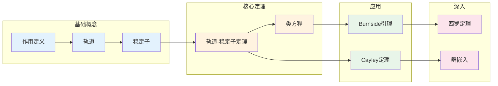

# 群作用 - 思维导图

## 概述

群作用是群论的核心概念之一，它描述了群如何在集合上"操作"。通过群作用，我们将抽象的群与具体的几何或组合结构联系起来，使群论成为研究对称性的强大工具。轨道-稳定子定理是群作用理论的基石。

---

## 核心思维导图

```mermaid
mindmap
  root((群作用<br/>Group Action))
    基本定义
      左作用
        G × X → X
        (g,x) ↦ g·x
      右作用
        X × G → X
        (x,g) ↦ x·g
      作用公理
        e·x = x
        (gh)·x = g·(h·x)
    轨道与稳定子
      轨道 Orbit
        G·x = {g·x : g∈G}
        元素x可达的所有位置
      稳定子 Stabilizer
        Gₓ = {g∈G : g·x = x}
        保持x不变的群元素
      轨道-稳定子定理

        |G·x| = [G : Gₓ]

    作用类型
      忠实作用
        ker = {e}
        不同元素作用不同
      自由作用
        Gₓ = {e}, ∀x
        无不动点
      传递作用
        一个轨道 = X
        可到达任意点
      正则作用
        忠实且传递
    应用
      计数
        Burnside引理
        Polya计数
      几何
        晶体群
        对称分类
      代数
        Cayley定理
        共轭作用

```

---

## 群作用结构图

```mermaid
graph TD
    subgraph 群G
        g1[g₁]
        g2[g₂]
        e[e]
    end
    
    subgraph 集合X
        x1[x₁]
        x2[x₂]
        x3[x₃]
        xn[xₙ]
    end
    
    subgraph 轨道分解
        O1[G·x₁ = {x₁, x₂}]
        O2[G·x₃ = {x₃, xₙ}]
    end
    
    g1 -->|作用| x1
    g1 -->|作用| x2
    g2 -->|作用| x3
    e -->|作用| x1
    e -->|作用| x2
    e -->|作用| x3
    
    x1 --> O1
    x2 --> O1
    x3 --> O2
    xn --> O2
    
    style G fill:#e3f2fd
    style X fill:#fff3e0
    style O1 fill:#c8e6c9
    style O2 fill:#c8e6c9

```

---

## 轨道-稳定子关系

```mermaid
graph TD
    subgraph 群G
        Gx[Gₓ 稳定子]
        Gx --- g1G[g₁Gₓ]
        Gx --- g2G[g₂Gₓ]
        Gx --- gnG[gₙGₓ]
    end
    
    subgraph 轨道G·x
        x[x = e·x]
        g1x[g₁·x]
        g2x[g₂·x]
        gnx[gₙ·x]
    end
    
    Gx -.->|1-1对应| x

    g1G -.-> g1x
    g2G -.-> g2x
    gnG -.-> gnx
    
    subgraph 定理
        Thm[|G·x| = [G:Gₓ]<br/>轨道大小 = 稳定子指数]

    end
    
    style Gx fill:#ffcdd2
    style G fill:#e3f2fd
    style Gx fill:#fff3e0
    style Thm fill:#c8e6c9

```

---

## 作用类型分类

```mermaid
graph TD
    A[群作用] --> F[忠实作用<br/>Faithful]
    A --> T[传递作用<br/>Transitive]
    A --> Fr[自由作用<br/>Free]
    
    F --> F1[kernel = {e}]
    F --> F2[G ↪ Sym(X)]
    
    T --> T1[单一轨道]
    T --> T2[G·x = X, ∀x]
    
    Fr --> Fr1[Gₓ = {e}, ∀x]
    Fr --> Fr2[无不动点]
    
    F --- C1{交集}
    T --- C1
    C1 --> R[正则作用<br/>Regular]
    
    R --> R1[忠实+传递+自由]
    R --> R2[G ≅ 轨道]
    R --> R3[|G| = |X|]
    
    style A fill:#e3f2fd
    style F fill:#fff3e0
    style T fill:#fff3e0
    style Fr fill:#fff3e0
    style R fill:#c8e6c9

```

---

## 类方程与计数

```mermaid
mindmap
  root((类方程<br/>Class Equation))
    共轭作用
      G在自身上的作用
      g·x = gxg⁻¹
    共轭类
      Cl(x) = {gxg⁻¹ : g∈G}
      元素的共轭轨道
    中心化子
      C_G(x) = {g : gx=xg}
      = 稳定子 Gₓ
    类方程

      |G| = |Z(G)| + Σ[G:C_G(xᵢ)]

    应用
      p-群有非平凡中心
      西罗定理证明
      单群分析

```

---

## 重要定理网络

```mermaid
graph TD
    subgraph 基本定理
        OST[轨道-稳定子定理<br/>|G·x| = [G:Gₓ]]
        CE[类方程<br/>|G| = |Z| + Σ[G:C(xᵢ)]]
        BL[Burnside引理<br/>|X/G| = (1/|G|)Σ|X^g|]

    end
    
    subgraph 应用定理
        CT[Cayley定理<br/>G ↪ Sₙ]
        ST[西罗定理]
        FT[费特-汤普森<br/>奇数阶可解]
    end
    
    OST --> CE
    OST --> BL
    CE --> ST
    CE --> FT
    OST --> CT
    
    style OST fill:#e3f2fd
    style CE fill:#e3f2fd
    style BL fill:#e3f2fd
    style CT fill:#c8e6c9
    style ST fill:#c8e6c9
    style FT fill:#c8e6c9

```

---

## 典型群作用例子

```mermaid
graph LR
    subgraph 例子1: 左平移
        G1[G] -->|g·x = gx| G2[G]

        K1[ker= {e}] --> F[忠实]
        T1[传递] --> R[正则作用]
    end
    
    subgraph 例子2: 共轭作用
        G3[G] -->|g·x = gxg⁻¹| G4[G]

        C[共轭类] --> Z[Z(G)]
        CC[中心化子] --> Orb[轨道]
    end
    
    subgraph 例子3: 陪集作用
        G5[G] -->|g·(aH) = (ga)H| Cos[G/H]

        K2[ker = ∩gHg⁻¹] --> Core[核=Core_G(H)]
        Trans[传递] --> N[正规化子]
    end
    
    subgraph 例子4: 对称群作用
        Sn[Sₙ] -->|自然作用| Set[{1,...,n}]

        Pr[传递] --> St[稳定子=Sₙ₋₁]
    end
    
    style G1 fill:#e3f2fd
    style G3 fill:#e3f2fd
    style G5 fill:#e3f2fd
    style Sn fill:#e3f2fd

```

---

## Burnside引理与计数

```mermaid
mindmap
  root((Burnside引理<br/>Burnside's Lemma))
    陈述

      |X/G| = (1/|G|) Σ |X^g|

      轨道数 = 平均不动点数
    证明思路
      双重计数
      Σ|Gₓ| = Σ|X^g|

    应用
      轨道计数
      染色问题
      分子结构
    与Polya定理关系
      Polya是Burnside的推广
      引入循环指标
    例子
      项链计数
      立方体染色
      化学分子

```

---

## 群作用例子详解表

| 作用名称 | 定义 | 轨道 | 稳定子 | 性质 |
|----------|------|------|--------|------|
| **左平移** | $g \cdot x = gx$ | $G$ | $\{e\}$ | 正则作用 |
| **右平移** | $x \cdot g = xg$ | $G$ | $\{e\}$ | 正则作用 |
| **共轭作用** | $g \cdot x = gxg^{-1}$ | 共轭类 | 中心化子 | 核=$Z(G)$ |
| **陪集作用** | $g \cdot (aH) = gaH$ | $G/H$ | $gHg^{-1}$ | 传递 |
| **左乘作用** | 在子群上 | 陪集 | 共轭子群 | 传递 |
| **凯莱作用** | $G$ 在自身 | 一个轨道 | $\{e\}$ | 忠实 |

---

## Cayley定理图示

```mermaid
graph TD
    subgraph 任意有限群G
        G1[G = {e, g₁, g₂, ...}]
    end
    
    subgraph 左平移作用
        A[g·x = gx 定义了<br/>同态 φ: G → Sym(G)]
    end
    
    subgraph 对称群Sym(G)
        S[Sym(G) ≅ Sₙ<br/>n = |G|]

    end
    
    subgraph 嵌入
        I[ker(φ) = {e}<br/>因为作用自由]
    end
    
    subgraph 结论
        C[G ↪ Sym(G) ≅ Sₙ<br/>每个有限群都是置换群的子群]
    end
    
    G1 --> A
    A --> S
    A --> I
    I --> C
    
    style G1 fill:#e3f2fd
    style S fill:#fff3e0
    style C fill:#c8e6c9

```

---

## 轨道计数公式

```mermaid
flowchart TD
    subgraph 基本计数
        A[|G| = |Gₓ| · |G·x|] --> B[轨道-稳定子]
        B --> C[|G·x| = [G:Gₓ]]

    end
    
    subgraph 类方程
        C --> D[|G| = |Z(G)| + Σ[G:C(xᵢ)]]

        D --> E[p-群有非平凡中心]
    end
    
    subgraph Burnside计数
        F[|X/G| = (1/|G|)Σ|X^g|] --> G[轨道数计算]

        G --> H[对称计数]
    end
    
    style A fill:#e3f2fd
    style B fill:#e3f2fd
    style C fill:#e3f2fd
    style D fill:#fff3e0
    style E fill:#fff3e0
    style F fill:#e8f5e9
    style G fill:#e8f5e9

```

---

## 学习路径



---

## 重要公式速查

| 公式 | 说明 |
|------|------|
| $|G \cdot x| = [G : G_x]$ | 轨道-稳定子定理 |
| $|G| = |G_x| \cdot |G \cdot x|$ | 轨道大小公式 |
| $|G| = |Z(G)| + \sum [G : C_G(x_i)]$ | 类方程 |
| $|X/G| = \frac{1}{|G|} \sum_{g \in G} |X^g|$ | Burnside引理 |
| $\text{ker}(\rho) = \bigcap_{x \in X} G_x$ | 作用核公式 |

---

## 与后续概念的联系

- **表示论**: 群在向量空间上的线性作用
- **拓扑学**: 覆叠空间与群作用
- **几何学**: 克莱因的埃尔兰根纲领
- **组合学**: 波利亚计数理论
- **数论**: 伽罗瓦群在根上的作用

---

*文档版本：1.0*
*创建时间：2026年4月*
*分类：代数学 / 群论 / 思维导图*
