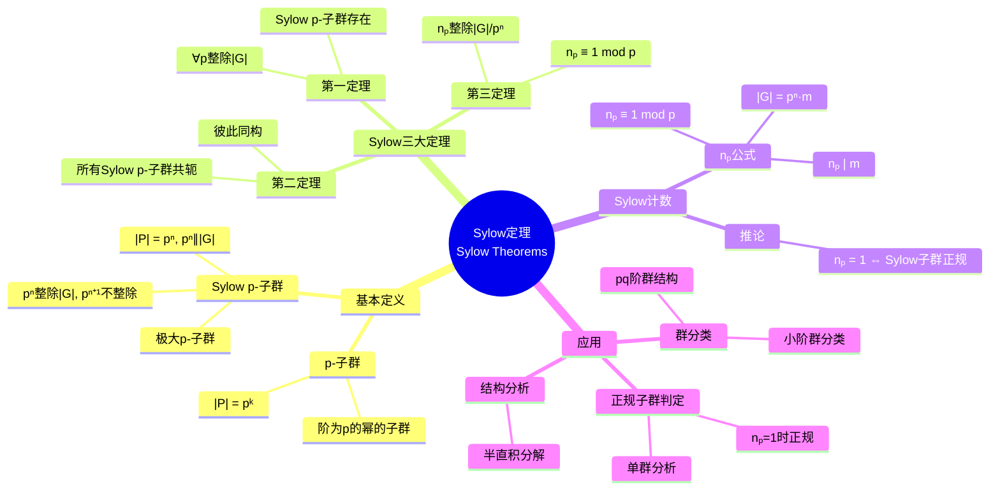
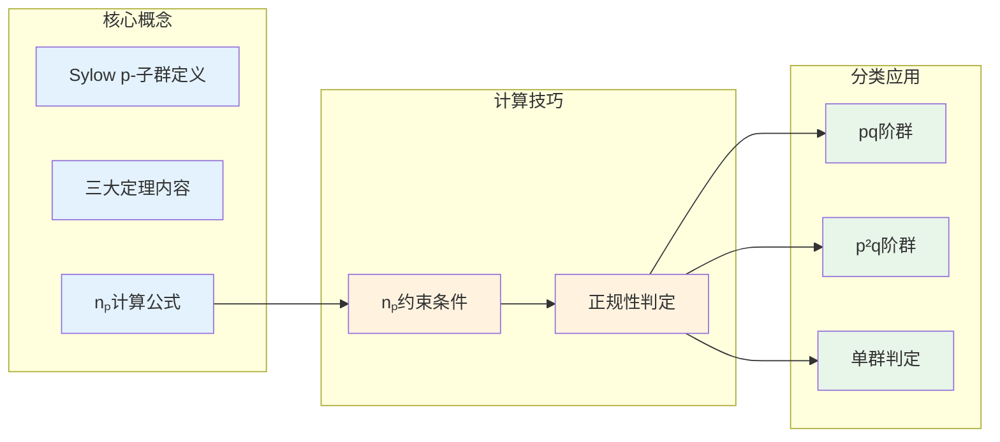

# Sylow定理 - 思维导图

## 概述

Sylow定理是有限群论中最基本、最重要的定理之一。它建立了有限群的阶与其p-子群结构之间的深刻联系，为分析有限群的结构提供了强有力的工具。Sylow定理不仅在理论上具有重要意义，也是解决有限群分类问题的关键步骤。

---

## 核心思维导图



---

## Sylow定理体系

```mermaid
graph TD
    subgraph 基本设定
        G[有限群 G]
        Order[|G| = pⁿ·m<br/>p∤m]

    end
    
    subgraph Sylow三大定理
        S1[第一定理<br/>存在性]
        S2[第二定理<br/>共轭性]
        S3[第三定理<br/>计数]
    end
    
    subgraph 存在性
        S1 --> P[∃ Sylow p-子群 P]
        S1 --> All[对所有p| |G|]

    end
    
    subgraph 共轭性
        S2 --> Conj[所有Sylow p-子群<br/>彼此共轭]
        S2 --> Iso[同构]
        S2 --> ConjAct[G在Sylow子群上<br/>作用传递]
    end
    
    subgraph 计数
        S3 --> Np[nₚ = |Sylₚ(G)|]
        S3 --> Div[nₚ | m]

        S3 --> Cong[nₚ ≡ 1 mod p]
    end
    
    G --> Order
    Order --> S1
    Order --> S2
    Order --> S3
    
    style G fill:#e3f2fd
    style S1 fill:#fff3e0
    style S2 fill:#fff3e0
    style S3 fill:#fff3e0
    style P fill:#c8e6c9

```

---

## Sylow子群结构

```mermaid
graph TD
    subgraph 群G的阶
        Order[|G| = p₁^a₁ · p₂^a₂ ··· pₖ^aₖ]

    end
    
    subgraph Sylow子群
        P1[Sylow p₁-子群 P₁]
        P2[Sylow p₂-子群 P₂]
        Pk[Sylow pₖ-子群 Pₖ]
    end
    
    subgraph 性质
        N1[n_{p₁} ≡ 1 mod p₁]
        N2[n_{p₂} ≡ 1 mod p₂]
        Nk[n_{pₖ} ≡ 1 mod pₖ]
    end
    
    Order --> P1
    Order --> P2
    Order --> Pk
    
    P1 --> N1
    P2 --> N2
    Pk --> Nk
    
    P1 -.->|直积?| G
    P2 -.->|直积?| G
    Pk -.->|直积?| G
    
    style Order fill:#e3f2fd
    style P1 fill:#fff3e0
    style P2 fill:#fff3e0
    style Pk fill:#fff3e0

```

---

## 证明思路

```mermaid
flowchart TD
    subgraph 第一定理证明
        A1[G作用于X=G/P的子集<br/>|X|=C(|G|, pⁿ)]

        A2[轨道-稳定子]
        A3[存在轨道大小<br/>与p互素]
        A4[稳定子即为<br/>Sylow p-子群]
    end
    
    subgraph 第二定理证明
        B1[G共轭作用于<br/>Sylow子群集合]
        B2[应用轨道-稳定子]
        B3[证明单一轨道]
    end
    
    subgraph 第三定理证明
        C1[固定一个Sylow子群P]
        C2[P作用于所有<br/>Sylow子群集合]
        C3[计算不动点]
        C4[得出同余条件]
    end
    
    style A1 fill:#e3f2fd
    style B1 fill:#fff3e0
    style C1 fill:#e8f5e9

```

---

## nₚ的可能取值

```mermaid
graph TD
    subgraph nₚ的约束条件
        C1[nₚ | m]

        C2[nₚ ≡ 1 mod p]
        C3[nₚ = [G : N_G(P)]]
    end
    
    subgraph 特殊情况
        S1[nₚ = 1] --> N[P ◁ G<br/>Sylow子群正规]
        S2[nₚ = p+1] --> I[p²阶群]
        S3[nₚ = |G|/pⁿ] --> E[N_G(P) = P]

    end
    
    subgraph 应用
        A1[单群分析<br/>nₚ > 1]
        A2[半直积结构]
        A3[群嵌入S_{nₚ}]
    end
    
    C1 --> S1
    C2 --> S1
    C1 --> S2
    C2 --> S2
    S1 --> A1
    S2 --> A2
    N --> A2
    
    style C1 fill:#e3f2fd
    style C2 fill:#e3f2fd
    style S1 fill:#c8e6c9
    style N fill:#c8e6c9

```

---

## 典型应用：pq阶群分类

```mermaid
mindmap
  root((pq阶群<br/>p<q primes))
    阶数分析

      |G| = pq
      Sylow p-子群 P, |P|=p
      Sylow q-子群 Q, |Q|=q

    n_q分析
      n_q | p

      n_q ≡ 1 mod q
      因为p<q, 所以n_q=1
      Q ◁ G 正规
    n_p分析
      n_p | q

      n_p ≡ 1 mod p
      可能: n_p=1 或 n_p=q
    情况1: n_p=1
      P ◁ G
      G = P × Q ≅ C_p × C_q ≅ C_{pq}
      循环群, 阿贝尔
    情况2: n_p=q
      q ≡ 1 mod p
      G = Q ⋊ P 半直积
      非阿贝尔群
      例子: S₃, p=2,q=3
    结论
      pq阶群最多两种
      阿贝尔: C_{pq}
      非阿贝尔: 当q≡1 mod p时存在

```

---

## 单群判定应用

```mermaid
flowchart TD
    subgraph 单群判定条件
        A[|G| = pⁿ·m] --> B[nₚ > 1 对所有p| |G|]

        B --> C[否则存在正规Sylow子群]
    end
    
    subgraph 例子: p²q阶群
        D[|G| = p²q] --> E[nₚ分析]

        E --> F[n_q分析]
        F --> G[总存在正规Sylow子群]
        G --> H[p²q阶群非单]
    end
    
    subgraph 小阶单群
        I[|G| = 60] --> J[n₅ = 6]

        J --> K[n₃ = 10]
        K --> L[n₂ = 15或5]
        L --> M[A₅ 是单群]
    end
    
    style B fill:#e3f2fd
    style G fill:#c8e6c9
    style M fill:#c8e6c9

```

---

## 群分类例子

```mermaid
graph TD
    subgraph 阶数分类
        O1[|G| = p] --> C1[循环群 Cₚ]
        O2[|G| = p²] --> C2[C_{p²} 或 Cₚ×Cₚ]
        O3[|G| = pq, p<q] --> C3[循环或半直积]
        O4[|G| = p³] --> C4[5种群]
        O5[|G| = 12] --> C5[5种群]

    end
    
    subgraph Sylow分析关键
        S1[nₚ=1 ⇒ 正规]
        S2[半直积结构]
        S3[自同构作用]
    end
    
    O2 -.-> S1
    O3 -.-> S1
    O3 -.-> S2
    O4 -.-> S1
    O4 -.-> S2
    
    style O1 fill:#e3f2fd
    style O2 fill:#fff3e0
    style O3 fill:#fff3e0
    style O4 fill:#e8f5e9
    style C1 fill:#c8e6c9

```

---

## 重要推论总结

| 推论 | 陈述 | 应用 |
|------|------|------|
| **Cauchy定理** | $p \mid |G| \Rightarrow \exists$ 元素阶为 $p$ | 元素存在性 |
| **正规性判定** | $n_p = 1 \Leftrightarrow$ Sylow $p$-子群正规 | 正规子群判定 |
| **可解性** | $p$-群可解 | 归纳证明 |
| **嵌入** | $G$ 嵌入 $S_{n_p}$ | 群表示 |
| **结构分解** | $n_p = n_q = 1 \Rightarrow G \cong P \times Q$ | 直积分解 |

---

## 学习要点



---

## 重要公式速查

| 公式/性质 | 说明 |
|-----------|------|
| $|P| = p^n$ 其中 $p^n \| |G|$ | Sylow子群阶 |
| $n_p \equiv 1 \pmod{p}$ | Sylow计数同余 |
| $n_p \mid m$ 其中 $|G| = p^n m$ | Sylow计数整除 |
| $n_p = [G : N_G(P)]$ | Sylow计数公式 |
| $n_p = 1 \Leftrightarrow P \trianglelefteq G$ | 正规性判定 |
| $G$ 单群 $\Rightarrow n_p > 1$ 对所有 $p$ | 单群必要条件 |

---

## 与后续概念的联系

- **有限单群分类**: Sylow定理是分类的基础工具
- **可解群理论**: 通过Sylow子群的可解性分析
- **表示论**: Sylow子群的表示诱导
- **代数数论**: 伽罗瓦群的Sylow子群与局部域

---

*文档版本：1.0*
*创建时间：2026年4月*
*分类：代数学 / 群论 / 思维导图*
