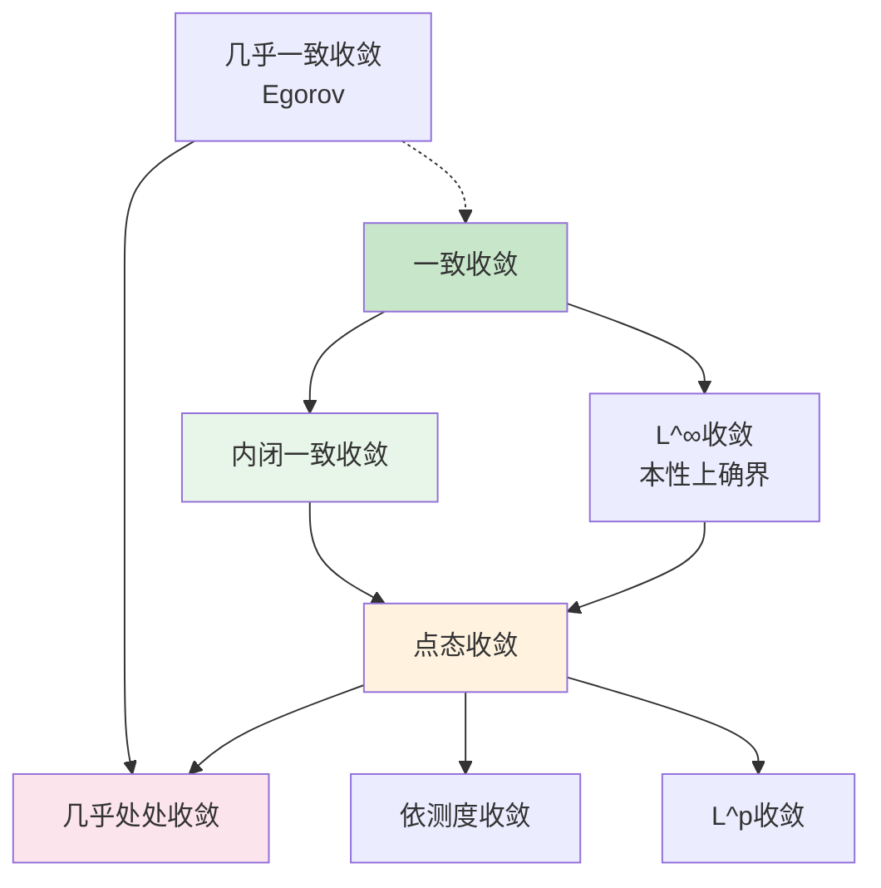

# 一致收敛思维导图

## 概述

一致收敛是函数序列和函数项级数的重要收敛概念，比点态收敛更强。它保证了极限函数的连续性、可积性和可微性，是分析学中的核心概念。

---

## 核心思维导图

```mermaid
mindmap
  root((一致收敛<br/>Uniform Convergence))
    基本概念
      点态收敛
        逐点定义
        ∀x: lim fₙ(x)=f(x)
      一致收敛
        sup范数收敛
        ∀ε, ∃N, ∀n≥N, ∀x: |fₙ(x)-f(x)|<ε
      内闭一致收敛
        紧集上一致收敛
      几乎处处收敛
        测度论概念
    判别方法
      Weierstrass判别
        M-判别法
        ΣMₙ收敛 ⇒ Σfₙ一致收敛
      Abel判别法
        部分和有界
        单调趋于0
      Dirichlet判别法
        部分和一致有界
        单调趋于0
      Dini定理
        紧集上单调连续
        ⇒ 一致收敛
    重要性质
      连续性保持
        fₙ连续 ∧ 一致收敛
        ⇒ f连续
      积分交换
        一致收敛 ⇒ 逐项积分
      微分交换
        导数一致收敛 + 某点收敛
        ⇒ 逐项微分
      有界性保持
    应用
      幂级数
        内闭一致收敛
      Fourier级数
        部分和性质
      函数逼近
        Weierstrass定理
      微分方程
        解的存在性
    相关概念
      等度连续性
        Ascoli定理
      紧开拓扑
        函数空间拓扑
      一致空间
        一致结构
```

---

## 收敛层次结构



---

## 一致收敛 vs 点态收敛

| 性质 | 点态收敛 | 一致收敛 |
|------|----------|----------|
| 定义 | ∀x, ∀ε, ∃N(ε,x) | ∀ε, ∃N(ε), ∀x |
| 连续性 | 不一定保持 | 保持 |
| 积分 | 不一定可交换 | 可逐项积分 |
| 微分 | 不一定可交换 | 需导数一致收敛 |
| 有界性 | 不一定保持 | 保持 |
| 完备性 | 不完备 | C(X)完备 |

---

## 判别法总结

```mermaid
flowchart TD
    A[判断一致收敛] --> B{函数序列?}
    
    B -->|是| C{sup|fₙ-f|→0?}
    C -->|是| D[一致收敛]
    C -->|否| E[不一致收敛]
    
    B -->|否| F{函数项级数}
    F --> G{ΣMₙ收敛?}
    G -->|是| H[M-判别法<br/>一致收敛]
    
    G -->|否| I{交错级数?}
    I -->|是| J[Leibniz判别]
    
    I -->|否| K{部分和有界?}
    K -->|是| L{单调趋于0?}
    L -->|一致| M[Dirichlet判别]
    L -->|点态| N[Abel判别]
    
    style D fill:#c8e6c9
    style H fill:#c8e6a7
    style E fill:#ffcdd2
```

---

## 重要定理

| 定理 | 条件 | 结论 |
|------|------|------|
| **连续性** | $f_n \in C(X)$，一致收敛于 $f$ | $f \in C(X)$ |
| **逐项积分** | $f_n$ 在 $[a,b]$ 上一致收敛 | $\int_a^b \lim f_n = \lim \int_a^b f_n$ |
| **逐项微分** | $f_n'$ 一致收敛，$f_n(x_0)$ 收敛 | $(\lim f_n)' = \lim f_n'$ |
| **Dini** | 紧集上单调连续序列收敛于连续函数 | 一致收敛 |
| **Weierstrass** | 多项式一致逼近连续函数 | 在紧集上成立 |

---

## 一致收敛与运算交换

```mermaid
graph LR
    A[一致收敛] --> B[极限交换<br/>lim lim fₙ = lim lim fₙ]
    A --> C[积分交换<br/>∫ lim fₙ = lim ∫ fₙ]
    
    D[导数一致收敛] --> E[微分交换<br/>(lim fₙ)' = lim fₙ']
    
    F[等度连续] --> G[Ascoli定理<br/>相对紧性]
    
    style A fill:#e3f2fd
    style D fill:#fff3e0
    style F fill:#e8f5e9
```

---

## 应用：函数空间

```mermaid
mindmap
  root((函数空间<br/>C(X)))
    一致范数
      ‖f‖∞ = sup|f(x)|
      上确界范数
    完备性
      一致极限
      Banach空间
    紧性
      Arzelà-Ascoli
        一致有界
        等度连续
    应用
      存在性定理
      不动点定理
      逼近理论
```

---

## 学习路径


---

## 与其他概念的联系

- **泛函分析**: 赋范空间、Banach空间、算子理论
- **实分析**: Egorov定理、Lusin定理
- **复分析**: 解析函数列的一致收敛性
- **拓扑学**: 紧开拓扑、函数空间拓扑
- **逼近论**: Weierstrass逼近定理、Fourier级数

---

## 参考

- 《数学分析原理》Rudin
- 《实分析与复分析》Rudin
- 《泛函分析》张恭庆

---

*文档版本：1.1（质量提升版）*
*最后更新：2026年4月*
*分类：数学分析 / 收敛理论 / 思维导图*
