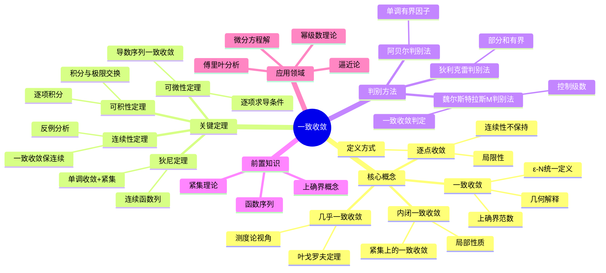

# 一致收敛思维导图

## 概述
一致收敛是函数序列收敛的强化形式，保证极限函数的优良性质。

## 核心要点

### 一致收敛定义
$$\forall ε>0, \exists N, \forall n>N, \forall x∈E: |f_n(x)-f(x)|<ε$$

**关键区别**: N 不依赖于 x

### 重要性质
| 性质 | 逐点收敛 | 一致收敛 |
|------|----------|----------|
| 连续性 | 不保证 | 保证 |
| 可积性 | 不保证 | 保证 |
| 可微性 | 不保证 | 附加条件保证 |

### 魏尔斯特拉斯M判别法
若 |fₙ(x)| ≤ Mₙ 且 ΣMₙ 收敛，则 Σfₙ(x) 一致收敛。

## 参考
- 《实变函数与泛函分析》夏道行
- 《数学分析中的典型问题》裴礼文
