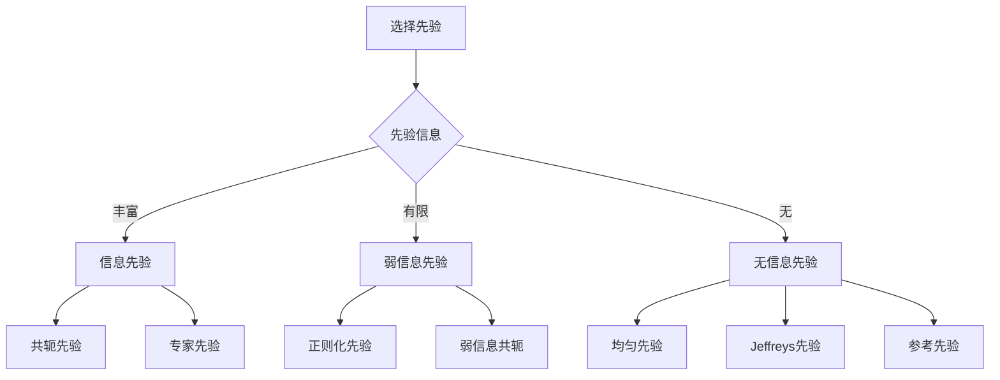
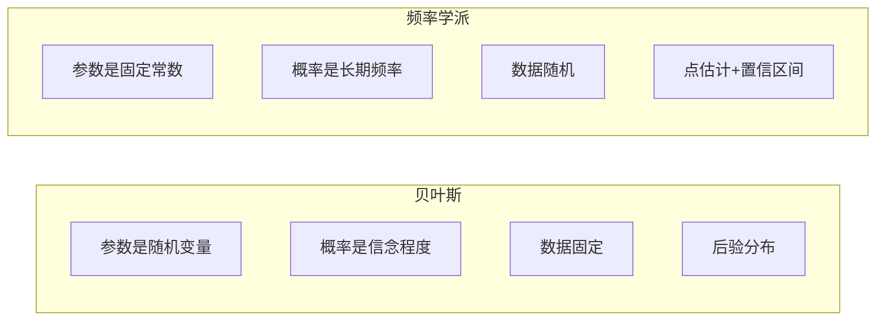

# 贝叶斯统计思维导图 / Bayesian Statistics Mind Map

**主题编号**: MM.STAT.05
**创建日期**: 2026年4月4日
**最后更新**: 2026年4月4日

---

## 思维导图 / Mind Map

```mermaid
mindmap
  root((贝叶斯统计<br/>Bayesian<br/>Statistics))
    基本理论
      贝叶斯定理
        P(θ|y) = P(y|θ)P(θ)/P(y)

        后验 ∝ 似然 × 先验
      核心概念
        先验分布
          先验选择
            信息先验
            无信息先验
            弱信息先验
        似然函数
          数据信息
          模型假设
        后验分布
          参数推断基础
          预测分布
        证据因子
          边际似然
          模型比较
    先验分布
      共轭先验
        二项-贝塔
        正态-正态
        泊松-伽马
        指数-伽马
      Jeffreys先验
        无信息先验
        参数变换不变
        Fisher信息
      主观先验
        专家知识
        历史数据
    后验推断
      点估计
        后验均值
        后验中位数
        最大后验MAP
      区间估计
        可信区间
        最高后验密度HPD
      假设检验
        贝叶斯因子
        后验概率
    计算方法
      解析解
        共轭先验
        显式公式
      数值方法
        MCMC
          Gibbs采样
          Metropolis-Hastings
        变分推断
        拉普拉斯近似
    预测与模型选择
      后验预测分布
        新数据预测
        模型检验
      模型比较
        贝叶斯因子
        DIC
        WAIC
        LOO-CV
    层次模型
      随机效应
      混合效应
      多层模型

```

---

## 核心概念详解 / Core Concepts

### 1. 贝叶斯定理 / Bayes' Theorem

#### 基本形式

$$P(\theta|y) = \frac{P(y|\theta)P(\theta)}{P(y)} = \frac{P(y|\theta)P(\theta)}{\int P(y|\theta)P(\theta)d\theta}$$

其中:
- $P(\theta)$: **先验分布** - 观测数据前对参数的认知
- $P(y|\theta)$: **似然函数** - 数据在给定参数下的概率
- $P(\theta|y)$: **后验分布** - 观测数据后对参数的更新认知

- $P(y)$: **证据/边际似然** - 数据的边际概率

**核心关系**:
$$\text{后验} \propto \text{似然} \times \text{先验}$$

### 2. 先验分布 / Prior Distribution

#### 先验选择策略



#### 常用共轭先验

| 似然 | 先验 | 后验 | 超参数更新 |
|------|------|------|------------|
| Binomial(n,θ) | Beta(α,β) | Beta(α+y, β+n-y) | α' = α+y, β' = β+n-y |
| Poisson(λ) | Gamma(α,β) | Gamma(α+Σyᵢ, β+n) | α' = α+Σyᵢ, β' = β+n |
| Normal(μ,σ²) | N(μ₀,τ²) | N(μₙ,τₙ²) | 见下方公式 |
| Multinomial | Dirichlet(α) | Dirichlet(α+y) | α'ⱼ = αⱼ+yⱼ |

**正态-正态共轭**:
$$\mu_n = \frac{\frac{\mu_0}{\tau_0^2} + \frac{n\bar{y}}{\sigma^2}}{\frac{1}{\tau_0^2} + \frac{n}{\sigma^2}}, \quad \frac{1}{\tau_n^2} = \frac{1}{\tau_0^2} + \frac{n}{\sigma^2}$$

#### 无信息先验

**Jeffreys先验**:
$$p(\theta) \propto \sqrt{I(\theta)}$$

其中 $I(\theta) = -E[\frac{\partial^2}{\partial\theta^2}\ln p(y|\theta)]$ 是Fisher信息量

**常用Jeffreys先验**:
- 二项比例: θ ~ Beta(1/2, 1/2)
- 正态均值(σ已知): 均匀分布
- 正态方差: p(σ²) ∝ 1/σ²

### 3. 后验推断 / Posterior Inference

#### 点估计

| 估计量 | 公式 | 特点 |
|--------|------|------|
| **后验均值** | $E[\theta\|y]$ | 最小化后验期望平方损失 |
| **后验中位数** | median(θ\|y) | 最小化后验期望绝对损失 |
| **MAP估计** | $\arg\max_\theta p(\theta\|y)$ | 后验众数，类似MLE |

#### 区间估计

**可信区间 (Credible Interval)**:
$$P(a \leq \theta \leq b | y) = 1 - \alpha$$

**最高后验密度区间 (HPD)**:
$$\{\theta: p(\theta|y) \geq k\}$$

其中k选择使得区间概率为1-α

**对比**: 贝叶斯HPD vs 频率学置信区间

| 特性 | 贝叶斯HPD | 频率学CI |
|------|-----------|----------|
| 解释 | "θ在区间内的概率是95%" | "重复抽样，95%的区间包含θ" |
| 条件 | 基于观测数据 | 基于重复抽样 |
| 形状 | 可以不对称 | 通常对称 |

#### 假设检验

**贝叶斯因子**:
$$BF_{10} = \frac{p(y|H_1)}{p(y|H_0)} = \frac{\int p(y|\theta_1,H_1)p(\theta_1|H_1)d\theta_1}{\int p(y|\theta_0,H_0)p(\theta_0|H_0)d\theta_0}$$

**解释尺度** (Jeffreys):

| BF₁₀ | 证据强度 |
|------|----------|
| 1-3 | 微弱 |
| 3-10 | 中等 |
| 10-30 | 强 |
| 30-100 | 很强 |
| >100 | 决定性 |

**后验概率**:
$$P(H_1|y) = \frac{BF_{10} \cdot P(H_1)}{BF_{10} \cdot P(H_1) + P(H_0)}$$

### 4. 计算方法 / Computational Methods

#### MCMC方法

**Gibbs采样**:

```

1. 初始化 θ⁽⁰⁾
2. 对于 t = 1, 2, ..., T:
   θ₁⁽ᵗ⁾ ~ p(θ₁|θ₂⁽ᵗ⁻¹⁾, ..., θₖ⁽ᵗ⁻¹⁾, y)
   θ₂⁽ᵗ⁾ ~ p(θ₂|θ₁⁽ᵗ⁾, θ₃⁽ᵗ⁻¹⁾, ..., θₖ⁽ᵗ⁻¹⁾, y)

   ...
   θₖ⁽ᵗ⁾ ~ p(θₖ|θ₁⁽ᵗ⁾, ..., θₖ₋₁⁽ᵗ⁾, y)

```

**Metropolis-Hastings算法**:

```

1. 初始化 θ⁽⁰⁾
2. 对于 t = 1, 2, ..., T:
   a. 从建议分布生成 θ* ~ q(θ*|θ⁽ᵗ⁻¹⁾)
   b. 计算接受概率 α = min(1, [p(θ*|y)q(θ⁽ᵗ⁻¹⁾|θ*)] / [p(θ⁽ᵗ⁻¹⁾|y)q(θ*|θ⁽ᵗ⁻¹⁾)])

   c. 以概率α接受θ*，否则保持θ⁽ᵗ⁻¹⁾

```

#### 诊断与收敛

- **迹线图 (Trace Plot)**: 检查混合情况
- **自相关图**: 评估采样效率
- **Gelman-Rubin统计量 (R̂)**: < 1.1表示收敛
- **有效样本量 (ESS)**: 评估独立样本等价数

### 5. 模型比较 / Model Comparison

#### 常用准则

| 准则 | 公式 | 解释 |
|------|------|------|
| **DIC** | $-2\ln p(y|\hat{\theta}_{Bayes}) + 2p_D$ | 类似AIC，考虑模型复杂度 |
| **WAIC** | $-2\sum_i \ln E[p(y_i|\theta)] + 2p_{WAIC}$ | 完全贝叶斯，使用全后验 |
| **LOO-CV** | $-2\sum_i \ln p(y_i|y_{-i})$ | 留一交叉验证 |
| **边际似然** | $p(y) = \int p(y|\theta)p(\theta)d\theta$ | 用于贝叶斯因子 |

---

## 层次贝叶斯模型 / Hierarchical Bayesian Models

### 基本结构

```

数据层:    yᵢⱼ ~ p(y|θⱼ)
组层:      θⱼ ~ p(θ|φ)

超先验:    φ ~ p(φ)

```

### 示例: 八所学校问题

**模型**:
- $y_j \sim N(\theta_j, \sigma_j^2)$ (观测效应)
- $\theta_j \sim N(\mu, \tau^2)$ (真实效应)
- $\mu \sim N(0, 10^2)$, $\tau \sim \text{Half-Cauchy}(0, 5)$ (超先验)

**特点**: 通过部分池化实现收缩估计

---

## 应用案例 / Application Cases

### 案例1: 药物试验贝叶斯分析

**背景**: 评估新药相对于标准药的有效性

**数据**: 新药组100人，65人有效；标准组100人，50人有效

**模型**: 二项-贝塔共轭
- 先验: θ ~ Beta(1, 1) (均匀先验)
- 新药后验: θ₁ ~ Beta(66, 36)
- 标准药后验: θ₀ ~ Beta(51, 51)

**推断**:
- P(θ₁ > θ₀ | data) = 0.97

- 后验均值差: 0.15 (95% CI: [0.02, 0.28])

**结论**: 新药更有效的后验概率为97%

### 案例2: 贝叶斯回归

**模型**:
$$y_i = \beta_0 + \beta_1 x_i + \epsilon_i, \quad \epsilon_i \sim N(0, \sigma^2)$$

**先验**:
- β₀, β₁ ~ N(0, 100)
- σ² ~ Inverse-Gamma(0.01, 0.01)

**结果**: 后验分布提供完整的不确定性量化

---

## 贝叶斯 vs 频率学派 / Bayesian vs Frequentist



| 方面 | 贝叶斯 | 频率学派 |
|------|--------|----------|
| 参数 | 随机变量 | 固定未知常数 |
| 概率解释 | 主观信念 | 长期频率 |
| 推断基础 | 后验分布 | 抽样分布 |
| 区间解释 | "θ在区间内" | "区间包含θ" |
| 样本量 | 任意 | 大样本理论 |
| 先验信息 | 显式纳入 | 不纳入 |

---

## 相关文档 / Related Documents

- [统计学](../12-应用数学/02-统计学.md)
- [参数估计思维导图](./01-参数估计-思维导图.md)
- [回归分析思维导图](./03-回归分析-思维导图.md)

---

**参考文献 / References**:

1. Gelman, A. et al. "Bayesian Data Analysis". 2013.
2. McElreath, R. "Statistical Rethinking". 2020.
3. Kruschke, J.K. "Doing Bayesian Data Analysis". 2015.
4. Robert, C.P. "The Bayesian Choice". 2007.
