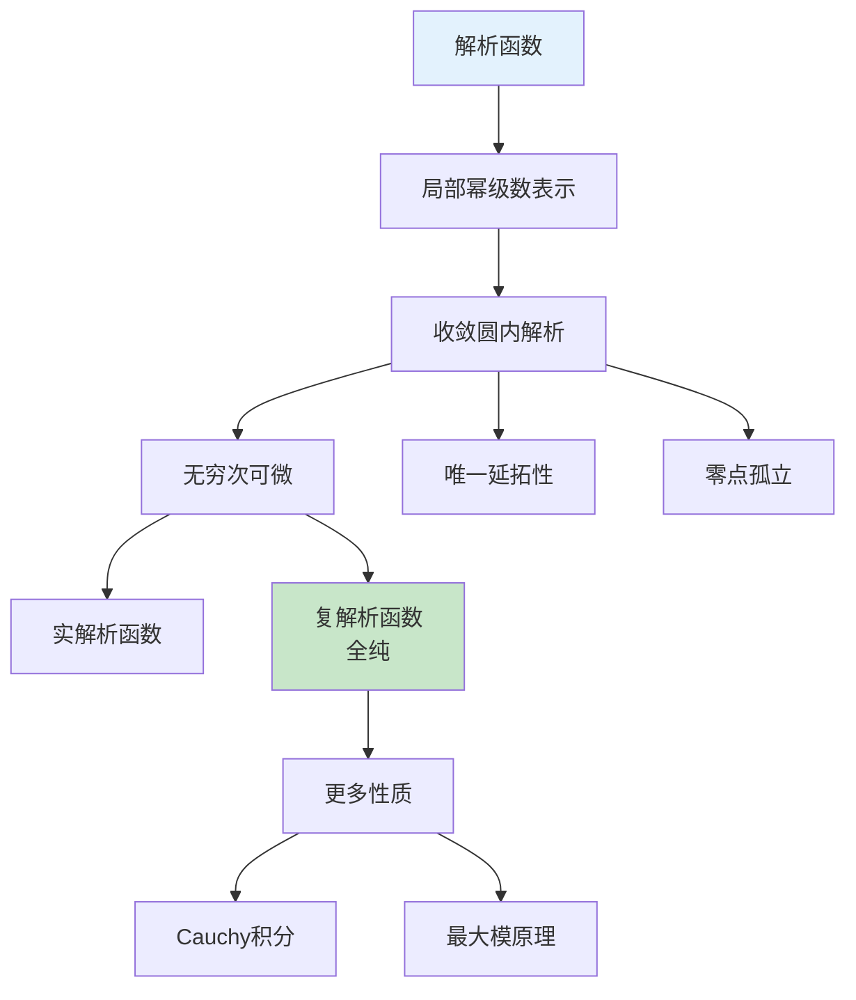

# 幂级数思维导图

## 概述

幂级数是形如 $\sum_{n=0}^{\infty} a_n (x-x_0)^n$ 的函数项级数，是分析学中最重要的级数类型之一。它具有优良的收敛性质和分析运算特性，是函数展开和解析函数研究的基础工具。

---

## 核心思维导图

```mermaid
mindmap
  root((幂级数<br/>Power Series))
    基本理论
      收敛半径R
        柯西-阿达马公式
        比值法求R
        根值法求R
      收敛区间
        (-R, R)内绝对收敛
        端点单独判别
        收敛域可能为单点/全体R
      一致收敛性
        内闭一致收敛
        收敛圆内紧集
    运算性质
      四则运算
        加减法
        乘法: Cauchy乘积
        除法: 幂级数相除
      分析运算
        逐项求导
          收敛半径不变
        逐项积分
          收敛半径不变
        连续性
          和函数连续
    和函数性质
      解析性
        无穷次可微
        泰勒展开唯一
      零点孤立性
      恒等定理
    展开理论
      Taylor展开
        展开条件
        余项估计
      唯一性定理
        系数唯一确定
      解析延拓
        延拓可能性
        自然边界
    重要展开
      指数函数
      三角函数
      对数函数
      二项式级数
      反三角函数
```

---

## 收敛半径理论

```mermaid
graph TD
    A[幂级数 Σaₙxⁿ] --> B[收敛半径R]
    
    B --> C[柯西-阿达马<br/>1/R = limsup|aₙ|¹/ⁿ]
    B --> D[比值法<br/>R = lim|aₙ/aₙ₊₁|]
    B --> E[根值法<br/>R = 1/lim|aₙ|¹/ⁿ]
    
    B --> F{收敛性}
    F -->|x|<R| G[绝对收敛]
    F -->|x|>R| H[发散]
    F -->|x=R| I[端点判别]
    
    G --> J[一致收敛<br/>内闭紧集]
    
    style G fill:#c8e6c9
    style H fill:#ffcdd2
    style I fill:#fff3e0
```

---

## 收敛半径计算公式

| 方法 | 公式 | 适用条件 |
|------|------|----------|
| 柯西-阿达马 | $R = \frac{1}{\limsup_{n\to\infty} |a_n|^{1/n}}$ | 通用 |
| 比值法 | $R = \lim_{n\to\infty} |\frac{a_n}{a_{n+1}}|$ | 极限存在且非零 |
| 根值法 | $R = \lim_{n\to\infty} \frac{1}{|a_n|^{1/n}}$ | 极限存在 |

---

## 幂级数运算性质

```mermaid
graph LR
    subgraph 代数运算
        A[f(x) = Σaₙxⁿ] --> B[加减: Σ(aₙ±bₙ)xⁿ]
        A --> C[乘法: Cauchy乘积]
        C --> D[Σcₙxⁿ, cₙ=Σaₖbₙ₋ₖ]
    end
    
    subgraph 分析运算
        E[逐项求导] --> F[f'(x) = Σnaₙxⁿ⁻¹]
        E --> G[收敛半径不变]
        
        H[逐项积分] --> I[∫f(x)dx = Σaₙxⁿ⁺¹/(n+1)]
        H --> J[收敛半径不变]
    end
    
    A --> E
    A --> H
```

---

## 重要幂级数展开

| 函数 | 展开式 | 收敛域 |
|------|--------|--------|
| $e^x$ | $\sum_{n=0}^{\infty} \frac{x^n}{n!}$ | $(-\infty, +\infty)$ |
| $\sin x$ | $\sum_{n=0}^{\infty} \frac{(-1)^n x^{2n+1}}{(2n+1)!}$ | $(-\infty, +\infty)$ |
| $\cos x$ | $\sum_{n=0}^{\infty} \frac{(-1)^n x^{2n}}{(2n)!}$ | $(-\infty, +\infty)$ |
| $\ln(1+x)$ | $\sum_{n=1}^{\infty} \frac{(-1)^{n-1} x^n}{n}$ | $(-1, 1]$ |
| $(1+x)^\alpha$ | $\sum_{n=0}^{\infty} \binom{\alpha}{n} x^n$ | $(-1, 1)$ |
| $\arctan x$ | $\sum_{n=0}^{\infty} \frac{(-1)^n x^{2n+1}}{2n+1}$ | $[-1, 1]$ |
| $\arcsin x$ | $\sum_{n=0}^{\infty} \frac{(2n)!}{4^n(n!)^2} \frac{x^{2n+1}}{2n+1}$ | $[-1, 1]$ |

---

## Taylor展开理论

```mermaid
mindmap
  root((Taylor展开))
    展开条件
      C^∞函数
        无穷次可微
      余项趋于0
        拉格朗日余项
        柯西余项
        积分余项
    唯一性
      系数唯一
        aₙ = f⁽ⁿ⁾(0)/n!
      恒等定理
        零点集有聚点
        ⇒ 恒为0
    应用
      近似计算
      微分方程
      特殊函数
      渐近分析
```

---

## 余项公式

| 形式 | 公式 |
|------|------|
| Lagrange | $R_n(x) = \frac{f^{(n+1)}(\xi)}{(n+1)!} x^{n+1}$ |
| Cauchy | $R_n(x) = \frac{f^{(n+1)}(\theta x)}{n!} (1-\theta)^n x^{n+1}$ |
| 积分 | $R_n(x) = \frac{1}{n!} \int_0^x f^{(n+1)}(t)(x-t)^n dt$ |
| Peano | $R_n(x) = o(x^n)$ |

---

## 解析函数



---

## 学习路径


---

## 与其他概念的联系

- **复分析**: 解析函数、全纯函数、收敛圆
- **微分方程**: 幂级数解法、常点与奇点
- **逼近论**: Weierstrass逼近、多项式逼近
- **泛函分析**: 函数空间、算子理论
- **特殊函数**: 超几何级数、Bessel函数

---

## 参考

- 《数学分析》陈纪修
- 《复分析》Ahlfors
- 《实分析与复分析》Rudin

---

*文档版本：1.1（质量提升版）*
*最后更新：2026年4月*
*分类：数学分析 / 级数理论 / 思维导图*
