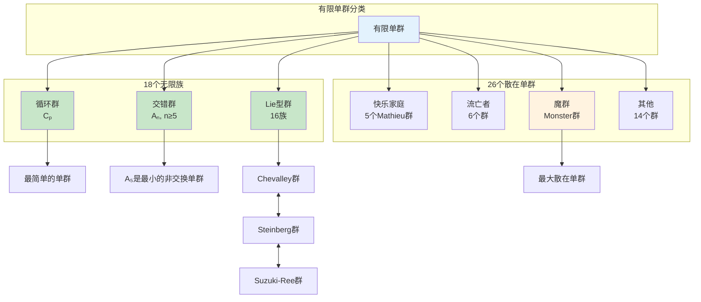
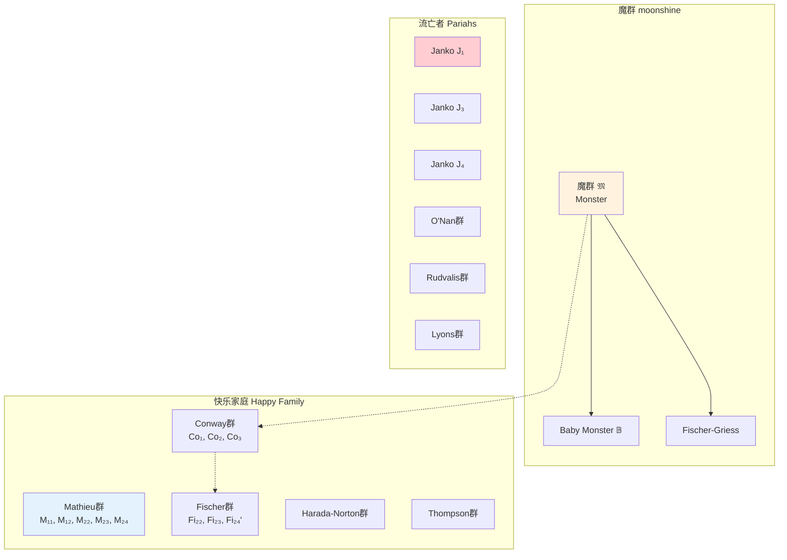
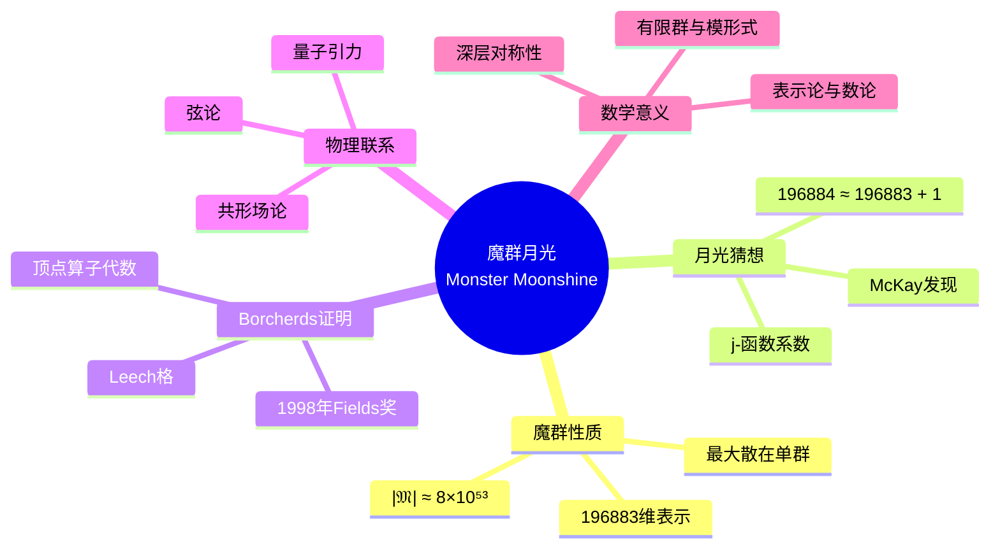
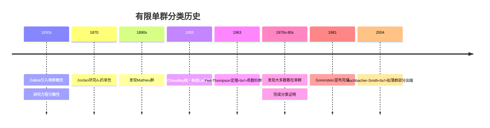
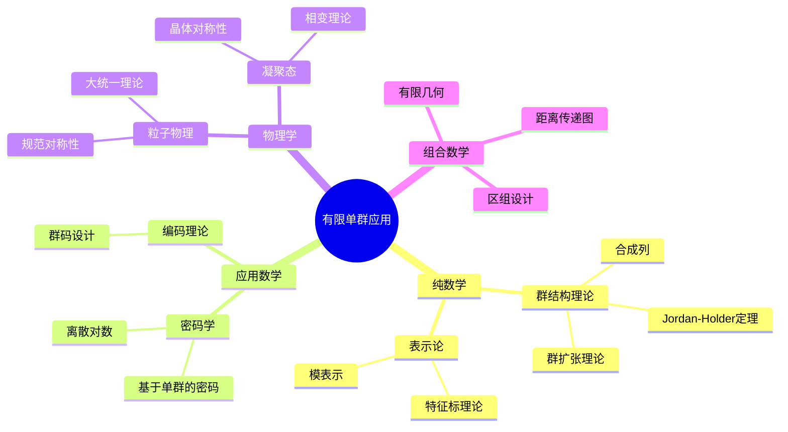
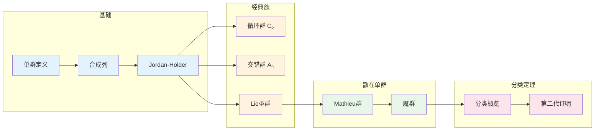

# 有限单群 - 思维导图

## 概述

有限单群是群论的"原子"——它们是构建所有有限群的基本构件。有限单群分类定理是20世纪数学最伟大的成就之一，历经约100年、数百位数学家的共同努力，最终完整刻画了所有有限单群的结构。这一成就被称为"数学的大定理"。

---

## 核心思维导图

```mermaid
mindmap
  root((有限单群<br/>Finite Simple Groups))
    基本定义
      单群
        没有非平凡正规子群
        {e}和G是唯一正规子群
      合成因子
        合成列的因子
        Jordan-Holder定理
      重要性
        群的"原子"
        所有有限群的基本构件
    分类定理
      巨大定理
        约10000页证明
        100+数学家
        100+年努力
      18个无限族
        循环群 Cₚ
        交错群 Aₙ, n≥5
        Lie型群
      26个散在单群
        魔群 Monster
        大魔群
        小魔群
    典型无限族
      循环群
        Cₚ, p素数
        最简单的单群
      交错群
        Aₙ, n≥5
        由偶置换组成
      Lie型群
        有限域上的Lie群
        经典群与例外群
    散在单群
      魔群
        最大散在单群
        阶约8×10⁵³
      数学月光
        魔群与模形式联系
        Borcherds证明
    应用
      群结构分析
      密码学
      物理对称性

```

---

## 有限单群分类全景



---

## 单群判定准则

```mermaid
flowchart TD
    Start([群G]) --> Check1{|G| = p?}
    Check1 -->|是| C[Cₚ 单群]
    Check1 -->|否| Check2{G ≅ Aₙ, n≥5?}
    
    Check2 -->|是| A[Aₙ 单群]
    Check2 -->|否| Check3{Sylow分析<br/>nₚ>1 ∀p?}
    
    Check3 -->|否| NotS[非单群<br/>有正规Sylow子群]
    Check3 -->|是| Check4{合成列检验}
    
    Check4 -->|合成因子都是单群| S[可能是单群]
    Check4 -->|否则| NotS
    
    S --> F[属于分类列表]
    
    style C fill:#c8e6c9
    style A fill:#c8e6c9
    style S fill:#fff3e0
    style NotS fill:#ffcdd2

```

---

## 交错群 Aₙ (n≥5)

```mermaid
mindmap
  root((交错群 Aₙ))
    定义
      Sₙ的正规子群
      偶置换组成
      指数[Sₙ:Aₙ] = 2
    单性证明
      n≥5时单
      3-轮换生成
      正规子群分析
    小例子
      A₃ ≅ C₃
      A₄ 非单, 有Klein四元群
      A₅ 最小非交换单群

      |A₅| = 60

    A₅的结构
      同构于PSL(2,5)
      二十面体群
      5阶子群, 3阶子群, 2阶子群
    重要性
      第一个非交换单群族
      Galois可解性理论

```

---

## Lie型群概览

```mermaid
graph TD
    subgraph Lie型群
        CL[Chevalley群<br/>经典群+例外群]
        ST[Steinberg群<br/>扭群]
        SR[Suzuki-Ree群<br/>特殊族]
    end
    
    subgraph 经典群
        A[线性群<br/>PSL(n,q)]
        B[正交群<br/>PΩ(2n+1,q)]
        C[辛群<br/>PSp(2n,q)]
        D[正交群<br/>PΩ⁺(2n,q)]
    end
    
    subgraph 例外群
        E6[E₆(q)]
        E7[E₇(q)]
        E8[E₈(q)]
        F4[F₄(q)]
        G2[G₂(q)]
    end
    
    subgraph 扭群
        2A[²Aₙ<br/>PSU]
        2D[²Dₙ<br/>扭正交]
        3D4[³D₄]
        2E6[²E₆]
    end
    
    CL --> A
    CL --> B
    CL --> C
    CL --> D
    CL --> E6
    CL --> E7
    CL --> E8
    CL --> F4
    CL --> G2
    ST --> 2A
    ST --> 2D
    ST --> 3D4
    ST --> 2E6
    
    style CL fill:#e3f2fd
    style A fill:#fff3e0
    style B fill:#fff3e0
    style C fill:#fff3e0
    style D fill:#fff3e0
    style E8 fill:#c8e6c9

```

---

## 散在单群谱系



---

## 魔群与月光猜想



---

## 分类定理历史



---

## 小阶单群列表

| 群 | 阶 | 类型 | 备注 |
|----|-----|------|------|
| $C_p$ | $p$ (素数) | 循环 | 最简单的单群 |
| $A_5$ | 60 | 交错群 | 最小非交换单群 |
| ${\rm PSL}(2,7)$ | 168 | Lie型 | 168阶单群 |
| $A_6$ | 360 | 交错群 | 同构于${\rm PSL}(2,9)$ |
| ${\rm PSL}(2,8)$ | 504 | Lie型 | 阶为$2^3 \cdot 3^2 \cdot 7$ |
| ${\rm PSL}(2,11)$ | 660 | Lie型 | 660阶单群 |
| $A_7$ | 2520 | 交错群 | 2520阶单群 |
| ${\rm PSL}(2,13)$ | 1092 | Lie型 | 1092阶单群 |

---

## 应用与意义



---

## 学习路径



---

## 重要定理速查

| 定理 | 陈述 | 意义 |
|------|------|------|
| **Jordan-Holder** | 合成列唯一（同构意义） | 单群是基本构件 |
| **Feit-Thompson** | 奇数阶群可解 | 非交换单群必为偶阶 |
| **分类定理** | 所有有限单群属于18+26族 | 完整分类 |
| **A₅单性** | $A_n$ 单当且仅当 $n \geq 5$ | 第一个非交换单群族 |

---

## 与后续概念的联系

- **表示论**: 单群的不可约表示
- **代数数论**: 伽罗瓦群的单商
- **代数几何**: 单群作用的代数簇
- **数学物理**: 魔群月光与弦论

---

*文档版本：1.0*
*创建时间：2026年4月*
*分类：代数学 / 群论 / 思维导图*
