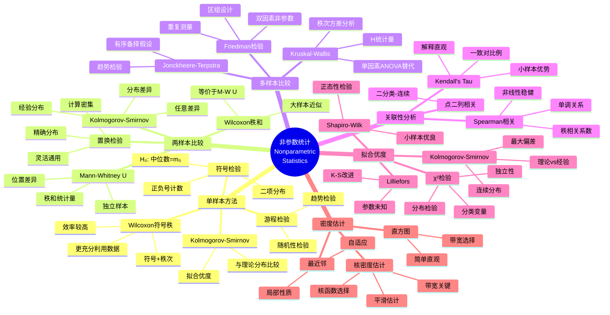
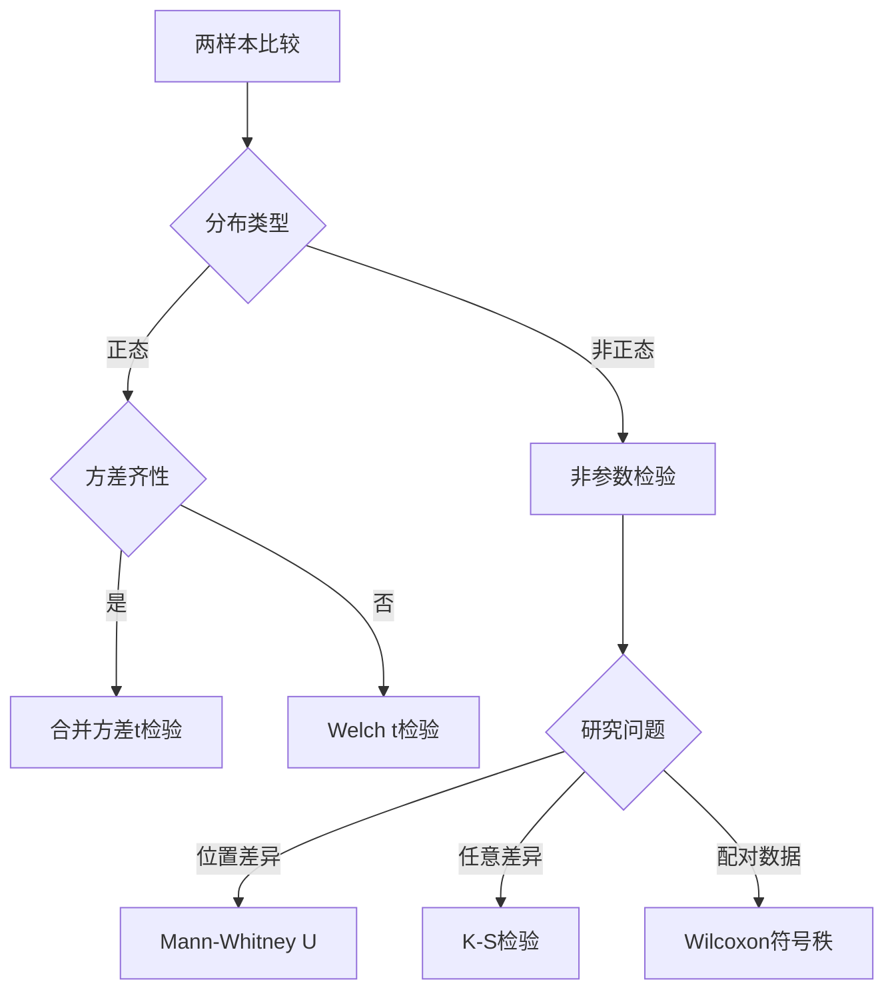
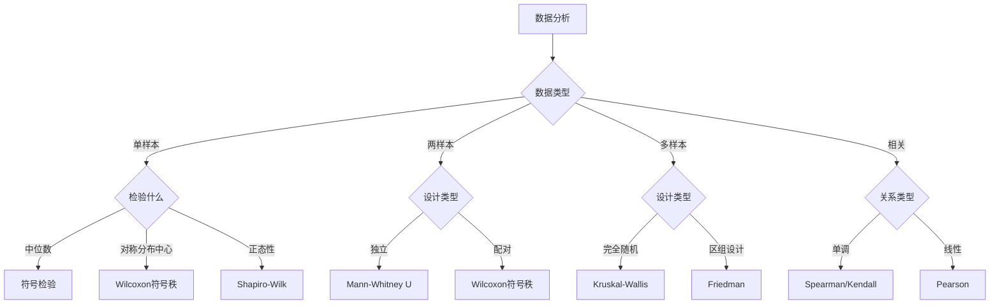

# 非参数统计思维导图 / Nonparametric Statistics Mind Map

**主题编号**: MM.STAT.06
**创建日期**: 2026年4月4日
**最后更新**: 2026年4月4日

---

## 思维导图 / Mind Map

---

## 核心概念详解 / Core Concepts

### 1. 非参数方法概述 / Overview

#### 特点与优势

**非参数方法**: 不对总体分布做具体假设的统计方法

**优势**:
- 分布自由 (Distribution-free)
- 稳健性 (Robust)
- 适用范围广
- 计算相对简单

**劣势**:
- 效率可能较低（正态假设下）
- 损失部分信息（只用秩次）

**效率比较** (渐近相对效率):

| 非参数方法 | 参数替代 | ARE(正态) | ARE(重尾) |
|------------|----------|-----------|-----------|
| Wilcoxon符号秩 | 单样本t | 0.955 | >1 |
| Mann-Whitney U | 两样本t | 0.955 | >1 |
| Spearman | Pearson相关 | 0.912 | >1 |
| Kendall's Tau | Pearson相关 | 0.912 | >1 |

### 2. 单样本方法 / One-Sample Methods

#### 符号检验 / Sign Test

**假设**: H₀: M = M₀ vs H₁: M ≠ M₀ (M为中位数)

**检验统计量**:
- S⁺ = 正号的个数
- S⁻ = 负号的个数

**分布**: 在H₀下，S⁺ ~ Binomial(n', 0.5)，其中n'为有效观测数

**适用**: 只需要知道观测值与M₀的相对大小

#### Wilcoxon符号秩检验 / Wilcoxon Signed-Rank Test

**步骤**:
1. 计算差值: $D_i = X_i - M_0$
2. 取绝对值: $|D_i|$
3. 对|Dᵢ|排序，赋予秩次

4. 对正差值的秩次求和: $W^+ = \sum_{D_i>0} R_i$

**假设**: 分布对称

**大样本近似**: $Z = \frac{W^+ - n(n+1)/4}{\sqrt{n(n+1)(2n+1)/24}}$

### 3. 两样本比较 / Two-Sample Comparison

#### Mann-Whitney U检验 / Wilcoxon Rank-Sum Test

**假设**:
- H₀: 两总体分布相同
- H₁: 两总体位置不同（或有序备择）

**步骤**:
1. 合并两组数据
2. 对所有观测值赋予秩次
3. 计算第一组的秩和: $R_1$
4. U统计量: $U = n_1n_2 + \frac{n_1(n_1+1)}{2} - R_1$

**均值与方差**:
$$E[U] = \frac{n_1n_2}{2}, \quad \text{Var}(U) = \frac{n_1n_2(n_1+n_2+1)}{12}$$

**大样本**: $Z = \frac{U - E[U]}{\sqrt{\text{Var}(U)}}$

**假设检验决策树**:

### 4. 多样本比较 / K-Sample Comparison

#### Kruskal-Wallis检验

**目的**: 检验k个独立样本是否来自相同分布

**假设**: H₀: 所有总体分布相同

**检验统计量**:
$$H = \frac{12}{N(N+1)}\sum_{i=1}^{k}\frac{R_i^2}{n_i} - 3(N+1)$$

其中:
- N = 总样本量
- Rᵢ = 第i组的秩和
- nᵢ = 第i组样本量

**分布**: 在H₀下，H ~ χ²(k-1)

**与ANOVA关系**: K-W检验是单因素ANOVA的秩次版本

#### Friedman检验

**用途**: 随机区组设计的非参数替代

**模型**: 每个区组内对处理进行排序

**统计量**:
$$\chi^2_F = \frac{12}{nk(k+1)}\sum_{j=1}^{k}R_j^2 - 3n(k+1)$$

其中n为区组数，k为处理数

### 5. 关联性分析 / Association Analysis

#### Spearman秩相关

**计算步骤**:
1. 分别对X和Y的观测值赋予秩次
2. 计算秩次的Pearson相关系数

**公式**:
$$r_s = 1 - \frac{6\sum d_i^2}{n(n^2-1)}$$

其中dᵢ是两个变量秩次之差

**特点**:
- 测量单调关系（不限于线性）
- 对异常值稳健

#### Kendall's Tau

**概念**: 一致对(C)与不一致对(D)的比例

$$\tau = \frac{C - D}{C + D} = \frac{C - D}{n(n-1)/2}$$

**解释**:
- τ = 1: 完全正相关
- τ = -1: 完全负相关
- τ = 0: 无关联

**与Spearman比较**:
- Kendall's Tau更容易解释
- Spearman计算更简单
- 两者通常高度相关

### 6. 拟合优度检验 / Goodness-of-Fit Tests

#### χ²拟合优度检验

**用途**: 检验观测频数与期望频数是否一致

**统计量**:
$$\chi^2 = \sum_{i=1}^{k}\frac{(O_i - E_i)^2}{E_i}$$

**分布**: χ²(k-1-p)，其中p为估计参数个数

**条件**: 每个单元的期望频数≥5

#### Kolmogorov-Smirnov检验

**用途**: 检验样本是否来自指定连续分布

**统计量**:
$$D_n = \sup_x |F_n(x) - F_0(x)|$$

其中Fₙ为经验分布函数，F₀为理论分布

**特点**:
- 适用于连续分布
- 对每个数据点都敏感
- Lilliefors修正用于正态性检验（参数未知）

#### 正态性检验比较

| 检验 | 适用场景 | 特点 |
|------|----------|------|
| Shapiro-Wilk | 小样本(n<50) | 功效最高 |
| Kolmogorov-Smirnov | 大样本 | 较保守 |
| Lilliefors | 参数未知 | K-S修正 |
| Anderson-Darling | 尾部敏感 | 检测尾部差异 |
| Jarque-Bera | 大样本 | 基于偏度峰度 |

---

## 非参数密度估计 / Nonparametric Density Estimation

### 核密度估计 / Kernel Density Estimation

**估计公式**:
$$\hat{f}_h(x) = \frac{1}{nh}\sum_{i=1}^{n}K\left(\frac{x-X_i}{h}\right)$$

**常用核函数**:

| 核函数 | 公式 | 效率 |
|--------|------|------|
| 高斯 | $\frac{1}{\sqrt{2\pi}}e^{-u^2/2}$ | 95.1% |
| Epanechnikov | $\frac{3}{4}(1-u^2)I(|u|\leq1)$ | 100% |
| 均匀 | $\frac{1}{2}I(|u|\leq1)$ | 92.9% |

**带宽选择**: 最关键参数
- **过大**: 过度平滑，细节丢失
- **过小**: 欠平滑，噪声过多
- **最优**: Silverman规则 $h = 0.9\min(s, IQR/1.34)n^{-1/5}$

---

## 应用案例 / Application Cases

### 案例1: 两种药物疗效比较

**研究问题**: 比较新药与标准药对疼痛缓解的效果

**数据** (疼痛评分，0-10):
- 新药: 3, 5, 2, 6, 4, 3, 5, 2
- 标准药: 6, 7, 5, 8, 7, 6, 8, 7

**分析**:
- Shapiro-Wilk检验: 数据非正态 (p < 0.05)
- Mann-Whitney U检验: U = 8, p = 0.002
- **结论**: 新药显著更有效

### 案例2: 多组教学方法比较

**研究问题**: 比较4种教学方法的效果

**数据**: 每组15名学生，成绩分布未知

**分析**:
- Kruskal-Wallis检验: H = 9.87, p = 0.020
- 事后Dunn检验进行多重比较
- **结论**: 方法间存在显著差异，方法A优于方法D

### 案例3: 相关性分析

**研究问题**: 研究广告投入与销售额的关系

**数据**: 存在异常值

**分析**:
- Pearson相关: r = 0.65
- Spearman相关: ρ = 0.82
- **结论**: Spearman相关更高，表明关系可能是单调但非线性的

---

## 方法选择指南 / Method Selection Guide

---

## 相关文档 / Related Documents

- [统计学](../12-应用数学/02-统计学.md)
- [假设检验思维导图](./02-假设检验-思维导图.md)
- [方差分析思维导图](./04-方差分析-思维导图.md)

---

**参考文献 / References**:

1. Conover, W.J. "Practical Nonparametric Statistics". 1999.
2. Hollander, M. and Wolfe, D.A. "Nonparametric Statistical Methods". 1999.
3. Wasserman, L. "All of Nonparametric Statistics". 2006.
4. Hettmansperger, T.P. and McKean, J.W. "Robust Nonparametric Statistical Methods". 2011.
