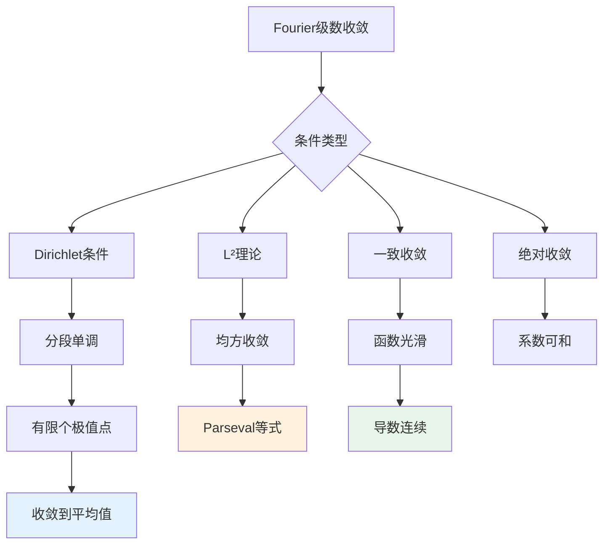

# 傅里叶级数思维导图

## 概述

傅里叶级数是将周期函数表示为正弦和余弦函数的无穷级数。这一理论不仅是分析学的核心内容，也是信号处理、物理学和工程学的基本工具。

---

## 核心思维导图

```mermaid
mindmap
  root((傅里叶级数<br/>Fourier Series))
    基本概念
      三角函数系
        {1, cos(nx), sin(nx)}
        n=1,2,3,...
        正交性
      Fourier系数
        a₀, aₙ, bₙ
        Euler公式
      级数形式
        三角形式
        复指数形式
    收敛理论
      点态收敛
        Dirichlet条件
        Dini判别法
      一致收敛
        光滑函数
        导数条件
      L²收敛
        Parseval等式
        能量守恒
        均方收敛
      Gibbs现象
        间断点处
        过冲现象
    重要定理
      Dirichlet定理
        分段光滑⇒收敛
        收敛到平均值
      Parseval等式
        能量守恒
        系数平方和
      Riemann-Lebesgue引理
        系数趋于0
      Weierstrass逼近
        三角多项式稠密
    复数形式
      复指数
        e^(inx)
        正交性
      复系数
        cₙ = ⟨f,e^(inx)⟩
      与实形式关系
        cₙ = (aₙ-ibₙ)/2
    应用
      信号处理
        频谱分析
        滤波
      偏微分方程
        分离变量
        热方程/波动方程
      数值计算
        FFT算法
        快速计算
    推广
      Fourier变换
        非周期函数
        连续谱
      广义函数
        δ函数
        分布意义
      高维情形
        多元Fourier级数
        球谐函数
```

---

## Fourier级数理论体系

```mermaid
graph TD
    subgraph 函数空间
        A[周期函数L²[-π,π]] --> B[三角函数系]
        B --> C[标准正交基]
    end
    
    subgraph Fourier展开
        D[f(x) ∼ a₀/2 + Σ(aₙcos(nx)+bₙsin(nx))] --> E[Fourier系数]
        E --> F[aₙ = (1/π)∫f(x)cos(nx)dx]
        E --> G[bₙ = (1/π)∫f(x)sin(nx)dx]
    end
    
    subgraph 收敛性
        H[点态收敛] --> I[Dirichlet条件]
        J[L²收敛] --> K[Parseval等式]
        L[一致收敛] --> M[光滑性条件]
    end
    
    C --> D
    F --> H
    F --> J
    F --> L
```

---

## Fourier系数公式

| 系数 | 公式 | 复数形式 |
|------|------|----------|
| **a₀** | $\frac{1}{\pi} \int_{-\pi}^{\pi} f(x) dx$ | $2c_0$ |
| **aₙ** | $\frac{1}{\pi} \int_{-\pi}^{\pi} f(x) \cos(nx) dx$ | $c_n + c_{-n}$ |
| **bₙ** | $\frac{1}{\pi} \int_{-\pi}^{\pi} f(x) \sin(nx) dx$ | $i(c_n - c_{-n})$ |
| **cₙ** | $\frac{1}{2\pi} \int_{-\pi}^{\pi} f(x) e^{-inx} dx$ | - |

---

## 收敛性定理



---

## 重要定理总结

| 定理 | 条件 | 结论 |
|------|------|------|
| **Dirichlet** | $f$ 分段光滑，有限个极值点 | 级数收敛到 $\frac{f(x^+)+f(x^-)}{2}$ |
| **Parseval** | $f \in L^2[-\pi,\pi]$ | $\frac{1}{\pi}\int|f|^2 = \frac{a_0^2}{2} + \sum(a_n^2+b_n^2)$ |
| **Riemann-Lebesgue** | $f$ 可积 | $a_n, b_n \to 0$ 当 $n \to \infty$ |
| **Weierstrass** | $f$ 连续，周期 | 三角多项式一致逼近 |
| **Dini** | $\int_0^\delta |\frac{\phi(t)}{t}|dt < \infty$ | 级数在 $x$ 收敛到 $f(x)$ |

---

## 复数形式

```mermaid
graph LR
    subgraph 三角形式
        A[f(x) ∼ a₀/2 + Σ(aₙcos(nx)+bₙsin(nx))]
    end
    
    subgraph 复数形式
        B[f(x) ∼ Σcₙe^(inx)]
        B --> C[cₙ = (1/2π)∫f(x)e^(-inx)dx]
    end
    
    subgraph 关系
        D[c₀ = a₀/2] --> E[cₙ = (aₙ-ibₙ)/2]
        E --> F[c₋ₙ = (aₙ+ibₙ)/2]
    end
    
    A --> B
```

---

## 函数性质与系数衰减

| 函数光滑性 | 系数衰减率 | 收敛性 |
|-----------|-----------|--------|
| 可积 | $a_n, b_n = o(1)$ | - |
| 分段光滑 | $a_n, b_n = O(1/n)$ | 点态收敛 |
| 连续，分段光滑 | $a_n, b_n = O(1/n)$ | 一致收敛 |
| $C^k$ 类 | $a_n, b_n = O(1/n^{k+1})$ | $k$ 阶可逐项微分 |
| 解析 | $a_n, b_n = O(r^n), r<1$ | 指数收敛 |

---

## 学习路径


---

## 与其他概念的联系

- **泛函分析**: Hilbert空间、正交展开
- **信号处理**: 频谱分析、滤波、采样定理
- **偏微分方程**: 分离变量法、特征函数展开
- **群表示**: 圆群的表示论
- **数值分析**: FFT算法、快速计算
- **量子力学**: 动量本征态展开

---

## 参考

- 《Fourier分析》Stein & Shakarchi
- 《Fourier Series and Integrals》Dym & McKean
- 《A First Course in Fourier Analysis》Kammler

---

*文档版本：1.1（质量提升版）*
*最后更新：2026年4月*
*分类：数学分析 / Fourier分析 / 思维导图*
