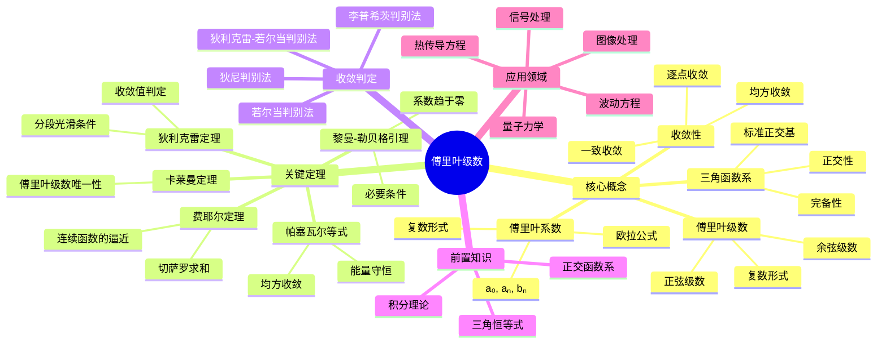

msc_primary: "00A99"
msc_secondary: ['00-XX']
---

# 傅里叶级数思维导图

## 概述
傅里叶级数将周期函数展开为正弦余弦级数，是调和分析的基石。

## 核心要点

### 傅里叶系数
$$a_n = \frac{1}{\pi}\int_{-\pi}^{\pi} f(x)\cos(nx)dx$$
$$b_n = \frac{1}{\pi}\int_{-\pi}^{\pi} f(x)\sin(nx)dx$$

### 收敛定理
**狄利克雷定理**: 若 f 分段光滑，则傅里叶级数收敛到
$$\frac{f(x^+)+f(x^-)}{2}$$

### 帕塞瓦尔等式
$$\frac{1}{\pi}\int_{-\pi}^{\pi} |f(x)|^2 dx = \frac{a_0^2}{2} + \sum_{n=1}^{\infty}(a_n^2 + b_n^2)$$

### 应用领域
- **信号处理**: 频谱分析
- **PDE**: 分离变量法
- **量子力学**: 波函数展开

## 参考
- 《傅里叶分析》Stein
- 《调和分析》Grafakos
