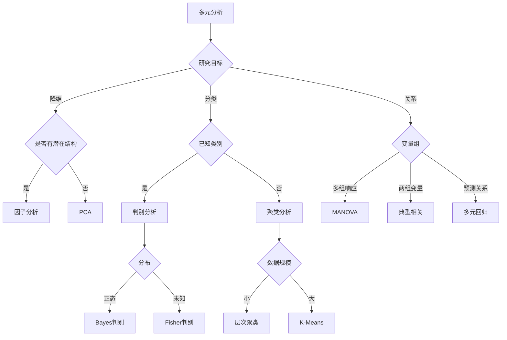

# 多元统计分析思维导图 / Multivariate Statistical Analysis Mind Map

**主题编号**: MM.STAT.07
**创建日期**: 2026年4月4日
**最后更新**: 2026年4月4日

---

## 思维导图 / Mind Map

```mermaid
mindmap
  root((多元统计分析<br/>Multivariate<br/>Statistics))
    多元描述统计
      均值向量
        μ = [μ₁,...,μp]'
        样本估计
      协方差矩阵
        Σ = [σij]
        对称正定
        S样本估计
      相关系数矩阵
        R = [rij]
        标准化
      马氏距离
        D² = (x-μ)'Σ⁻¹(x-μ)
        考虑相关性
    多元正态分布
      密度函数
        Np(μ, Σ)
        二次型
      性质
        边缘分布
        条件分布
        线性变换
      估计
        极大似然
        样本均值
        样本协方差
    主成分分析PCA
      目的
        降维
        信息压缩
        可视化
      方法
        特征值分解
        方差最大化
        正交约束
      应用
        特征提取
        数据压缩
        噪声过滤
    因子分析
      模型
        X = μ + LF + ε
        公共因子
        特殊因子
      估计方法
        主成分法
        主因子法
        最大似然
      旋转
        方差最大
        正交旋转
        斜交旋转
    判别分析
      Fisher判别
        投影方向
        类间/类内
        最优分离
      Bayes判别
        后验概率
        最小错误率
        最小风险
      多类扩展
        多组判别
        逐步判别
    聚类分析
      层次聚类
        距离度量
        连接方法
        树状图
      K均值
        目标函数
        迭代优化
        初始值敏感
      模型聚类
        混合模型
        EM算法
        概率分配
    多元回归
      经典多元回归
        Y = XB + E
        最小二乘
        假设检验
      多变量方差分析
        MANOVA
        Wilks Lambda
        Pillai Trace
      结构方程模型
        潜变量
        路径分析
        验证性因子
    典型相关
      CCA
        变量组间关系
        最大相关
        典型变量
      冗余分析
        解释方差
        预测关系

```

---

## 核心概念详解 / Core Concepts

### 1. 多元描述统计 / Multivariate Descriptive Statistics

#### 均值向量与协方差矩阵

**均值向量**:
$$\boldsymbol{\mu} = E[\mathbf{X}] = \begin{bmatrix} \mu_1 \\ \mu_2 \\ \vdots \\ \mu_p \end{bmatrix}$$

**协方差矩阵**:
$$\boldsymbol{\Sigma} = E[(\mathbf{X}-\boldsymbol{\mu})(\mathbf{X}-\boldsymbol{\mu})'] = \begin{bmatrix} \sigma_{11} & \sigma_{12} & \cdots & \sigma_{1p} \\ \sigma_{21} & \sigma_{22} & \cdots & \sigma_{2p} \\ \vdots & \vdots & \ddots & \vdots \\ \sigma_{p1} & \sigma_{p2} & \cdots & \sigma_{pp} \end{bmatrix}$$

**性质**:
- 对称: Σ = Σ'
- 半正定: 对于任意a，a'Σa ≥ 0
- |Σ| > 0 (满秩)

#### 马氏距离 / Mahalanobis Distance

$$D^2 = (\mathbf{x} - \boldsymbol{\mu})'\boldsymbol{\Sigma}^{-1}(\mathbf{x} - \boldsymbol{\mu})$$

**特点**:
- 考虑变量间相关性
- 尺度不变
- 服从χ²(p)分布（多元正态）

### 2. 多元正态分布 / Multivariate Normal Distribution

#### 密度函数

$$f(\mathbf{x}) = \frac{1}{(2\pi)^{p/2}|\boldsymbol{\Sigma}|^{1/2}}\exp\left\{-\frac{1}{2}(\mathbf{x}-\boldsymbol{\mu})'\boldsymbol{\Sigma}^{-1}(\mathbf{x}-\boldsymbol{\mu})\right\}$$

#### 重要性质

```

┌─────────────────────────────────────────────────────────┐
│              多元正态分布性质                            │
├─────────────────────────────────────────────────────────┤
│ 1. 边缘分布: Xi ~ N(μi, σii)                            │
│ 2. 条件分布: X₁|X₂ ~ N(μ₁|₂, Σ₁|₂)                       │

│ 3. 线性变换: AX + b ~ N(Aμ+b, AΣA')                     │
│ 4. 独立性 ⇔ 协方差为0                                   │
│ 5. 马氏距离² ~ χ²(p)                                    │
└─────────────────────────────────────────────────────────┘

```

**条件分布**:
$$\boldsymbol{\mu}_{1|2} = \boldsymbol{\mu}_1 + \boldsymbol{\Sigma}_{12}\boldsymbol{\Sigma}_{22}^{-1}(\mathbf{x}_2 - \boldsymbol{\mu}_2)$$
$$\boldsymbol{\Sigma}_{1|2} = \boldsymbol{\Sigma}_{11} - \boldsymbol{\Sigma}_{12}\boldsymbol{\Sigma}_{22}^{-1}\boldsymbol{\Sigma}_{21}$$

### 3. 主成分分析 / Principal Component Analysis

#### 基本原理

**目标**: 寻找p维空间的正交变换，使新变量方差最大化

**优化问题**:
$$\max_{\mathbf{a}_1} \mathbf{a}_1'\mathbf{S}\mathbf{a}_1 \quad \text{s.t.} \quad \mathbf{a}_1'\mathbf{a}_1 = 1$$

**解**: a₁是S的最大特征值对应的特征向量

#### 主成分性质

| 主成分 | 方差 | 累积贡献率 |
|--------|------|------------|
| PC₁ | λ₁ | λ₁/∑λᵢ |
| PC₂ | λ₂ | (λ₁+λ₂)/∑λᵢ |
| ... | ... | ... |
| PCₖ | λₖ | ∑ᵢ₌₁ᵏλᵢ/∑λᵢ |

**选择主成分数**:
- 累积贡献率≥80-90%
- 特征值>1 (Kaiser准则)
- 碎石图拐点

#### 计算步骤


### 4. 因子分析 / Factor Analysis

#### 模型设定

$$\mathbf{X} = \boldsymbol{\mu} + \mathbf{L}\mathbf{F} + \boldsymbol{\epsilon}$$

其中:
- **L** (p×m): 因子载荷矩阵
- **F** (m×1): 公共因子向量
- **ε** (p×1): 特殊因子

**假设**:
- E[F] = 0, Cov(F) = I
- E[ε] = 0, Cov(ε) = Ψ (对角)
- Cov(F, ε) = 0

**协方差分解**:
$$\boldsymbol{\Sigma} = \mathbf{L}\mathbf{L}' + \boldsymbol{\Psi}$$

#### 因子旋转

**目的**: 使因子载荷矩阵更易解释

| 旋转类型 | 方法 | 特点 |
|----------|------|------|
| **正交旋转** | Varimax | 使载荷平方的方差最大 |
| **正交旋转** | Quartimax | 简化变量 |
| **斜交旋转** | Promax | 允许因子相关 |
| **斜交旋转** | Oblimin | 一般斜交旋转 |

**PCA vs 因子分析**:

| 特性 | PCA | 因子分析 |
|------|-----|----------|
| 目的 | 数据压缩 | 潜在结构 |
| 模型 | 无误差项 | 有误差项 |
| 方差解释 | 全部方差 | 公共方差 |
| 方向 | 解释变量 | 解释相关矩阵 |

### 5. 判别分析 / Discriminant Analysis

#### Fisher线性判别

**目标**: 寻找投影方向a，使类间分离最大

**准则**:
$$\max_{\mathbf{a}} J(\mathbf{a}) = \frac{\mathbf{a}'\mathbf{B}\mathbf{a}}{\mathbf{a}'\mathbf{W}\mathbf{a}}$$

其中:
- B: 类间散度矩阵
- W: 类内散度矩阵

**解**: W⁻¹B的特征向量

#### Bayes判别

**后验概率**:
$$P(g|\mathbf{x}) = \frac{\pi_g f_g(\mathbf{x})}{\sum_{k}\pi_k f_k(\mathbf{x})}$$

**判别规则**: 选择使P(g|x)最大的类

**正态假设**:
$$f_g(\mathbf{x}) = (2\pi)^{-p/2}|\boldsymbol{\Sigma}_g|^{-1/2}\exp\left\{-\frac{1}{2}D_g^2(\mathbf{x})\right\}$$

其中 $D_g^2$ 是到第g类中心的马氏距离

### 6. 聚类分析 / Cluster Analysis

#### 层次聚类

**距离度量**:

| 距离 | 公式 | 适用 |
|------|------|------|
| 欧氏 | $\sqrt{\sum(x_i-y_i)^2}$ | 连续变量 |
| 曼哈顿 | $\sum|x_i-y_i|$ | 异常值稳健 |
| 马氏 | $\sqrt{(x-y)'S^{-1}(x-y)}$ | 考虑相关性 |
| 相关 | $1-\rho_{xy}$ | 形状相似 |

**连接方法**:

| 方法 | 定义 | 特点 |
|------|------|------|
| 单连接 | min{d(i,j)} | 易链式 |
| 完全连接 | max{d(i,j)} | 紧凑簇 |
| 平均连接 | avg{d(i,j)} | 折中 |
| Ward法 | 最小化组内方差 | 球形簇 |

#### K-Means聚类

**目标函数**:
$$\min_{C} \sum_{k=1}^{K}\sum_{i \in C_k} ||\mathbf{x}_i - \boldsymbol{\mu}_k||^2$$

**算法步骤**:
1. 随机选择K个中心
2. 将每个点分配到最近的中心
3. 重新计算中心
4. 重复2-3直到收敛

**缺点**:
- 需要预设K
- 对初始值敏感
- 假设球形簇

### 7. 多元方差分析 / MANOVA

#### 基本模型

$$\mathbf{Y}_{ij} = \boldsymbol{\mu} + \boldsymbol{\tau}_i + \boldsymbol{\epsilon}_{ij}$$

**假设检验**:
- H₀: τ₁ = τ₂ = … = τₖ = 0
- H₁: 至少一个τᵢ ≠ 0

#### 检验统计量

| 统计量 | 定义 | 性质 |
|--------|------|------|
| **Wilks' Λ** | |E|/|E+H| | 最常用 |
| **Pillai's Trace** | tr[H(E+H)⁻¹] | 稳健 |
| **Hotelling-Lawley** | tr[HE⁻¹] | 功效高 |
| **Roy's Largest Root** | λ₁ | 功效最高(单维) |

其中H为假设矩阵，E为误差矩阵

---

## 应用案例 / Application Cases

### 案例1: 企业财务指标PCA

**变量**: 流动比率、速动比率、资产负债率、ROE、ROA、总资产周转率

**结果**:
- PC₁ (42%): 盈利能力 (ROE, ROA)
- PC₂ (28%): 偿债能力 (流动、速动比率)
- PC₃ (18%): 营运效率

**应用**: 企业信用评分简化

### 案例2: 市场细分聚类

**变量**: 年龄、收入、消费频次、客单价、品牌忠诚度

**分析**:
- K-means聚类 (K=4)
- 结果:
  - 群体1: 高价值常客
  - 群体2: 年轻潜力客户
  - 群体3: 价格敏感客户
  - 群体4: 低频高消费

### 案例3: 医学诊断判别

**问题**: 基于生化指标区分健康人和糖尿病患者

**变量**: 血糖、胰岛素、HbA1c、BMI、年龄

**分析**:
- Fisher判别: 第一判别函数贡献85%
- 交叉验证准确率: 92%
- 误判率: 健康误为患病 5%，患病误为健康 11%

---

## 方法选择决策树 / Method Selection



---

## 相关文档 / Related Documents

- [统计学](../12-应用数学/02-统计学.md)
- [回归分析思维导图](./03-回归分析-思维导图.md)
- [方差分析思维导图](./04-方差分析-思维导图.md)

---

**参考文献 / References**:

1. Johnson, R.A. and Wichern, D.W. "Applied Multivariate Statistical Analysis". 2007.
2. Jolliffe, I.T. and Cadima, J. "Principal component analysis: a review". 2016.
3. Everitt, B.S. and Hothorn, T. "An Introduction to Applied Multivariate Analysis with R". 2011.
4. Hastie, T., Tibshirani, R., and Friedman, J. "The Elements of Statistical Learning". 2009.
