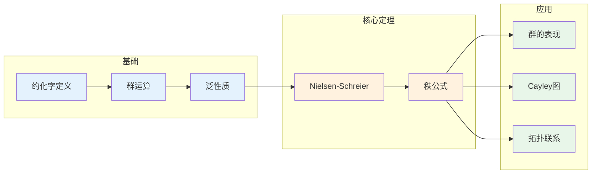

# 自由群 - 思维导图

## 概述

自由群是群论中最基本、最"自由"的构造。它由一组生成元通过最小组合规则生成，没有任何额外的关系约束。自由群在群论中扮演着"泛对象"的角色——任何群都可以表示为自由群的商群。这一观点由Dyck、Nielsen和Schreier等人发展，是现代组合群论的基石。

---

## 核心思维导图

```mermaid
mindmap
  root((自由群<br/>Free Group))
    基本定义
      生成元集合S
        S = {a, b, c, ...}
      约化字
        形如 a₁^ε₁ a₂^ε₂ ... aₙ^εₙ
        εᵢ = ±1
        无 aa⁻¹ 或 a⁻¹a 出现
      群运算
        字连接后约化
        满足群公理
    泛性质
      自由对象
        范畴论视角
        遗忘函子的左伴随
      泛性质表述
        任意映射 S→G 唯一延拓
        到同态 F(S)→G
      重要性
        所有群都是自由群的商
        群的表示理论
    基本性质
      无限群
        当|S|≥1时无限
      无挠群
        无非平凡有限阶元
      可解字问题
        存在算法判定相等
      Hopf性质
        满自同态是自同构
    子群结构
      Nielsen-Schreier
        自由群的子群自由
        秩公式: 1+|S|[F:H]
      生成集
        Schreier生成元
        Nielsen约化
    应用
      群表示
        表现 ⟨S|R⟩ = F(S)/⟨⟨R⟩⟩
        Cayley图
      拓扑学
        基本群
        覆叠空间
```

---

## 自由群构造

```mermaid
graph TD
    subgraph 生成元
        S[S = {a, b, c, ...}]
    end
    
    subgraph 字母表
        A[S ∪ S⁻¹<br/>a, b, c, ..., a⁻¹, b⁻¹, c⁻¹, ...]
    end
    
    subgraph 字
        W[S* 所有有限序列]
        W1[abc⁻¹a⁻¹]
        W2[ba⁻¹cb]
        W3[...]
    end
    
    subgraph 约化
        R[消除 aa⁻¹, a⁻¹a]
        R1[abc⁻¹a⁻¹] --> R2[不可约字]
        R3[aba⁻¹b⁻¹bb⁻¹] --> R4[abab⁻¹]
    end
    
    subgraph 自由群F(S)
        FS[所有约化字]
        Op[运算: 连接后约化]
    end
    
    S --> A
    A --> W
    W --> R
    R --> FS
    
    style S fill:#e3f2fd
    style FS fill:#c8e6c9
```

---

## 泛性质图示

```mermaid
graph TD
    subgraph 集合范畴
        S[S 集合]
    end
    
    subgraph 群范畴
        F[F(S) 自由群]
        G[任意群 G]
    end
    
    subgraph 映射
        i[包含 i: S→F(S)]
        f[任意映射 f: S→G]
        phi[唯一同态 φ: F(S)→G]
    end
    
    S --> i
    i --> F
    S --> f
    f --> G
    F --> phi
    phi --> G
    
    subgraph 交换性
        Comm[φ∘i = f]
    end
    
    i -.-> Comm
    f -.-> Comm
    phi -.-> Comm
    
    style S fill:#e3f2fd
    style F fill:#fff3e0
    style G fill:#e8f5e9
    style phi fill:#c8e6c9
```

---

## 自由群性质网络

```mermaid
mindmap
  root((自由群性质))
    无限性
      |S|≥1 ⇒ |F(S)|=∞
      每个元素有无限阶
    无挠性
      无有限阶元
      仅单位元有限阶
    剩余有限性
      可嵌入有限群直积
      共尾有限群序列
    Hopf性质
      满自同态⇒自同构
      非共Hopf群反例
    Whitehead问题
      F≅G? 字问题可解
      同构问题复杂
    子群自由性
      Nielsen-Schreier定理
      子群都是自由的
```

---

## Nielsen-Schreier定理

```mermaid
graph TD
    subgraph 定理陈述
        NS[Nielsen-Schreier定理]
    end
    
    subgraph 内容
        F[F 自由群]
        H[H ≤ F 子群]
        Free[H 也是自由群]
    end
    
    subgraph 秩公式
        Rank[rank(H) = 1 + [F:H]·(rank(F) - 1)]
        Case1[[F:H]=∞ ⇒ rank(H)=∞]
        Case2[[F:H]<∞ ⇒ 有限秩]
    end
    
    subgraph 证明方法
        Schreier[Schreier方法]
        Nielsen[Nielsen约化]
        Topo[拓扑证明]
    end
    
    NS --> F
    F --> H
    H --> Free
    Free --> Rank
    NS --> Schreier
    NS --> Nielsen
    NS --> Topo
    
    style NS fill:#e3f2fd
    style Free fill:#c8e6c9
    style Rank fill:#fff3e0
```

---

## 群的表现

```mermaid
graph TD
    subgraph 自由群
        F[F(S)]
    end
    
    subgraph 关系
        R[R ⊆ F(S)]
    end
    
    subgraph 正规闭包
        NR[⟨⟨R⟩⟩]
        NR1[包含R的最小正规子群]
    end
    
    subgraph 商群
        G[F(S)/⟨⟨R⟩⟩ = ⟨S|R⟩]
    end
    
    subgraph 性质
        P1[任何群都有表现]
        P2[表现不唯一]
        P3[字问题不可判定]
    end
    
    F --> R
    R --> NR
    NR --> G
    G --> P1
    G --> P2
    G --> P3
    
    style F fill:#e3f2fd
    style G fill:#c8e6c9
    style NR fill:#fff3e0
```

---

## 常见群的表现

```mermaid
graph LR
    subgraph 循环群
        Cn[⟨a | aⁿ=1⟩]
        Cinf[⟨a | ∅⟩ ≅ ℤ]
    end
    
    subgraph 二面体群
        Dn[⟨r,s | rⁿ=s²=1, srs=r⁻¹⟩]
    end
    
    subgraph 自由阿贝尔群
        FA[⟨a,b | ab=ba⟩]
    end
    
    subgraph 辫群
        Bn[⟨σ₁,...,σₙ₋₁ | 辫关系⟩]
    end
    
    subgraph 平凡群
        Triv[⟨a | a=1⟩]
    end
    
    style Cn fill:#e3f2fd
    style Cinf fill:#c8e6c9
    style Dn fill:#fff3e0
    style FA fill:#e8f5e9
```

---

## 自由群与拓扑

```mermaid
mindmap
  root((拓扑联系))
    基本群
      π₁(一点并圆)
        F(S) = π₁(∨S¹)
        每个生成元对应一个圆
      覆叠空间
        子群↔覆叠空间
        Nielsen-Schreier的几何证明
    Cayley图
      定义
        顶点=群元素
        边=右乘生成元
      性质
        树状结构(自由群)
        正则图
      应用
        几何群论
        字度量
    万有覆叠
      图空间
        玫瑰图
        图的万有覆叠是树
      作用
        自由群作用在树上
```

---

## Cayley图结构

```mermaid
graph TD
    subgraph 自由群F(a,b)的Cayley图
        E[e] --- A[a]
        E --- B[b]
        E --- AI[a⁻¹]
        E --- BI[b⁻¹]
        
        A --- AA[aa]
        A --- AB[ab]
        A --- ABI[ab⁻¹]
        
        B --- BA[ba]
        B --- BB[bb]
        B --- BAI[ba⁻¹]
        
        AI --- AIA[a⁻¹a] -.-> E
        BI --- BIB[b⁻¹b] -.-> E
    end
    
    style E fill:#e3f2fd
    style A fill:#fff3e0
    style B fill:#fff3e0
    style AI fill:#fff3e0
    style BI fill:#fff3e0
```

---

## 自由群与其他结构关系

```mermaid
graph TD
    subgraph 泛性质网络
        Set[集合范畴]
        Grp[群范畴]
        Ab[阿贝尔群范畴]
    end
    
    subgraph 自由构造
        F[自由群 F(S)]
        FA[自由阿贝尔群 ℤ^(S)]
        V[向量空间 F^(S)]
    end
    
    subgraph 函子
        U[遗忘函子 U: Grp→Set]
        Uab[遗忘函子 U: Ab→Set]
        Fab[遗忘函子 U: Vect→Set]
    end
    
    Set -->|F ⊣ U| Grp
    Set -->|ℤ^(-) ⊣ U| Ab
    Set -->|F^(-) ⊣ U| Vect
    
    F -->|交换化| FA
    FA -->|域扩张| V
    
    style F fill:#e3f2fd
    style FA fill:#fff3e0
    style V fill:#e8f5e9
```

---

## 重要定理总结

| 定理 | 陈述 | 意义 |
|------|------|------|
| **泛性质** | 任意 $f: S \to G$ 唯一延拓为 $\varphi: F(S) \to G$ | 自由群的特征刻画 |
| **Nielsen-Schreier** | 自由群的子群自由 | 子群结构完全确定 |
| **秩公式** | ${\rm rank}(H) = 1 + [F:H]({\rm rank}(F)-1)$ | 子群秩计算 |
| **Hopf性质** | 满自同态是自同构 | 自由群的刚性 |
| **Nielsen约化** | 任何生成集可Nielsen约化 | 算法构造基 |

---

## 学习路径



---

## 与后续概念的联系

- **组合群论**: 群的表现、字问题
- **几何群论**: Cayley图、字度量、双曲群
- **拓扑学**: 基本群、覆叠空间
- **代数拓扑**: 图的同调
- **数理逻辑**: 字问题的不可判定性

---

*文档版本：1.0*
*创建时间：2026年4月*
*分类：代数学 / 群论 / 思维导图*
