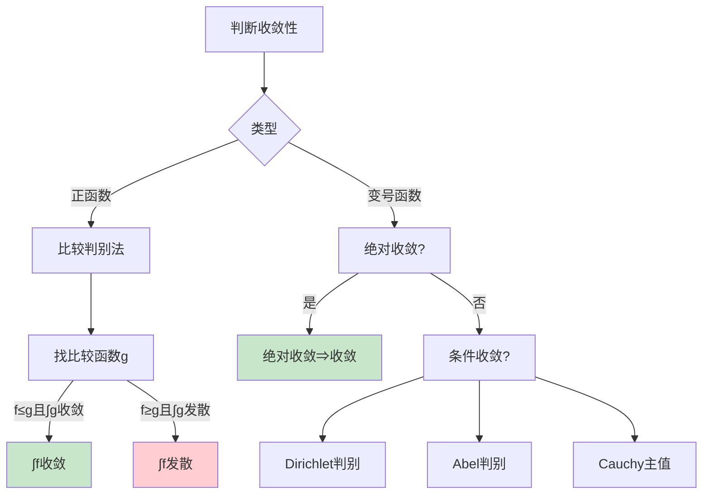
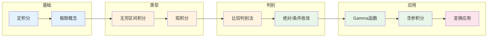

# 反常积分思维导图

## 概述

反常积分是定积分在积分区间无界或被积函数无界情形下的推广。它们是分析学中的重要工具，在物理学、概率论和工程学中有广泛应用。

---

## 核心思维导图

```mermaid
mindmap
  root((反常积分<br/>Improper Integrals))
    无穷区间积分
      定义
        ∫ₐ^∞ f(x)dx
        ∫₋∞^b f(x)dx
        ∫₋∞^∞ f(x)dx
      收敛性
        极限定义
        Cauchy准则
        绝对收敛
        条件收敛
      判别法
        比较判别法
        极限比较法
        p-积分判别
        Dirichlet判别
        Abel判别
    瑕积分
      定义
        被积函数无界
        瑕点/奇点
      类型
        区间端点无界
        内部点无界
      收敛性
        单侧极限定义
        主值积分
    重要例子
      p-积分
        ∫₁^∞ 1/xᵖ dx
        p>1收敛
      高斯积分
        ∫₋∞^∞ e⁻ˣ² dx = √π
      Dirichlet积分
        ∫₀^∞ sinx/x dx = π/2
    计算方法
      Newton-Leibniz
        原函数在无穷远
      变量替换
        化简积分
      分部积分
        递推公式
      含参积分
        积分号下求导
        积分号下积分
    应用
      概率论
        期望与方差
        特征函数
      物理学
        势能计算
        场论积分
      信号处理
        Fourier变换
        Laplace变换
```

---

## 反常积分分类

```mermaid
graph TD
    A[反常积分] --> B[无穷区间]
    A --> C[瑕积分]
    A --> D[混合型]
    
    B --> E[∫ₐ^∞ f(x)dx]
    B --> F[∫₋∞^b f(x)dx]
    B --> G[∫₋∞^∞ f(x)dx]
    
    C --> H[端点瑕点]
    C --> I[内点瑕点]
    
    D --> J[无穷+瑕点]
    
    E --> K[极限lim(M→∞)∫ₐ^M]
    H --> L[极限lim(ε→0+)∫ₐ^(c-ε)]
    
    style E fill:#e3f2fd
    style F fill:#e3f2fd
    style H fill:#fff3e0
    style I fill:#fff3e0
```

---

## 收敛判别法



---

## 重要判别法总结

| 判别法 | 条件 | 结论 |
|--------|------|------|
| **比较判别** | $0 \leq f(x) \leq g(x)$ | $\int g$ 收敛 $\Rightarrow$ $\int f$ 收敛 |
| **极限比较** | $\lim \frac{f(x)}{g(x)} = L \in (0,\infty)$ | 同敛散 |
| **p-积分** | $\int_1^\infty \frac{1}{x^p}dx$ | $p>1$ 收敛，$p\leq 1$ 发散 |
| **p-积分(瑕)** | $\int_0^1 \frac{1}{x^p}dx$ | $p<1$ 收敛，$p\geq 1$ 发散 |
| **Dirichlet** | $F(b)=\int_a^b f$ 有界，$g$ 单调趋于0 | $\int_a^\infty fg$ 收敛 |
| **Abel** | $\int_a^\infty f$ 收敛，$g$ 单调有界 | $\int_a^\infty fg$ 收敛 |

---

## p-积分敛散性

```mermaid
graph LR
    subgraph 无穷区间
        A[∫₁^∞ 1/xᵖ dx] --> B{p>1?}
        B -->|是| C[收敛<br/>1/(p-1)]
        B -->|否| D[发散]
    end
    
    subgraph 瑕积分
        E[∫₀¹ 1/xᵖ dx] --> F{p<1?}
        F -->|是| G[收敛<br/>1/(1-p)]
        F -->|否| H[发散]
    end
    
    style C fill:#c8e6a7
    style G fill:#c8e6a7
    style D fill:#ffcdd2
    style H fill:#ffcdd2
```

---

## 重要反常积分

| 积分 | 结果 | 类型 | 收敛性 |
|------|------|------|--------|
| **高斯积分** | $\int_{-\infty}^{\infty} e^{-x^2} dx = \sqrt{\pi}$ | 绝对收敛 | 概率论基础 |
| **Dirichlet** | $\int_0^{\infty} \frac{\sin x}{x} dx = \frac{\pi}{2}$ | 条件收敛 | Fourier分析 |
| **Euler-Poisson** | $\int_0^{\infty} e^{-x^2} dx = \frac{\sqrt{\pi}}{2}$ | 绝对收敛 | 高斯积分一半 |
| **Frullani** | $\int_0^{\infty} \frac{f(ax)-f(bx)}{x} dx$ | 条件收敛 | 对数形式 |
| **Laplace** | $\int_0^{\infty} e^{-ax} dx = \frac{1}{a}$ | 绝对收敛 | $a>0$ |

---

## 绝对收敛与条件收敛

```mermaid
graph TD
    A[∫f(x)dx] --> B{∫|f(x)|dx收敛?}
    
    B -->|是| C[绝对收敛]
    C --> D[原积分收敛]
    C --> E[可重排]
    
    B -->|否| F{∫f(x)dx收敛?}
    F -->|是| G[条件收敛]
    G --> H[Riemann重排定理]
    F -->|否| I[发散]
    
    style C fill:#c8e6c9
    style G fill:#fff3e0
    style I fill:#ffcdd2
```

---

## 含参反常积分

```mermaid
mindmap
  root((含参反常积分))
    一致收敛
      Weierstrass判别
        |f(x,y)|≤g(x), ∫g收敛
      Dirichlet判别
      Abel判别
    分析性质
      连续性
        一致收敛⇒连续
      积分交换
        累次积分可交换
      微分交换
        一致收敛+控制条件
    Gamma函数
      Γ(s) = ∫₀^∞ x^(s-1)e^(-x)dx
      解析延拓
      函数方程
    Beta函数
      B(p,q) = ∫₀¹ x^(p-1)(1-x)^(q-1)dx
      与Gamma关系
```

---

## 学习路径



---

## 与其他概念的联系

- **Lebesgue积分**: 反常积分与Lebesgue可积的关系
- **复分析**: 围道积分计算实反常积分
- **概率论**: 期望、特征函数定义
- **物理**: 势能、场论计算
- **积分变换**: Fourier变换、Laplace变换
- **特殊函数**: Gamma函数、Beta函数

---

## 参考

- 《数学分析》陈纪修
- 《数学分析原理》Rudin
- 《实分析与复分析》Rudin

---

*文档版本：1.1（质量提升版）*
*最后更新：2026年4月*
*分类：数学分析 / 积分理论 / 思维导图*
