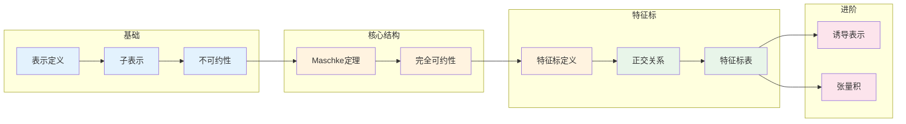

# 表示论基础 - 思维导图

## 概述

群表示论是将抽象的群结构转化为具体的线性变换群（矩阵群）的理论。通过表示，我们可以用线性代数的工具研究群的结构，这是连接抽象代数与几何、物理、化学的桥梁。表示论在现代数学和物理学中无处不在，从晶体对称性分类到粒子物理的标准模型，都有其身影。

---

## 核心思维导图

```mermaid
mindmap
  root((表示论基础<br/>Representation Theory))
    基本定义
      表示
        ρ: G → GL(V)
        同态到线性群
      表示空间
        V 向量空间
        G-模结构
      表示的度
        dim(V)
        有限维/无限维
    表示类型
      不可约表示
        无非平凡子表示
        基本构件
      可约表示
        可分解为直和
        完全可约性
      平凡表示
        ρ(g) = id
        一维
    特征标
      定义
        χ(g) = tr(ρ(g))
        类函数
      正交关系
        Schur正交
        不可约特征标正交基
      特征标表
        有限群的完全不变量
    正则表示
      左正则表示
        在ℂ[G]上
        包含所有不可约表示
      分解
        ℂ[G] ≅ ⊕ nᵢVᵢ
        nᵢ = dim(Vᵢ)
    Maschke定理
      条件
        G有限, char∤|G|

      结论
        完全可约性
        半单代数
    应用
      分子对称性
      粒子物理
      调和分析

```

---

## 表示基本结构

```mermaid
graph TD
    subgraph 群G
        G1[G]
    end
    
    subgraph 表示
        R[ρ: G → GL(V)]
    end
    
    subgraph 表示空间V
        V1[V]
        Sub[子表示 W ⊆ V]
        Irr[不可约表示<br/>无非平凡子表示]
    end
    
    subgraph 分解
        Maschke[⊕分解<br/>完全可约]
        V1 -->|直和| W1[W₁]

        V1 --> W2[W₂]
        V1 --> Wk[Wₖ]
    end
    
    G1 --> R
    R --> V1
    V1 --> Sub
    Sub --> Irr
    V1 --> Maschke
    
    style G1 fill:#e3f2fd
    style R fill:#fff3e0
    style V1 fill:#e8f5e9
    style Irr fill:#c8e6c9

```

---

## 不可约表示分类

```mermaid
graph TD
    subgraph 有限群表示
        Fin[有限群 G]
    end
    
    subgraph 不可约表示数目
        Num[等于共轭类数]
    end
    
    subgraph 一维表示
        Dim1[deg = 1]
        Ab[G/[G,G] 的表示]
        Num1[|G/[G,G]| 个]

    end
    
    subgraph 高维表示
        DimH[deg > 1]
        Decomp[维数公式<br/>Σ(dim Vᵢ)² = |G|]

    end
    
    subgraph 例子S₃
        S3[S₃]
        Triv[平凡<br/>χ₁]
        Sign[符号<br/>χ₂]
        Std[标准<br/>χ₃, dim=2]
    end
    
    Fin --> Num
    Fin --> Dim1
    Fin --> DimH
    
    Num1 --> Decomp
    S3 --> Triv
    S3 --> Sign
    S3 --> Std
    
    style S3 fill:#e3f2fd
    style Triv fill:#fff3e0
    style Sign fill:#fff3e0
    style Std fill:#c8e6c9

```

---

## 特征标理论

```mermaid
mindmap
  root((特征标理论<br/>Character Theory))
    定义
      χ(g) = tr(ρ(g))
      共轭类上常值
      类函数
    正交关系
      第一正交
        ⟨χᵢ,χⱼ⟩ = δᵢⱼ
        内积: (1/|G|)Σχ(g)χ'(g)⁻¹

      第二正交
        Σχᵢ(g)χᵢ(h)⁻¹ = |C(g)|δ_{Cl(g),Cl(h)}

    特征标表
      行: 不可约特征标
      列: 共轭类
      正交性: 行/列
    重要性质
      χ(e) = dim(V)

      |χ(g)| ≤ χ(e)

      χ(g⁻¹) = χ(g)‾
    应用
      表示分解
      判断不可约性
      计算张量积

```

---

## 特征标表结构

```mermaid
graph TD
    subgraph S₃的特征标表
        Header["|       | {e} | (12) | (123) |"]
        Row1["| χ₁    |  1  |  1   |   1   |"]
        Row2["| χ₂    |  1  | -1   |   1   |"]
        Row3["| χ₃    |  2  |  0   |  -1   |"]

    end
    
    subgraph 验证
        V1[χ₁²+χ₂²+χ₃²=1+1+4=6=|S₃| ✓]
        V2[正交性: Σ|C(g)|χᵢ(g)χⱼ(g)⁻¹=0, i≠j ✓]

    end
    
    subgraph 列正交
        Col1["|{e}|: 1+1+4=6"]
        Col2["|(12)|: 3(1+1+0)=6"]
        Col3["|(123)|: 2(1+1+1)=6"]

    end
    
    Header --> Row1
    Header --> Row2
    Header --> Row3
    Row3 --> V1
    Row3 --> V2
    V2 --> Col1
    V2 --> Col2
    V2 --> Col3
    
    style Header fill:#e3f2fd
    style Row1 fill:#fff3e0
    style Row2 fill:#fff3e0
    style Row3 fill:#c8e6c9

```

---

## Maschke定理

```mermaid
graph TD
    subgraph 定理陈述
        Maschke[Maschke定理]
    end
    
    subgraph 条件
        G[有限群 G]
        Field[域 F]
        Char[char(F) ∤ |G|]

    end
    
    subgraph 结论
        Concl[完全可约性]
        Any[任意表示可分解]
        IrrDecomp[为不可约表示的直和]
    end
    
    subgraph 证明关键
        Avg[平均算子]
        Proj[构造G-等变投影]
        Comp[补子空间也是G-不变的]
    end
    
    Maschke --> G
    Maschke --> Field
    Field --> Char
    Maschke --> Concl
    Concl --> Any
    Any --> IrrDecomp
    Maschke --> Avg
    Avg --> Proj
    Proj --> Comp
    
    style Maschke fill:#e3f2fd
    style Concl fill:#c8e6c9
    style IrrDecomp fill:#c8e6c9

```

---

## 正则表示分解

```mermaid
graph TD
    subgraph 群代数
        CG[ℂ[G] = {Σa₉g}]
    end
    
    subgraph 正则表示
        Reg[左乘作用<br/>h·(Σa₉g) = Σa₉(hg)]
        Dim[dim = |G|]

    end
    
    subgraph 分解
        Decomp[ℂ[G] ≅ ⊕ᵢ (dim Vᵢ) Vᵢ]
        Multi[每个不可约表示出现次数=其维数]
    end
    
    subgraph 维数公式
        DimForm[|G| = Σᵢ (dim Vᵢ)²]

    end
    
    subgraph S₃例子
        S3[ℂ[S₃] ≅ 1·χ₁ ⊕ 1·χ₂ ⊕ 2·χ₃]
        Verify[6 = 1² + 1² + 2² ✓]
    end
    
    CG --> Reg
    Reg --> Decomp
    Decomp --> DimForm
    DimForm --> S3
    S3 --> Verify
    
    style CG fill:#e3f2fd
    style Reg fill:#fff3e0
    style Decomp fill:#e8f5e9
    style DimForm fill:#c8e6c9

```

---

## 表示的张量积

```mermaid
mindmap
  root((张量积表示))
    定义
      V ⊗ W
      (g·(v⊗w) = (g·v)⊗(g·w)
    特征标
      χ_{V⊗W}(g) = χ_V(g)·χ_W(g)
      逐点乘积
    Clebsch-Gordan
      Vᵢ ⊗ Vⱼ = ⊕ₖ cᵢⱼᵏ Vₖ
      分解系数
    对称与交错幂
      Sym²(V), Λ²(V)
      对称/反对称部分
    例子
      标准⊗标准 = 平凡⊕符号⊕标准
      S₃表示

```

---

## 诱导表示与限制

```mermaid
graph TD
    subgraph 子群H≤G
        H[H]
        RepH[ρ: H → GL(W)]
    end
    
    subgraph 诱导表示
        Ind[Ind_H^G(W)]
        Def[函数f: G→W, f(hg)=h·f(g)]
        Dim[dim = [G:H]·dim(W)]
    end
    
    subgraph Frobenius互反
        Fro[Hom_G(V, Ind_H^G(W)) ≅ Hom_H(Res_H^G(V), W)]
    end
    
    subgraph 限制表示
        Res[Res_H^G(V)]
        V[σ: G → GL(V)]
        ToH[限制到H]
    end
    
    H --> RepH
    RepH --> Ind
    Ind --> Dim
    Ind --> Fro
    V --> Res
    Res --> Fro
    
    style Ind fill:#e3f2fd
    style Res fill:#fff3e0
    style Fro fill:#c8e6c9

```

---

## 表示论应用

```mermaid
mindmap
  root((应用领域))
    物理学
      量子力学
        对称性与守恒律
        角动量理论
      粒子物理
        标准模型
        SU(3)×SU(2)×U(1)
      凝聚态
        晶体对称性
        能带理论
    化学
      分子轨道
        对称性匹配
        光谱选择定则
      晶体学
        230个空间群
    数学
      调和分析
        Fourier分析推广
        紧群上的分析
      数论
        Artin L-函数
        Langlands纲领
      组合
        Burnside引理
        Polya计数
    其他
      密码学
        表示攻击
      编码理论
        群码

```

---

## 重要公式速查

| 公式 | 说明 |
|------|------|
| $\chi(e) = \dim(V)$ | 特征标在单位元处的值 |
| $\sum_i (\dim V_i)^2 = |G|$ | 维数公式 |
| $\langle \chi, \chi' \rangle = \frac{1}{|G|} \sum_g \chi(g) \overline{\chi'(g)}$ | 特征标内积 |
| $\chi_{V \otimes W} = \chi_V \cdot \chi_W$ | 张量积特征标 |
| $\chi_{V^*} = \overline{\chi_V}$ | 对偶表示特征标 |
| $\dim(\text{Hom}_G(V,W)) = \langle \chi_V, \chi_W \rangle$ | Schur引理推论 |

---

## 学习路径



---

## 与后续概念的联系

- **李群表示论**: 连续群的表示
- **代数群**: 代数几何中的表示
- **模表示**: 特征p域上的表示
- **同调代数**: 群上同调与表示
- **几何表示论**: 几何方法研究表示
- **量子群**: 量子化后的表示论

---

*文档版本：1.0*
*创建时间：2026年4月*
*分类：代数学 / 群论 / 思维导图*
