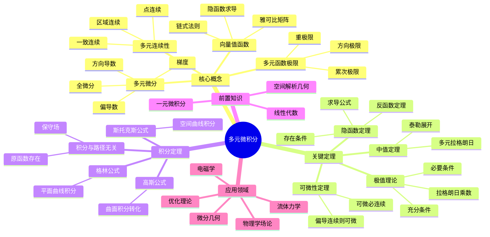

msc_primary: "00A99"
msc_secondary: ['00-XX']
---

# 多元微积分思维导图

## 概述
多元微积分将微积分理论推广到多元函数，是分析学的重要组成部分。

## 核心要点

### 多元可微性
**全微分**:
$$df = \frac{\partial f}{\partial x_1}dx_1 + \cdots + \frac{\partial f}{\partial x_n}dx_n$$

**关系链**:
偏导连续 → 可微 → 偏导存在 → 连续

### 梯度与方向导数
$$\nabla f = \left(\frac{\partial f}{\partial x_1}, \ldots, \frac{\partial f}{\partial x_n}\right)$$
$$\frac{\partial f}{\partial \mathbf{u}} = \nabla f \cdot \mathbf{u}$$

### 三大积分公式

| 公式 | 形式 | 维度关系 |
|------|------|----------|
| 格林 | ∮Pdx+Qdy = ∬(∂Q/∂x-∂P/∂y)dxdy | 2D |
| 高斯 | ∯F·dS = ∭∇·F dV | 3D |
| 斯托克斯 | ∮F·dr = ∬(∇×F)·dS | 2D→3D |

## 参考
- 《多元微积分》Marsden
- 《数学分析》卓里奇
