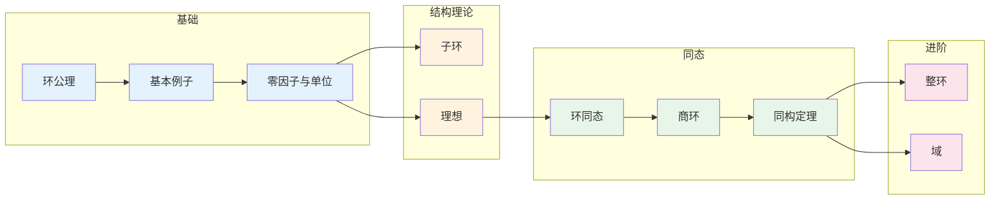

# 环的基本概念 - 思维导图

## 概述

环是代数学中同时具有两种运算（加法和乘法）的代数结构，它是群的直接推广，也是通向域、模等更复杂结构的关键一步。整数环 $\mathbb{Z}$ 是最典型的环例子，它既是抽象环论的原型，也是数论的基石。环论在代数几何、代数数论和密码学中有着核心地位。

---

## 核心思维导图

```mermaid
mindmap
  root((环的基本概念<br/>Ring Fundamentals))
    定义与公理
      加法群结构
        (R,+) 是阿贝尔群
      乘法半群
        (R,·) 是半群
        结合律
      分配律
        a(b+c) = ab+ac
        (b+c)a = ba+ca
    基本分类
      含幺环
        乘法单位元1
      交换环
        ab = ba
      整环
        无零因子
        乘法消去律
      除环/体
        非零元可逆
        非交换域
      域
        交换除环
        非零元乘法群
    重要例子
      数环
        ℤ 整数环
        ℚ, ℝ, ℂ
        ℤ/nℤ
      多项式环
        R[x]
        R[x₁,...,xₙ]
      矩阵环
        Mₙ(R)
        非交换例子
      函数环
        C(X)
        连续函数
    零因子与单位
      零因子
        ab=0, a,b≠0
      幂零元
        aⁿ=0
      单位
        可逆元 R*
        构成乘法群
    特征
      char(R)
        使n·1=0的最小n
        0表示特征0
      域的特征
        0或素数p

```

---

## 环的层次结构

```mermaid
graph TD
    R[环 Ring] --> CR[含幺环<br/>Ring with 1]
    R --> NCR[非含幺环]
    
    CR --> ComR[交换环<br/>Commutative]
    CR --> NComR[非交换环]
    
    ComR --> ID[整环<br/>Integral Domain<br/>无零因子]
    NComR --> DR[除环/体<br/>Division Ring]
    
    ID --> F[域 Field<br/>交换除环]
    DR --> F
    
    ID --> PID[主理想整环]
    PID --> UFD[唯一分解整环]
    
    NComR --> MR[矩阵环 Mₙ(R)]
    MR --> SimpleR[单环]
    
    style R fill:#e3f2fd
    style CR fill:#bbdefb
    style ComR fill:#fff3e0
    style ID fill:#ffe0b2
    style F fill:#c8e6c9
    style DR fill:#e8f5e9

```

---

## 环公理体系

```mermaid
graph TD
    subgraph 加法结构 (R,+)
        A1[封闭性] --> A2[结合律]
        A2 --> A3[交换律]
        A3 --> A4[零元 0]
        A4 --> A5[负元 -a]
    end
    
    subgraph 乘法结构 (R,·)
        M1[封闭性] --> M2[结合律]
        M2 --> M3[可选: 交换律]
        M2 --> M4[可选: 单位元 1]
    end
    
    subgraph 联系
        D1[左分配律<br/>a(b+c)=ab+ac]
        D2[右分配律<br/>(b+c)a=ba+ca]
    end
    
    A5 --> D1
    M2 --> D1
    M2 --> D2
    
    subgraph 特殊性质
        NZ[无零因子<br/>ab=0⇒a=0或b=0]
        Inv[可逆元<br/>ab=ba=1]
    end
    
    style A1 fill:#e3f2fd
    style M1 fill:#fff3e0
    style D1 fill:#e8f5e9
    style NZ fill:#c8e6c9

```

---

## 零因子、幂零元与单位

```mermaid
mindmap
  root((特殊元素))
    零因子
      定义
        ab=0, 但a≠0,b≠0
        零因子不存在⇒整环
      例子
        ℤ/6ℤ: 2·3=0
        M₂(ℝ): 非零矩阵乘积为零
    幂零元
      定义
        aⁿ=0, 对某个n>0
        幂零⇒零因子(在交换环)
      例子
        ℤ/8ℤ: 2³=0
        严格上三角矩阵
    单位(可逆元)
      定义
        ∃b: ab=ba=1
        记R*
      性质
        R* 是乘法群
        单位不是零因子
      例子
        ℤ* = {±1}
        ℚ* = ℚ\\{0}
        (ℤ/nℤ)*

```

---

## 典型环例子详解

```mermaid
graph LR
    subgraph 数环
        Z[ℤ<br/>整数环] --> Q[ℚ<br/>域]
        Q --> R[ℝ<br/>域]
        R --> C[ℂ<br/>代数闭域]
        Z --> Zn[ℤ/nℤ<br/>有限环]
    end
    
    subgraph 多项式环
        Rx[ℝ[x]<br/>欧几里得整环]
        Rx --> RxQ[ℚ(x)<br/>分式域]
        RxM[ℝ[x,y]<br/>多元多项式]
    end
    
    subgraph 矩阵环
        Mn[M₂(ℝ)<br/>非交换单环]
        Mn --> GL[GL₂(ℝ)<br/>单位群]
    end
    
    subgraph 函数环
        CX[C[0,1]<br/>连续函数]
        CX --> Sub[子环结构]
    end
    
    style Z fill:#e3f2fd
    style Q fill:#c8e6c9
    style Rx fill:#fff3e0
    style Mn fill:#ffcdd2
    style CX fill:#e8f5e9

```

---

## 特征的性质

```mermaid
graph TD
    subgraph 特征定义
        Char[char(R)]
        Def[n·1 = 0的最小正整数n]
        Zero[若不存在则为0]
    end
    
    subgraph 域的特征
        ZeroChar[char = 0] --> Qsub[包含ℚ子域]
        PChar[char = p] --> Fpsub[包含𝔽ₚ子域]
    end
    
    subgraph 重要性质
        Fresh[Freshman法则<br/>(a+b)^p = a^p + b^p]
        Frobenius[Frobenius自同态]
    end
    
    subgraph 例子
        Z[char(ℤ) = 0]
        Zp[char(ℤ/pℤ) = p]
        Q[char(ℚ) = 0]
        Fpn[char(𝔽_{pⁿ}) = p]
    end
    
    Char --> ZeroChar
    Char --> PChar
    PChar --> Fresh
    Fresh --> Frobenius
    
    style Char fill:#e3f2fd
    style ZeroChar fill:#fff3e0
    style PChar fill:#c8e6c9
    style Fresh fill:#e8f5e9

```

---

## 环同态基础

```mermaid
graph TD
    subgraph 环同态定义
        Hom[φ: R → S]
        Cond1[φ(a+b) = φ(a)+φ(b)]
        Cond2[φ(ab) = φ(a)φ(b)]
    end
    
    subgraph 核与像
        Ker[ker(φ) = {a: φ(a)=0}]
        Im[im(φ) = {φ(a): a∈R}]
    end
    
    subgraph 理想
        Ideal[ker(φ) 是R的理想]
        Proper[真理想]
        Max[极大理想]
        Prime[素理想]
    end
    
    subgraph 同态基本定理
        Thm[R/ker(φ) ≅ im(φ)]
    end
    
    Hom --> Cond1
    Hom --> Cond2
    Hom --> Ker
    Hom --> Im
    Ker --> Ideal
    Ideal --> Proper
    Ideal --> Max
    Ideal --> Prime
    Ker --> Thm
    Im --> Thm
    
    style Hom fill:#e3f2fd
    style Ker fill:#fff3e0
    style Ideal fill:#e8f5e9
    style Thm fill:#c8e6c9

```

---

## 环的例子对比表

| 环 | 交换 | 含幺 | 零因子 | 整环 | 域 |
|----|------|------|--------|------|-----|
| $\mathbb{Z}$ | ✓ | ✓ | ✗ | ✓ | ✗ |
| $\mathbb{Q}, \mathbb{R}, \mathbb{C}$ | ✓ | ✓ | ✗ | ✓ | ✓ |
| $\mathbb{Z}/n\mathbb{Z}$ ($n$ 合数) | ✓ | ✓ | ✓ | ✗ | ✗ |
| $\mathbb{Z}/p\mathbb{Z}$ ($p$ 素数) | ✓ | ✓ | ✗ | ✓ | ✓ |
| $M_n(\mathbb{R})$ ($n \geq 2$) | ✗ | ✓ | ✓ | ✗ | ✗ |
| $\mathbb{H}$ (四元数) | ✗ | ✓ | ✗ | ✗ | ✓ |
| $2\mathbb{Z}$ | ✓ | ✗ | ✗ | ✓ | ✗ |
| $\mathbb{R}[x]$ | ✓ | ✓ | ✗ | ✓ | ✗ |

---

## 学习路径



---

## 与后续概念的联系

- **模论**: 环在阿贝尔群上的作用
- **域论**: 特殊的交换除环
- **代数几何**: 交换环与代数簇
- **代数数论**: 数环的算术性质
- **同调代数**: 环上的模同调

---

*文档版本：1.0*
*创建时间：2026年4月*
*分类：代数学 / 环论 / 思维导图*
