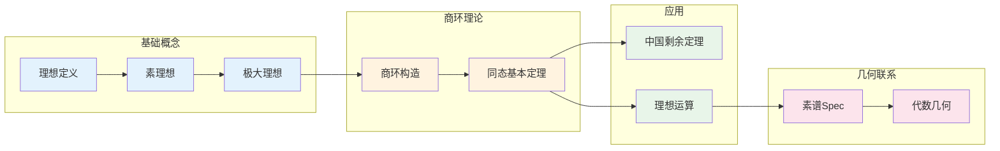

# 理想与商环 - 思维导图

## 概述

理想是环论中的核心概念，它是子群概念在环中的自然推广，同时也是环同态核的精确刻画。商环的构造使我们能够"模掉"某些关系，类似于群论中的商群。理想理论在代数数论和代数几何中占据中心地位——素理想是整数的素数的推广，而代数簇与素理想谱之间存在深刻的几何对应。

---

## 核心思维导图

```mermaid
mindmap
  root((理想与商环<br/>Ideals & Quotient Rings))
    理想定义
      基本概念
        I⊆R 子集
        对加法封闭
        吸收乘法
      类型
        双边理想
        左理想
        右理想
      生成理想
        (a) = RaR
        (a₁,...,aₙ)
    理想类型
      真理想
        I ≠ R
      极大理想
        极大真理想
        R/M 是域
      素理想
        ab∈P ⇒ a∈P或b∈P
        R/P 是整环
      准素理想
        素理想的推广
      根理想
        √I = {a: aⁿ∈I}
    商环构造
      R/I
        陪集 a+I
        运算良定义
      同态基本定理
        R/ker(φ) ≅ im(φ)
      对应定理
        理想 ↔ 商环理想
    理想运算
      交与和
        I∩J, I+J
      积
        I·J
      商
        (I:J)
      根
        √I
```

---

## 理想层次结构

```mermaid
graph TD
    subgraph 理想分类
        I[理想 I ⊆ R]
    end
    
    subgraph 特殊类型
        Prime[素理想 P]
        Max[极大理想 M]
        Prim[准素理想 Q]
        Rad[根理想 √I=I]
    end
    
    subgraph 包含关系
        Max --> Prime
        Prime --> Rad
        Prim -.-> Prime
    end
    
    subgraph 商环性质
        QMax[R/M 是域]
        QPrime[R/P 是整环]
        QPrim[R/Q 有唯一极小素理想]
    end
    
    Max --> QMax
    Prime --> QPrime
    Prim --> QPrim
    
    subgraph 整数环例子
        ZI[(n) = nℤ]
        ZMax[(p), p素数]
        ZPrime[(p), p素数]
        ZRad[所有根理想]
    end
    
    I --> Prime
    I --> Max
    I --> Prim
    I --> Rad
    
    ZI --> ZMax
    ZMax --> ZPrime
    ZPrime --> ZRad
    
    style I fill:#e3f2fd
    style Max fill:#c8e6c9
    style Prime fill:#fff3e0
    style ZMax fill:#e8f5e9
```

---

## 素理想与极大理想

```mermaid
graph TD
    subgraph 素理想 P
        PDef[ab ∈ P ⇒ a ∈ P 或 b ∈ P]
        PEquiv[R/P 是整环]
        PEx[ℤ中: (p), p素数]
    end
    
    subgraph 极大理想 M
        MDef[极大真理想]
        MEquiv[R/M 是域]
        MEx[ℤ中: (p), p素数]
    end
    
    subgraph 关系
        MaxImpliesPrime[极大 ⇒ 素]
        NotConv[素 ⇏ 极大]
        ConvPID[在PID中等价]
    end
    
    subgraph 例子
        Z[ℤ: (p)既是素又是极大]
        Zx[ℤ[x]: (x)素但非极大]
        Q[ℚ[x,y]: 复杂结构]
    end
    
    PDef --> PEquiv
    MDef --> MEquiv
    MDef --> MaxImpliesPrime
    PDef --> MaxImpliesPrime
    MaxImpliesPrime --> ConvPID
    
    PEx --> Z
    MEx --> Z
    Zx --> NotConv
    
    style PEquiv fill:#e3f2fd
    style MEquiv fill:#c8e6c9
    style MaxImpliesPrime fill:#fff3e0
```

---

## 商环构造

```mermaid
graph TD
    subgraph 原环R
        R1[R]
        I1[I 理想]
    end
    
    subgraph 陪集
        C[a+I = {a+i: i∈I}]
        AllC[R/I = {a+I: a∈R}]
    end
    
    subgraph 运算定义
        Add[(a+I)+(b+I) = (a+b)+I]
        Mul[(a+I)(b+I) = ab+I]
        Well[需验证良定义性]
    end
    
    subgraph 自然投影
        Pi[π: R → R/I]
        PiDef[π(a) = a+I]
        Ker[ker(π) = I]
    end
    
    subgraph 例子
        Zn[ℤ/nℤ = ℤ/(n)]
        Rx[ℝ[x]/(x²+1) ≅ ℂ]
        Double[R[x,y]/(x,y) ≅ R]
    end
    
    R1 --> C
    I1 --> C
    C --> AllC
    AllC --> Add
    AllC --> Mul
    Add --> Well
    Mul --> Well
    Well --> Pi
    Pi --> PiDef
    PiDef --> Ker
    
    AllC --> Zn
    AllC --> Rx
    AllC --> Double
    
    style R1 fill:#e3f2fd
    style AllC fill:#fff3e0
    style Pi fill:#e8f5e9
    style Ker fill:#c8e6c9
```

---

## 理想运算

```mermaid
mindmap
  root((理想运算))
    和 I+J
      定义
        {a+b: a∈I, b∈J}
      性质
        包含I和J的最小理想
        生成理想的和
      例子
        (a)+(b) = (gcd(a,b)) in ℤ
    交 I∩J
      定义
        I∩J
      性质
        包含于I和J的最大理想
        中国剩余定理
      例子
        (a)∩(b) = (lcm(a,b)) in ℤ
    积 I·J
      定义
        有限和 Σaᵢbᵢ
      性质
        I·J ⊆ I∩J
        幂等理想
      例子
        (a)(b) = (ab) in ℤ
    商 (I:J)
      定义
        {r∈R: rJ⊆I}
      性质
        理想商
        局部化基础
    根 √I
      定义
        {r: rⁿ∈I}
      性质
        包含I的最小根理想
        素理想交
```

---

## 同态基本定理体系

```mermaid
graph TD
    subgraph 第一同构定理
        Thm1[φ: R→S 环同态]
        Thm1R[R/ker(φ) ≅ im(φ)]
    end
    
    subgraph 对应定理
        Thm2[{J: ker(φ)⊆J⊆R} ↔ {K: K⊆im(φ)}]
        Preserve[保持包含、和、交]
    end
    
    subgraph 第二同构定理
        Thm3[R 环, S⊆R 子环, I⊆R 理想]
        Thm3R[S/(S∩I) ≅ (S+I)/I]
    end
    
    subgraph 第三同构定理
        Thm4[I⊆J⊆R 都是理想]
        Thm4R[(R/I)/(J/I) ≅ R/J]
    end
    
    Thm1 --> Thm1R
    Thm1R --> Thm2
    Thm2 --> Preserve
    Thm1 --> Thm3
    Thm3 --> Thm3R
    Thm1 --> Thm4
    Thm4 --> Thm4R
    
    style Thm1 fill:#e3f2fd
    style Thm1R fill:#c8e6c9
    style Thm2 fill:#fff3e0
    style Thm3R fill:#e8f5e9
    style Thm4R fill:#e8f5e9
```

---

## 中国剩余定理

```mermaid
graph TD
    subgraph 定理陈述
        CRT[中国剩余定理]
    end
    
    subgraph 条件
        Comax[I₁,...,Iₙ 两两互素]
        DefComax[Iᵢ+Iⱼ = R, i≠j]
    end
    
    subgraph 结论
        Iso[R/(∩Iᵢ) ≅ R/I₁ × ... × R/Iₙ]
        Product[同构于直积]
    end
    
    subgraph 整数情形
        ZEx[ℤ/(mn) ≅ ℤ/m × ℤ/n, (m,n)=1]
        App[解同余方程组]
        x ≡ a₁ mod m₁
        x ≡ aₙ mod mₙ
    end
    
    subgraph 多项式情形
        Poly[ℝ[x]/((x-a)(x-b)) ≅ ℝ × ℝ]
        Eval[赋值同态]
    end
    
    CRT --> Comax
    Comax --> Iso
    Iso --> ZEx
    ZEx --> App
    Iso --> Poly
    Poly --> Eval
    
    style CRT fill:#e3f2fd
    style Iso fill:#c8e6c9
    style ZEx fill:#fff3e0
    style App fill:#e8f5e9
```

---

## 素谱与几何

```mermaid
mindmap
  root((素谱 Spec(R)))
    定义
      Spec(R)
        所有素理想的集合
      拓扑
        Zariski拓扑
        闭集: V(I) = {P⊇I}
    结构层
      局部环层
        在P点的茎: Rₚ
      概形
        局部环化空间
    对应关系
      代数-几何
        环 ↔ 仿射概形
        理想 ↔ 闭子集
        素理想 ↔ 点
      例子
        Spec(ℂ[x]) = 𝔸¹ℂ
        Spec(ℤ) = 算术直线
    应用
      代数几何
        坐标环
        正则函数
      代数数论
        整数环的素理想
        Dedekind整环
```

---

## 重要定理总结

| 定理 | 陈述 | 应用 |
|------|------|------|
| **第一同构** | $R/\ker(\varphi) \cong \text{im}(\varphi)$ | 商环结构 |
| **对应定理** | 理想对应商环理想 | 子结构分析 |
| **中国剩余** | 两两互素理想的商同构于直积 | 同余方程、分解 |
| **极大⇒素** | 极大理想都是素理想 | 素理想存在性 |
| **素理想存在** | 任何真理想含于极大理想 | Zorn引理应用 |

---

## 学习路径



---

## 与后续概念的联系

- **交换代数**: 理想的深入理论、局部化
- **代数几何**: Spec函子、概形
- **代数数论**: Dedekind整环、类群
- **模论**: 理想作为模、模的局部化
- **同调代数**: Tor和Ext函子

---

*文档版本：1.0*
*创建时间：2026年4月*
*分类：代数学 / 环论 / 思维导图*
