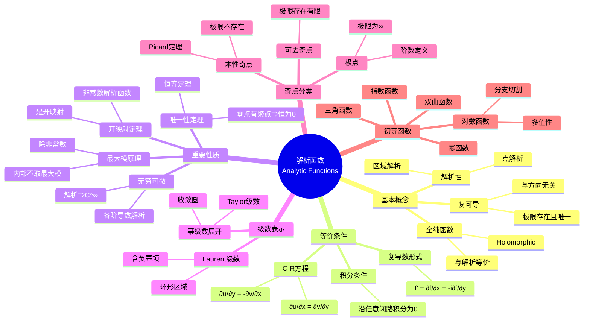
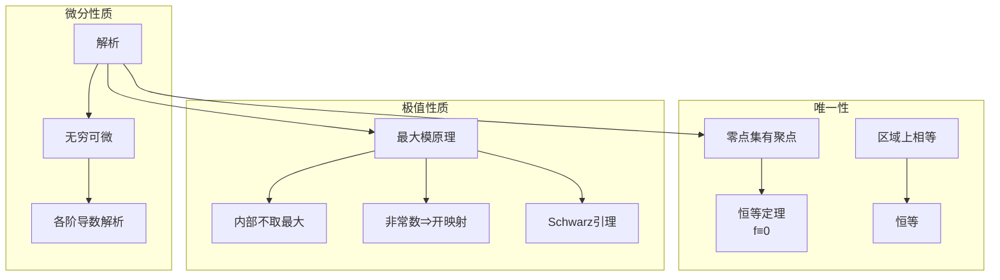

# 解析函数思维导图

## 概述

解析函数（全纯函数）是复变函数论的核心研究对象。在区域内处处可导的复变函数具有极其丰富的性质，这些性质构成了复分析的理论基础。

---

## 核心思维导图



---

## 解析性等价条件

```mermaid
graph TD
    A[f在z₀解析] --> B[复可导]
    A --> C[C-R方程满足]
    A --> D[局部幂级数展开]
    A --> E[沿闭路积分为0]
    
    B --> F[极限lim(f(z)-f(z₀))/(z-z₀)存在]
    
    C --> G[∂u/∂x = ∂v/∂y]
    C --> H[∂u/∂y = -∂v/∂x]
    
    D --> I[Taylor展开<br/>f(z)=Σaₙ(z-z₀)ⁿ]
    
    E --> J[Cauchy积分定理]
    
    style A fill:#e3f2fd
    style B fill:#fff3e0
    style C fill:#fff3e0
    style D fill:#e8f5e9
    style E fill:#fce4ec
```

---

## Cauchy-Riemann方程

| 形式 | 方程 | 复导数 |
|------|------|--------|
| 笛卡尔 | $\frac{\partial u}{\partial x} = \frac{\partial v}{\partial y}, \frac{\partial u}{\partial y} = -\frac{\partial v}{\partial x}$ | $f' = \frac{\partial u}{\partial x} + i\frac{\partial v}{\partial x}$ |
| 极坐标 | $\frac{\partial u}{\partial r} = \frac{1}{r}\frac{\partial v}{\partial \theta}, \frac{\partial v}{\partial r} = -\frac{1}{r}\frac{\partial u}{\partial \theta}$ | - |
| 复形式 | $\frac{\partial f}{\partial \bar{z}} = 0$ | $f' = \frac{\partial f}{\partial z}$ |

---

## 解析函数的性质



---

## 奇点分类

```mermaid
flowchart TD
    A[孤立奇点z₀] --> B{极限存在?}
    
    B -->|有限值| C[可去奇点]
    C --> D[定义f(z₀)=lim<br/>成为解析点]
    
    B -->|∞| E[极点]
    E --> F[m阶极点]
    F --> G[Laurent展开<br/>有限个负幂项]
    
    B -->|不存在| H[本性奇点]
    H --> I[Picard定理<br/>无穷多次取几乎所有值]
    
    style C fill:#c8e6c9
    style E fill:#fff3e0
    style H fill:#ffcdd2
```

---

## 重要初等函数

| 函数 | 定义 | 性质 |
|------|------|------|
| $e^z$ | $e^x(\cos y + i\sin y)$ | 周期 $2\pi i$，$(e^z)'=e^z$ |
| $\sin z$ | $\frac{e^{iz}-e^{-iz}}{2i}$ | 零点 $n\pi$，奇函数 |
| $\cos z$ | $\frac{e^{iz}+e^{-iz}}{2}$ | 零点 $(n+\frac{1}{2})\pi$，偶函数 |
| $\ln z$ | $\ln|z| + i\arg z$ | 多值，分支切割沿负实轴 |
| $z^a$ | $e^{a\ln z}$ | 一般多值，$a\in\mathbb{Z}$时单值 |
| $\tan z$ | $\sin z/\cos z$ | 极点 $z=(n+\frac{1}{2})\pi$ |

---

## 级数展开

```mermaid
mindmap
  root((级数展开))
    Taylor级数
      条件: 圆盘内解析
      公式: Σf⁽ⁿ⁾(z₀)(z-z₀)ⁿ/n!
      收敛半径: 到最近奇点距离
    Laurent级数
      条件: 环形区域解析
      公式: Σaₙ(z-z₀)ⁿ
      含负幂项
    展开应用
      奇点分析
      留数计算
      渐近估计
```

---

## 积分公式

| 公式 | 表达式 | 条件 |
|------|--------|------|
| **Cauchy积分** | $f(z_0) = \frac{1}{2\pi i} \oint_C \frac{f(z)}{z-z_0} dz$ | $f$ 在C内解析 |
| **导数公式** | $f^{(n)}(z_0) = \frac{n!}{2\pi i} \oint_C \frac{f(z)}{(z-z_0)^{n+1}} dz$ | 同上 |
| **平均值** | $f(z_0) = \frac{1}{2\pi} \int_0^{2\pi} f(z_0+re^{i\theta}) d\theta$ | 圆盘上解析 |

---

## 学习路径


---

## 与其他概念的联系

- **实分析**: 调和函数与解析函数的实部虚部关系
- **偏微分方程**: Laplace方程、调和函数
- **代数拓扑**: 环绕数、指标定理
- **物理学**: 二维电势、流体力学
- **数论**: ζ函数、模形式

---

## 参考

- 《复分析》Ahlfors
- 《复变函数论》钟玉泉
- 《Visual Complex Analysis》Needham

---

*文档版本：1.1（质量提升版）*
*最后更新：2026年4月*
*分类：复分析 / 解析函数 / 思维导图*
