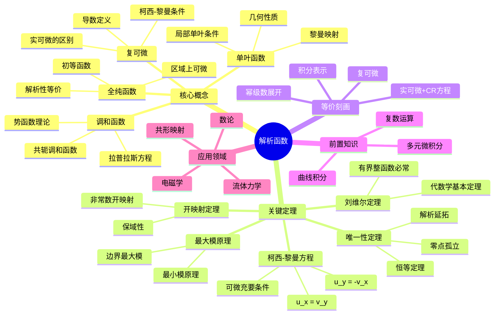

# 解析函数思维导图

## 概述
解析函数（全纯函数）是复分析的核心研究对象，具有极其优美的性质。

## 核心要点

### 柯西-黎曼方程
**定理**: f(z) = u(x,y) + iv(x,y) 可微 ⇔
$$\frac{\partial u}{\partial x} = \frac{\partial v}{\partial y}, \quad \frac{\partial u}{\partial y} = -\frac{\partial v}{\partial x}$$

### 刘维尔定理
**定理**: 有界整函数必为常数

**推论**: 代数学基本定理（非常数多项式必有根）

### 最大模原理
**定理**: 非常数全纯函数在区域内部不能达到最大模

## 参考
- 《复分析》Ahlfors
- 《复变函数论》钟玉泉
