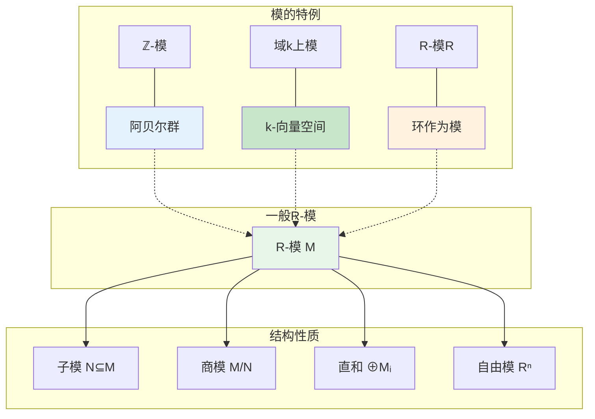
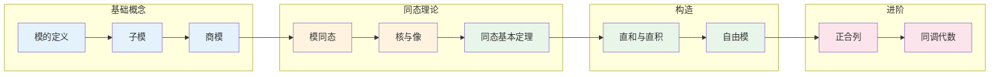

# 模的基本概念 - 思维导图

## 概述

模是同时推广向量空间和阿贝尔群的代数结构。它是环在阿贝尔群上的"作用"，当环是域时，模就是向量空间；当环是ℤ时，模就是阿贝尔群。模论是交换代数、同调代数和表示论的基础，它将线代数的思想推广到更一般的环上。

---

## 核心思维导图

```mermaid
mindmap
  root((模的基本概念<br/>Module Fundamentals))
    定义
      R-模
        (M,+) 阿贝尔群
        R × M → M
        标量乘法
      公理
        r(m+n) = rm+rn
        (r+s)m = rm+sm
        (rs)m = r(sm)
        1m = m
    基本例子
      ℤ-模
        阿贝尔群
        n·m = m+...+m
      域上模
        向量空间
      R-模 R
        环作为自身上的模
      理想
        子模
    子模与商模
      子模
        N⊆M 子群
        对R乘法封闭
      商模
        M/N
        陪集运算
      同态基本定理
        与群论类似
    模同态
      f: M→N
        f(rm) = rf(m)
      Hom_R(M,N)
        同态集合
        阿贝尔群结构
    直和与直积
      ⊕Mᵢ
        有限支集
      ∏Mᵢ
        无限制
      有限情形相等

```

---

## 模的层次结构



---

## 模公理体系

```mermaid
graph TD
    subgraph 加法结构 (M,+)
        A1[阿贝尔群] --> A2[零元 0]
        A2 --> A3[负元 -m]
    end
    
    subgraph 标量乘法
        SM1[R × M → M] --> SM2[(r,m) ↦ rm]
    end
    
    subgraph 分配律
        D1[r(m+n) = rm + rn]
        D2[(r+s)m = rm + sm]
    end
    
    subgraph 结合律与单位
        Assoc[(rs)m = r(sm)]
        Unit[1m = m]
    end
    
    A1 --> D1
    SM1 --> D1
    SM1 --> D2
    SM1 --> Assoc
    SM1 --> Unit
    
    style A1 fill:#e3f2fd
    style SM1 fill:#fff3e0
    style D1 fill:#e8f5e9
    style Assoc fill:#c8e6c9

```

---

## 子模与商模

```mermaid
graph TD
    subgraph 原模M
        M1[M]
        SM[子模 N ⊆ M]
    end
    
    subgraph 子模判定
        Cond1[N⊆M 子群]
        Cond2[∀r∈R, n∈N: rn∈N]
    end
    
    subgraph 商模构造
        Coset[m+N = {m+n: n∈N}]
        Quotient[M/N = {m+N}]
        Op[r(m+N) = rm+N]
    end
    
    subgraph 典型子模
        Ann[零化子 Ann(M)]
        Tor[挠子模 M_{tor}]
        Rad[根 rad(M)]
    end
    
    subgraph 例子
        SubZ[ℤ-模: nℤ ⊆ ℤ]
        SubVec[子空间 ⊆ 向量空间]
        SubMatrix[矩阵模: 列空间]
    end
    
    M1 --> SM
    SM --> Cond1
    SM --> Cond2
    
    SM --> Coset
    Coset --> Quotient
    Quotient --> Op
    
    M1 --> Ann
    M1 --> Tor
    M1 --> Rad
    
    M1 --> SubZ
    M1 --> SubVec
    M1 --> SubMatrix
    
    style M1 fill:#e3f2fd
    style SM fill:#fff3e0
    style Quotient fill:#e8f5e9
    style Tor fill:#c8e6c9

```

---

## 模同态

```mermaid
graph TD
    subgraph 同态定义
        Hom[f: M → N]
        Linear[f(rm) = rf(m)]
        Add[f(m₁+m₂) = f(m₁)+f(m₂)]
    end
    
    subgraph 核与像
        Ker[ker(f) = {m: f(m)=0}]
        KerSub[ker(f) ⊆ M 子模]
        Im[im(f) ⊆ N 子模]
    end
    
    subgraph 同态集合
        HomSet[Hom_R(M,N)]
        AbGroup[阿贝尔群]
        End[End_R(M)]
        Ring[环结构]
    end
    
    subgraph 同态基本定理
        Thm[M/ker(f) ≅ im(f)]
    end
    
    subgraph 特殊同态
        Iso[同构]
        Mono[单同态]
        Epi[满同态]
    end
    
    Hom --> Linear
    Hom --> Add
    Linear --> Ker
    Linear --> Im
    Ker --> KerSub
    
    Hom --> HomSet
    HomSet --> AbGroup
    HomSet --> End
    End --> Ring
    
    Hom --> Thm
    Hom --> Iso
    Hom --> Mono
    Hom --> Epi
    
    style Hom fill:#e3f2fd
    style Ker fill:#fff3e0
    style HomSet fill:#e8f5e9
    style Thm fill:#c8e6c9

```

---

## 自由模与基

```mermaid
mindmap
  root((自由模))
    定义
      同构于 Rⁿ
      有基
      直和 ⊕R
    基的存在性
      PID上子模自由
      自由模的子模自由
      有限生成自由模
    秩
      良定义性
        交换环上
        不变基数性质
      例子
        ℤⁿ 秩n
        k[x]ⁿ 秩n
    与向量空间区别
      基不一定存在
        ℚ 作为ℤ-模
        无基
      子模不一定自由
        非PID情形
    应用
      线性代数推广
      同调代数
      代数K-理论

```

---

## 模的直和与直积

```mermaid
graph TD
    subgraph 直和 ⊕ᵢMᵢ
        Direct[⊕Mᵢ = {(mᵢ): 有限支集}]
        UnivSum[泛性质: 到各分量的映射]
        Coprod[余积]
    end
    
    subgraph 直积 ∏ᵢMᵢ
        Product[∏Mᵢ = {(mᵢ): 任意}]
        UnivProd[泛性质: 从各分量的映射]
        Prod[积]
    end
    
    subgraph 有限情形
        Equal[有限时 ⊕ = ∏]
        Sum[同构于各分量直和]
    end
    
    subgraph 例子
        Zn[ℤⁿ = ℤ⊕...⊕ℤ]
        Free[有限生成自由模]
    end
    
    subgraph 正合列
        SES[短正合列<br/>0→A→B→C→0]
        Split[分裂 ⇔ B≅A⊕C]
    end
    
    Direct --> UnivSum
    Product --> UnivProd
    Direct --> Equal
    Product --> Equal
    Equal --> Zn
    Equal --> Free
    Equal --> SES
    SES --> Split
    
    style Direct fill:#e3f2fd
    style Product fill:#fff3e0
    style Equal fill:#c8e6c9
    style SES fill:#e8f5e9

```

---

## 正合列

```mermaid
graph TD
    subgraph 短正合列
        SES[0 → A →f B →g C → 0]
        ExactKer[im(f) = ker(g)]
        Mono[f 单]
        Epi[g 满]
    end
    
    subgraph 分裂性
        Split[分裂短正合列]
        Equiv[B ≅ A ⊕ C]
        Retract[存在截面 C→B]
        Section[存在收缩 B→A]
    end
    
    subgraph 应用
        Ext[Ext函子]
        Classify[模的分类]
        Homological[同调代数]
    end
    
    SES --> ExactKer
    SES --> Mono
    SES --> Epi
    
    SES --> Split
    Split --> Equiv
    Split --> Retract
    Split --> Section
    
    Split --> Ext
    Ext --> Classify
    Ext --> Homological
    
    style SES fill:#e3f2fd
    style Split fill:#c8e6c9
    style Equiv fill:#fff3e0
    style Ext fill:#e8f5e9

```

---

## 重要概念对比表

| 概念 | 群 | 向量空间 | R-模 |
|------|-----|----------|------|
| **标量** | 无 | 域元素 | 环元素 |
| **基存在** | 不适用 | 总是存在 | 不一定存在 |
| **子结构** | 子群 | 子空间 | 子模 |
| **商结构** | 需正规子群 | 商空间 | 商模 |
| **自由结构** | 自由群 | 向量空间 | 自由模 |
| **直和/积** | 直积 | 直和 | 直和与直积不同 |

---

## 学习路径



---

## 与后续概念的联系

- **同调代数**: 模的复形、导出函子
- **交换代数**: 诺特模、阿廷模
- **表示论**: 群代数上的模
- **代数几何**: 层模、凝聚模
- **代数K-理论**: 投射模、 Grothendieck群

---

*文档版本：1.0*
*创建时间：2026年4月*
*分类：代数学 / 模论 / 思维导图*
