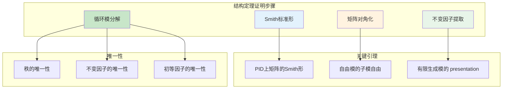
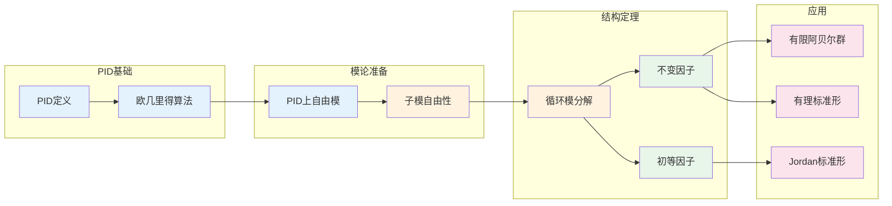

# 主理想整环上的模 - 思维导图

## 概述

主理想整环（PID）上的模论是线性代数最优美的推广之一。在PID上，有限生成模具有类似于有限维向量空间的结构定理——它们都可以分解为循环模的直和。这一定理统一了有限生成阿贝尔群的结构定理和线性代数中的Jordan标准形理论，是代数学中最深刻、最有用的结果之一。

---

## 核心思维导图

```mermaid
mindmap
  root((PID上的模<br/>Modules over PID))
    基本定理
      结构定理
        有限生成模
        循环模分解
        初等因子形式
      自由部分
        Rʳ 自由模
        秩r良定义
      挠部分
        挠子模M_{tor}
        准素分解
    循环模
      形式
        R 自由
        R/(pⁿ) 挠模
      结构
        零化子
        不变因子
    分类不变量
      不变因子
        d₁|d₂|...|dₙ
        M ≅ ⊕ R/(dᵢ)
      初等因子
        pⱼ^{eᵢⱼ}
        准素循环分解
    应用
      阿贝尔群
        ℤ-模 = 阿贝尔群
        有限生成阿贝尔群结构
      Jordan标准形
        k[x]-模
        线性算子结构
      有理标准形
        友矩阵
        多项式不变因子
```

---

## 结构定理体系

```mermaid
graph TD
    subgraph PID上的有限生成模
        M[M ≅ Rʳ ⊕ R/(d₁) ⊕ ... ⊕ R/(dₙ)]
    end
    
    subgraph 自由部分
        Free[Rʳ]
        Rank[秩 r = dim(M⊗K)]
        WellDef[秩良定义]
    end
    
    subgraph 挠部分
        Tor[M_{tor} ≅ ⊕ R/(dᵢ)]
        Invariant[d₁|d₂|...|dₙ 不变因子]
        Torsion[挠子模]
    end
    
    subgraph 初等因子形式
        Primary[⊕ R/(pⱼ^{eᵢⱼ})]
        Prime[pⱼ 素元]
        Unique[唯一性定理]
    end
    
    M --> Free
    M --> Tor
    
    Free --> Rank
    Rank --> WellDef
    
    Tor --> Invariant
    Invariant --> Primary
    Primary --> Prime
    Primary --> Unique
    
    style M fill:#e3f2fd
    style Free fill:#c8e6c9
    style Tor fill:#fff3e0
    style Primary fill:#e8f5e9
```

---

## 循环模结构

```mermaid
graph TD
    subgraph 循环R-模
        Cyclic[由单个元素生成]
        Iso[≅ R/Ann(m)]
    end
    
    subgraph 类型
        Free[R 自由循环]
        AnnZero[Ann(m) = 0]
        Torsion[R/(d) 挠循环]
        AnnNonZero[Ann(m) = (d)]
    end
    
    subgraph 挠循环分解
        Primary[准素循环]
        Rpn[R/(pⁿ)]
        Uniqueness[分解唯一]
    end
    
    subgraph PID性质应用
        Ideal[(d) 主理想]
        Factor[d = up₁^{e₁}...pₖ^{eₖ}]
        CRT[R/(d) ≅ ⊕ R/(pᵢ^{eᵢ})]
    end
    
    Cyclic --> Iso
    Iso --> Free
    Iso --> Torsion
    
    Torsion --> Primary
    Primary --> Rpn
    Rpn --> Uniqueness
    
    Torsion --> Ideal
    Ideal --> Factor
    Factor --> CRT
    
    style Cyclic fill:#e3f2fd
    style Free fill:#c8e6c9
    style Torsion fill:#fff3e0
    style Rpn fill:#e8f5e9
```

---

## 不变因子与初等因子

```mermaid
graph TD
    subgraph 两种形式
        Inv[不变因子形式]
        Elem[初等因子形式]
    end
    
    subgraph 不变因子
        InvForm[M ≅ Rʳ ⊕ ⊕ᵢ R/(dᵢ)]
        Div[d₁|d₂|...|dₖ]
        Rel[Ann(M) = (dₖ)]
    end
    
    subgraph 初等因子
        ElemForm[M ≅ Rʳ ⊕ ⊕ᵢⱼ R/(pⱼ^{eᵢⱼ})]
        Prime[pⱼ 不同素元]
        Primary[准素分量分解]
    end
    
    subgraph 转换
        Factor[dᵢ = ∏ pⱼ^{eᵢⱼ}]
        Uniqueness[两者唯一确定模]
    end
    
    subgraph 例子ℤ
        ZInv[ℤ-模: ℤʳ ⊕ ℤ/d₁ ⊕ ...]
        ZElem[ℤ-模: ℤʳ ⊕ ⊕ ℤ/pⱼ^{eᵢⱼ}]
    end
    
    Inv --> InvForm
    Elem --> ElemForm
    
    InvForm --> Div
    ElemForm --> Prime
    
    Div --> Factor
    Prime --> Factor
    Factor --> Uniqueness
    
    Inv --> ZInv
    Elem --> ZElem
    
    style Inv fill:#e3f2fd
    style Elem fill:#fff3e0
    style InvForm fill:#c8e6c9
    style ElemForm fill:#e8f5e9
```

---

## 有限生成阿贝尔群

```mermaid
graph TD
    subgraph ℤ-模 = 阿贝尔群
        Ab[有限生成阿贝尔群A]
    end
    
    subgraph 结构定理
        Structure[A ≅ ℤʳ ⊕ ℤ_{d₁} ⊕ ... ⊕ ℤ_{dₖ}]
        Free[自由部分 ℤʳ]
        Tor[挠部分 有限群]
    end
    
    subgraph 挠部分分解
        PrimaryTor[A_{tor} ≅ ⊕ ℤ_{pⱼ^{eᵢⱼ}}}]
        Sylow[对应Sylow子群]
        Unique[分解唯一性]
    end
    
    subgraph 分类
        Finite[有限阿贝尔群]
        r=0
        FreeAbel[自由阿贝尔群]
        Tor=0
        Mixed[混合]
    end
    
    subgraph 例子
        Ex1[ℤ/6 ≅ ℤ/2 ⊕ ℤ/3]
        Ex2[ℤ/4 ≇ ℤ/2 ⊕ ℤ/2]
        Ex3[ℤ² ⊕ ℤ/2]
    end
    
    Ab --> Structure
    Structure --> Free
    Structure --> Tor
    
    Tor --> PrimaryTor
    PrimaryTor --> Sylow
    PrimaryTor --> Unique
    
    Structure --> Finite
    Structure --> FreeAbel
    Structure --> Mixed
    
    Finite --> Ex1
    Finite --> Ex2
    Mixed --> Ex3
    
    style Ab fill:#e3f2fd
    style Structure fill:#c8e6c9
    style Free fill:#fff3e0
    style Tor fill:#e8f5e9
```

---

## Jordan标准形理论

```mermaid
mindmap
  root((Jordan标准形))
    k[x]-模视角
      向量空间V
        带线性算子T
      k[x]-模结构
        p(x)·v = p(T)(v)
    结构定理应用
      V ≅ ⊕ k[x]/(pᵢ^{eᵢ})
        循环子空间
      准素分解
        特征多项式因子
    Jordan块
      对应 k[x]/((x-λ)ⁿ)
        特征值λ
        阶数n
      矩阵形式
        λ 1
          λ 1
            ⋱
              λ
    有理标准形
      友矩阵
        对应 k[x]/(p(x))
      不变因子
        首一多项式
    计算
      特征多项式
      极小多项式
      几何重数
```

---

## 有理标准形 vs Jordan形

```mermaid
graph TD
    subgraph 有理标准形
        Rat[不依赖于特征值]
        Comp[友矩阵块]
        InvPoly[不变因子多项式]
    end
    
    subgraph Jordan标准形
        Jord[依赖于代数闭包]
        JordanBlock[Jordan块]
        ElemDiv[初等因子 (x-λ)ⁿ]
    end
    
    subgraph 关系
        AlgClosed[代数闭域上]
        Factor[不变因子分解]
        Linear[一次因子]
    end
    
    subgraph 例子
        Ex1[友矩阵 of x²+1]
        Ex2[Jordan块 J₂(3)]
    end
    
    Rat --> Comp
    Comp --> InvPoly
    
    Jord --> JordanBlock
    JordanBlock --> ElemDiv
    
    Rat --> AlgClosed
    Jord --> AlgClosed
    AlgClosed --> Factor
    Factor --> Linear
    
    Rat --> Ex1
    Jord --> Ex2
    
    style Rat fill:#e3f2fd
    style Jord fill:#fff3e0
    style AlgClosed fill:#c8e6c9
```

---

## 证明技术概要



---

## 重要定理总结

| 定理 | 陈述 | 应用 |
|------|------|------|
| **结构定理** | 有限生成R-模 ≅ Rʳ ⊕ ⊕ R/(dᵢ) | 模分类 |
| **不变因子唯一性** | d₁\|d₂\|...\|dₖ 唯一 | 同构判定 |
| **初等因子唯一性** | 准素分解唯一 | p-分量分析 |
| **自由子模** | PID上子模自由 | 结构简化 |
| **有限阿贝尔群** | ℤ-模结构定理 | 群论 |
| **Jordan形** | k[x]-模在代数闭域上 | 线性代数 |
| **有理标准形** | 一般域上的标准形 | 标准形理论 |

---

## 学习路径



---

## 与后续概念的联系

- **同调代数**: 投射模、内射模分解
- **交换代数**: 诺特环上的模
- **代数几何**: 凝聚层、局部自由层
- **K-理论**: Grothendieck群、类群
- **表示论**: 主理想群代数

---

*文档版本：1.0*
*创建时间：2026年4月*
*分类：代数学 / 模论 / 思维导图*
