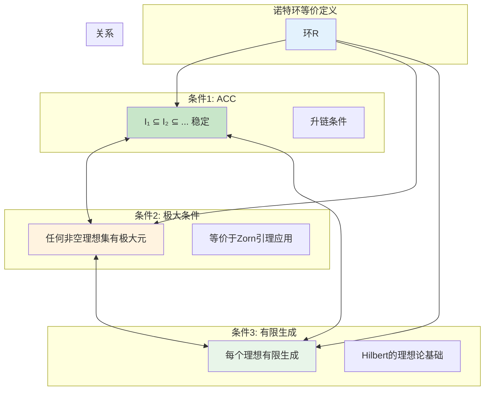
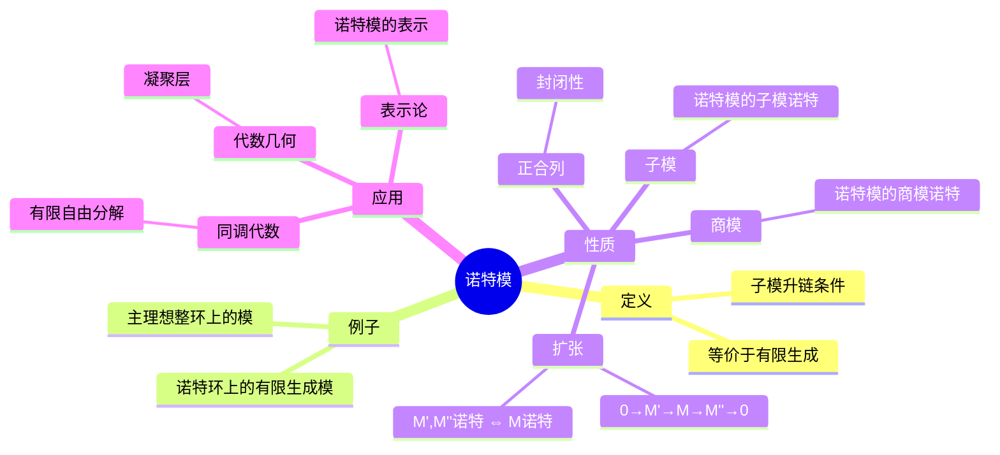
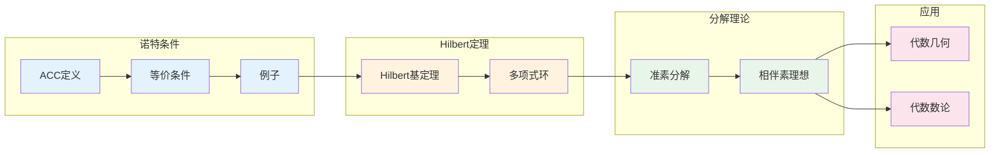

# 诺特环 - 思维导图

## 概述

诺特环是以Emmy Noether命名的环类，满足理想升链条件。这一条件看似技术性的要求，却具有深刻的代数与几何意义。诺特环是交换代数、代数几何和代数数论的基础，几乎所有在几何和数论中自然出现的环都是诺特环。Hilbert基定理保证了多项式环的诺特性，这使得诺特环在代数几何中具有普遍重要性。

---

## 核心思维导图

```mermaid
mindmap
  root((诺特环<br/>Noetherian Rings))
    等价定义
      升链条件ACC
        I₁⊆I₂⊆... 稳定
      极大条件
        非空理想集有极大元
      有限生成
        每个理想有限生成
    Hilbert基定理
      R诺特 ⇒ R[x]诺特
      推论
        k[x₁,...,xₙ]诺特
        仿射代数集有限基
    诺特模
      子模升链条件
        有限生成
      正合列
        封闭性
    准素分解
      理想分解
        I = ∩Qᵢ
        Qᵢ准素
      唯一性
        相伴素理想
        孤立分量
    应用
      代数几何
        仿射概形
        凝聚层
      代数数论
        整数环
        Dedekind整环
```

---

## 等价条件



---

## Hilbert基定理

```mermaid
graph TD
    subgraph 定理陈述
        HBT[Hilbert基定理]
    end
    
    subgraph 内容
        If[若R是诺特环]
        Then[则R[x]也是诺特环]
    end
    
    subgraph 证明思路
        Contradiction[反证法]
        LeadingCoeff[首项系数理想]
        ACCApply[ACC应用]
    end
    
    subgraph 重要推论
        Poly[k[x₁,...,xₙ]诺特]
        Quot[R诺特 ⇒ R[x₁,...,xₙ]/I诺特]
        AG[仿射代数集由有限个<br/>多项式方程定义]
    end
    
    subgraph 几何意义
        FiniteGen[每个代数集是<br/>有限个超曲面的交]
        Compact[拟紧性]
    end
    
    HBT --> If
    If --> Then
    Then --> Contradiction
    Contradiction --> LeadingCoeff
    LeadingCoeff --> ACCApply
    
    Then --> Poly
    Poly --> Quot
    Quot --> AG
    AG --> FiniteGen
    FiniteGen --> Compact
    
    style HBT fill:#e3f2fd
    style Then fill:#c8e6c9
    style Poly fill:#fff3e0
    style AG fill:#e8f5e9
```

---

## 诺特环的例子与反例

```mermaid
graph TD
    subgraph 诺特环例子
        Field[域]
        PID[PID]
        Poly[k[x₁,...,xₙ]]
        Z[ℤ]
        NoethQuot[诺特环的商]
        NoethLoc[诺特环的局部化]
    end
    
    subgraph 非诺特环
        PolyInf[k[x₁,x₂,...]]
        Holom[全纯函数环]
        C0[连续函数C[0,1]]
    end
    
    subgraph 域扩张
        AlgInt[代数整数环]
        Noeth[诺特]
        Dedekind[Dedekind整环]
    end
    
    subgraph 诺特条件的重要性
        FinGen[有限生成]
        PrimaryDecomp[准素分解]
        Spec[Spec(R)的良好性质]
    end
    
    Field --> PID
    PID --> Z
    PID --> Poly
    Z --> NoethQuot
    Poly --> NoethQuot
    
    PolyInf --> NonNoeth[非诺特]
    Holom --> NonNoeth
    C0 --> NonNoeth
    
    AlgInt --> Noeth
    Noeth --> Dedekind
    
    NoethQuot --> FinGen
    NoethQuot --> PrimaryDecomp
    NoethQuot --> Spec
    
    style Field fill:#c8e6c9
    style Poly fill:#c8e6c9
    style PolyInf fill:#ffcdd2
    style Noeth fill:#e3f2fd
    style Dedekind fill:#fff3e0
```

---

## 准素分解

```mermaid
graph TD
    subgraph 准素理想
        Q[准素理想Q]
        Def[ab∈Q, a∉Q ⇒ bⁿ∈Q]
        Equiv[√Q是素理想]
    end
    
    subgraph 准素分解定理
        Decomp[I = Q₁ ∩ ... ∩ Qₙ]
        QPrimary[Qᵢ准素]
        Minimal[无冗余]
    end
    
    subgraph 唯一性
        Associated[相伴素理想<br/>Pᵢ = √Qᵢ]
        Isolated[孤立分量唯一]
        Embedded[嵌入分量不唯一]
    end
    
    subgraph 几何解释
        Variety[V(I) = ∪V(Qᵢ)]
        Irreduc[V(Qᵢ)不可约]
        DecompGeom[代数集分解为<br/>不可约分支]
    end
    
    Q --> Def
    Def --> Equiv
    
    Equiv --> Decomp
    Decomp --> QPrimary
    Decomp --> Minimal
    
    Minimal --> Associated
    Associated --> Isolated
    Associated --> Embedded
    
    Decomp --> Variety
    Variety --> Irreduc
    Irreduc --> DecompGeom
    
    style Q fill:#e3f2fd
    style Decomp fill:#c8e6c9
    style Associated fill:#fff3e0
    style Variety fill:#e8f5e9
```

---

## 诺特模



---

## Artin环

```mermaid
graph TD
    subgraph Artin环
        Artin[Artin环]
        DCC[理想降链条件]
        FiniteLength[有限长度]
    end
    
    subgraph Artin vs Noether
        ArtinNoeth[Artin环 ⇔ Noether环 + 零维]
        DimZero[Krull维数为0]
        SemiLocal[半局部环]
    end
    
    subgraph 结构定理
        ArtinWedderburn[Artin-Wedderburn]
        R[Artin环 ≅ ⊕ Mₙᵢ(Dᵢ)]
        D[除环]
    end
    
    subgraph 例子
        FiniteRing[有限环]
        AlgFinite[域上有限维代数]
        LocalArtin[局部Artin环]
    end
    
    Artin --> DCC
    DCC --> FiniteLength
    
    Artin --> ArtinNoeth
    ArtinNoeth --> DimZero
    DimZero --> SemiLocal
    
    Artin --> ArtinWedderburn
    ArtinWedderburn --> R
    R --> D
    
    FiniteRing --> Artin
    AlgFinite --> Artin
    LocalArtin --> Artin
    
    style Artin fill:#e3f2fd
    style DCC fill:#c8e6c9
    style ArtinNoeth fill:#fff3e0
    style ArtinWedderburn fill:#e8f5e9
```

---

## 诺特环在代数几何中的应用

```mermaid
graph TD
    subgraph 仿射代数集
        X[X = V(I) ⊆ 𝔸ⁿ]
        Ideal[I(X) = 零点理想]
    end
    
    subgraph Hilbert基定理应用
        FiniteBasis[I由有限个多项式生成]
        XFinite[X由有限个方程定义]
    end
    
    subgraph 不可约分支
        Decomp[X = X₁ ∪ ... ∪ Xₙ]
        Irred[Xᵢ不可约]
        PrimaryDecomp[对应准素分解]
    end
    
    subgraph 凝聚层
        Coherent[凝聚层]
        FinPres[局部有限表现]
        NoethMod[诺特模对应]
    end
    
    subgraph 概形理论
        NoethScheme[诺特概形]
        QuasiCompact[拟紧性]
        LocNoeth[局部诺特性]
    end
    
    X --> Ideal
    Ideal --> FiniteBasis
    FiniteBasis --> XFinite
    
    X --> Decomp
    Decomp --> Irred
    Decomp --> PrimaryDecomp
    
    X --> Coherent
    Coherent --> FinPres
    Coherent --> NoethMod
    
    X --> NoethScheme
    NoethScheme --> QuasiCompact
    NoethScheme --> LocNoeth
    
    style X fill:#e3f2fd
    style FiniteBasis fill:#c8e6c9
    style Decomp fill:#fff3e0
    style Coherent fill:#e8f5e9
```

---

## 重要定理总结

| 定理 | 陈述 | 应用 |
|------|------|------|
| **Hilbert基定理** | R诺特 ⇒ R[x]诺特 | 多项式环、代数几何 |
| **准素分解** | 诺特环中每个理想是有限个准素理想的交 | 代数集分解 |
| **Lasker-Noether** | 诺特环中的准素分解 | 代数几何基础 |
| **Artin-Wedderburn** | Artin半单环 ≅ ⊕Mₙᵢ(Dᵢ) | 表示论 |
| **Krull交定理** | ∩Iⁿ = 0 (真理想) | 完备化理论 |
| **上升定理** | 素理想链的扩张 | 积分扩张 |

---

## 学习路径



---

## 与后续概念的联系

- **维数理论**: Krull维数、高度
- **完备化**: I-进完备化
- **分次环**: 齐次理想、Hilbert函数
- **同调代数**: 正则局部环、同调维数
- **代数几何**: 概形、凝聚层上同调
- **D-模**: 微分算子环、诺特性

---

*文档版本：1.0*
*创建时间：2026年4月*
*分类：代数学 / 环论 / 思维导图*
