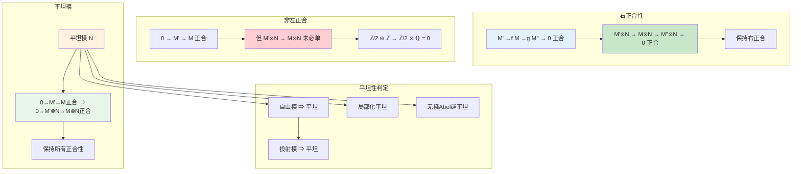
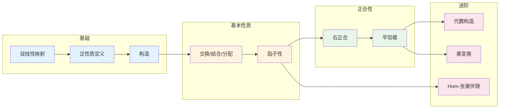

# 张量积 - 思维导图

## 概述

张量积是代数学中最重要、最深刻的构造之一。它统一了多线性代数、表示论、同调代数等众多领域的核心概念。张量积将两个模"粘合"在一起，构造出一个新的模，它捕捉了两个模之间最普遍的多线性关系。从向量空间的张量积到模的张量积，再到范畴论中的张量范畴，这一概念贯穿现代数学的多个分支。

---

## 核心思维导图

```mermaid
mindmap
  root((张量积<br/>Tensor Product))
    定义
      泛性质
        双线性映射
        普遍对象
      构造
        自由模商关系
        生成元 x⊗y
        关系
    基本性质
      交换律
        M⊗N ≅ N⊗M
      结合律
        (M⊗N)⊗P ≅ M⊗(N⊗P)
      分配律
        (⊕Mᵢ)⊗N ≅ ⊕(Mᵢ⊗N)
      单位元
        R⊗M ≅ M
    正合性
      右正合
        M'→M→M''→0
        M'⊗N→M⊗N→M''⊗N→0
      非左正合
        平坦模
    特殊模
      平坦模
        保持正合性
      忠实平坦
        反射正合性
    应用
      基变换
        标量扩张
      代数
        张量代数
        外代数
        对称代数

```

---

## 张量积定义

```mermaid
graph TD
    subgraph 泛性质
        Bilin[双线性映射<br/>B: M×N → P]
        Tensor[M⊗N 与 φ: M×N → M⊗N]
        Universal[任意双线性B]<-->Unique[唯一线性f: M⊗N → P]<-->Factor[f∘φ = B]
    end
    
    subgraph 构造
        Free[自由模 F(M×N)]
        Rel[关系子模]
        Bilinearity[(m+m')⊗n = m⊗n + m'⊗n]
        Scalar[(rm)⊗n = r(m⊗n)]
        Quotient[M⊗N = F/Rel]
    end
    
    subgraph 元素
        Gen[生成元 m⊗n]
        Sum[有限和 Σmᵢ⊗nᵢ]
        Simple[简单张量 m⊗n]
    end
    
    Bilin --> Tensor
    Tensor --> Universal
    
    Free --> Rel
    Rel --> Bilinearity
    Rel --> Scalar
    Rel --> Quotient
    
    Quotient --> Gen
    Gen --> Sum
    Gen --> Simple
    
    style Tensor fill:#e3f2fd
    style Quotient fill:#c8e6c9
    style Gen fill:#fff3e0

```

---

## 张量积性质

```mermaid
graph TD
    subgraph 基本同构
        Comm[M⊗N ≅ N⊗M]
        Assoc[(M⊗N)⊗P ≅ M⊗(N⊗P)]
        Dist[(⊕Mᵢ)⊗N ≅ ⊕(Mᵢ⊗N)]
        Unit[R⊗M ≅ M]
        Zero[0⊗M = 0]
    end
    
    subgraph 函子性
        Functor[-⊗N: R-Mod → R-Mod]
        Additive[加性函子]
        RightExact[右正合]
    end
    
    subgraph 同态
        HomTensor[Hom(M⊗N, P) ≅ Bilin(M,N;P)]
        Adjunction[Hom(M⊗N, P) ≅ Hom(M, Hom(N,P))]
    end
    
    subgraph 向量空间情形
        Dim[dim(V⊗W) = dim(V)·dim(W)]
        Basis[{eᵢ⊗fⱼ} 基]
        Dual[(V⊗W)* ≅ V*⊗W*]
    end
    
    Comm --> Functor
    Assoc --> Functor
    Dist --> Additive
    
    Functor --> HomTensor
    HomTensor --> Adjunction
    
    Comm --> Dim
    Dim --> Basis
    Basis --> Dual
    
    style Comm fill:#e3f2fd
    style Functor fill:#fff3e0
    style HomTensor fill:#c8e6c9
    style Dim fill:#e8f5e9

```

---

## 正合性与平坦性



---

## 代数结构

```mermaid
mindmap
  root((张量代数构造))
    张量代数
      T(M) = ⊕ M^{⊗n}
        分次代数
        泛性质
      应用
        通用包络代数
        微分几何
    外代数
      Λ(M) = T(M)/⟨m⊗m⟩
        交错多线性
        行列式
      应用
        微分形式
        上同调
    对称代数
      Sym(M) = T(M)/⟨m⊗n-n⊗m⟩
        对称多线性
        多项式环推广
      应用
        代数几何
        不变量理论
    克利福德代数
      Cl(V,Q)
        v² = Q(v)·1
        旋量理论
      应用
        自旋几何
        量子场论

```

---

## 基变换与标量扩张

```mermaid
graph TD
    subgraph 基变换
        RingHom[φ: R → S]
        Ext[标量扩张 S⊗ᵣM]
        Restr[限制标量 M作为R-模]
    end
    
    subgraph 域扩张
        KLF[K ⊆ L]
        ExtField[L⊗ₖV]
        DimPreserve[dimₗ(L⊗ₖV) = dimₖ(V)]
    end
    
    subgraph 例子
        CtoR[ℂ ⊗ℝ V]
        Complexify[复化]
        Vc[V ⊕ iV]
    end
    
    subgraph 应用
        FieldExt[域扩张下降]
        GaloisDescent[伽罗瓦下降]
        CentralSimple[中心单代数]
    end
    
    RingHom --> Ext
    RingHom --> Restr
    
    KLF --> ExtField
    ExtField --> DimPreserve
    
    ExtField --> Complexify
    Complexify --> Vc
    
    Ext --> FieldExt
    ExtField --> GaloisDescent
    ExtField --> CentralSimple
    
    style RingHom fill:#e3f2fd
    style Ext fill:#c8e6c9
    style ExtField fill:#fff3e0
    style Complexify fill:#e8f5e9

```

---

## Hom与张量伴随

```mermaid
graph TD
    subgraph 伴随对
        Tensor[-⊗N]
        Hom[Hom(N,-)]
        Adjunction[⊗ ⊣ Hom]
    end
    
    subgraph 同构
        AdjIso[Hom(M⊗N, P) ≅ Hom(M, Hom(N,P))]
        Currying[多线性映射 ↔ 线性映射]
    end
    
    subgraph 导出函子
        Left[Tor = L(-⊗N)]
        Right[Ext = R(Hom(N,-))]
        Balance[Tor平衡性]
    end
    
    subgraph 同调代数
        Resol[投射分解]
        Derived[导出函子]
        LongExact[长正合列]
    end
    
    Tensor --> Hom
    Hom --> Adjunction
    
    Adjunction --> AdjIso
    AdjIso --> Currying
    
    Tensor --> Left
    Hom --> Right
    Left --> Balance
    
    Left --> Resol
    Right --> Resol
    Resol --> Derived
    Derived --> LongExact
    
    style Tensor fill:#e3f2fd
    style Hom fill:#fff3e0
    style AdjIso fill:#c8e6c9
    style Left fill:#e8f5e9
    style Right fill:#e8f5e9

```

---

## 张量积计算例子

```mermaid
graph LR
    subgraph Abel群
        ZnZ[ℤ/m ⊗ ℤ/n ≅ ℤ/gcd(m,n)]
        ZQ[ℤ ⊗ ℚ ≅ ℚ]
        QQ[ℚ ⊗ ℚ ≅ ℚ]
        ZnQ[ℤ/n ⊗ ℚ = 0]
    end
    
    subgraph 向量空间
        RmRn[ℝᵐ ⊗ ℝⁿ ≅ ℝᵐⁿ]
        Basis[{eᵢ⊗fⱼ}]
    end
    
    subgraph 模
        Kx[k[x] ⊗ₖ k[y] ≅ k[x,y]]
        Quotient[k[x]/(f) ⊗ₖ k[y]/(g) ≅ k[x,y]/(f,g)]
    end
    
    subgraph 代数
        Mat[Mₙ ⊗ Mₘ ≅ Mₙₘ]
        Quat[ℂ ⊗ℝ ℍ ≅ M₂(ℂ)]
    end
    
    style ZnZ fill:#e3f2fd
    style ZQ fill:#c8e6c9
    style ZnQ fill:#ffcdd2
    style RmRn fill:#fff3e0
    style Kx fill:#e8f5e9
    style Quat fill:#e8f5e9

```

---

## 重要定理总结

| 定理 | 陈述 | 应用 |
|------|------|------|
| **泛性质** | 张量积表示双线性映射 | 定义与构造 |
| **右正合性** | $-\otimes N$ 右正合 | 同调代数基础 |
| **伴随性** | $-\otimes N \dashv \text{Hom}(N,-)$ | 范畴论 |
| **平坦判定** | 保持正合性 ⇔ 平坦 | 同调计算 |
| **基变换** | $S \otimes_R -$ 是标量扩张 | 域论、代数几何 |
| **Tor函子** | $L(-\otimes N)$ | 同调代数 |

---

## 学习路径



---

## 与后续概念的联系

- **同调代数**: Tor函子、导出张量积
- **代数几何**: 层的张量积、凝聚层
- **微分几何**: 张量丛、微分形式
- **表示论**: 表示的张量积、Clebsch-Gordan
- **K-理论**: 投射模的张量积、Grothendieck环
- **量子群**: 辫子张量范畴

---

*文档版本：1.0*
*创建时间：2026年4月*
*分类：代数学 / 模论 / 思维导图*
