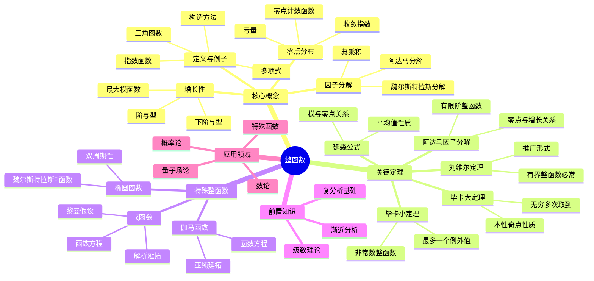

msc_primary: "00A99"
msc_secondary: ['00-XX']
---

# 整函数思维导图

## 概述
整函数是在整个复平面上解析的函数，具有特殊的增长性和零点分布理论。

## 核心要点

### 增长性度量
**阶**: ρ = limsup(r→∞) loglog M(r)/log r
**型**: σ = limsup(r→∞) log M(r)/r^ρ

### 魏尔斯特拉斯分解
**定理**: 给定零点序列 {aₙ}，存在整函数以这些为零点:
$$f(z) = z^m e^{g(z)} \prod_{n=1}^{\infty} E_{p_n}\left(\frac{z}{a_n}\right)$$

其中 E_p 为初等因子。

### 毕卡定理
**小定理**: 非常数整函数取到所有复数值，最多一个例外。

**大定理**: 在本性奇点任意邻域内，函数取所有复数值无穷多次，最多一个例外。

## 参考
- 《整函数》Boas
- 《复分析》Titchmarsh
