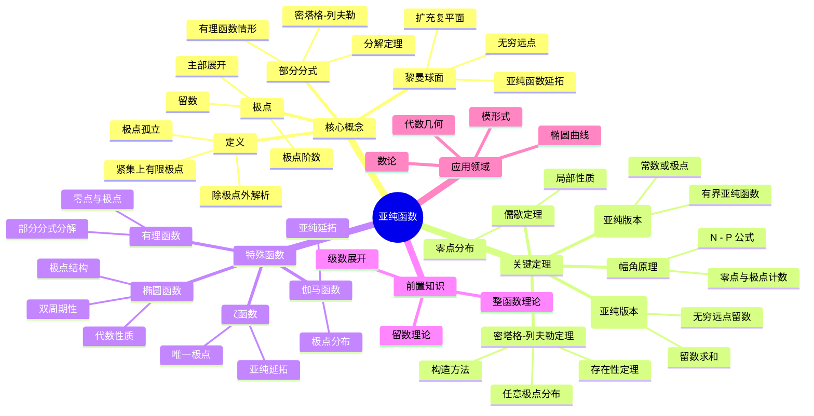

msc_primary: "00A99"
msc_secondary: ['00-00']
---

# 亚纯函数思维导图

## 概述
亚纯函数是复平面上除极点外解析的函数，是整函数的自然推广。

## 核心要点

### 亚纯函数定义
f 在区域 D 中亚纯 ⇔ f 在 D\{极点} 全纯，且极点是孤立的。

### 密塔格-列夫勒定理
**定理**: 给定极点位置 {bₙ} 和主部 {Pₙ(1/(z-bₙ))}，存在亚纯函数以这些为极点及主部。

### 椭圆函数
**定义**: 双周期亚纯函数

**基本性质**:
- 周期格 Λ = {mω₁ + nω₂}
- 周期平行四边形内有限极点
- 留数和为零
- 零点与极点个数相等

### 部分分式分解
**有理函数**: R(z) = P(z) + Σ Pⱼ(1/(z-bⱼ))

**亚纯函数**: 类似但可能含收敛因子

## 参考
- 《亚纯函数》Nevanlinna
- 《椭圆函数》Chandrasekharan
