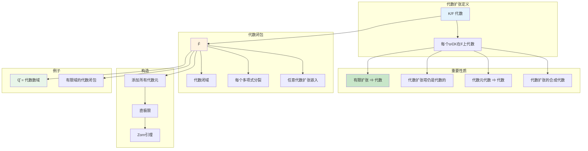
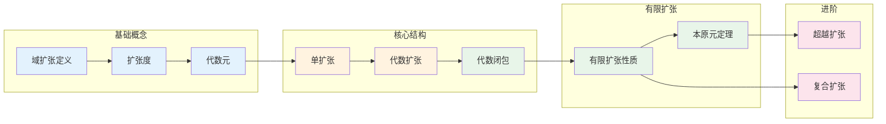

# 域扩张 - 思维导图

## 概述

域扩张是域论的核心概念，它研究一个域如何包含在更大的域中。域扩张理论不仅是代数数论和代数几何的基础，也是古典问题（如尺规作图、方程根式可解性）的数学框架。从简单的二次扩张到复杂的无限扩张，域扩张揭示了数的深层代数和几何结构。

---

## 核心思维导图

```mermaid
mindmap
  root((域扩张<br/>Field Extension))
    基本定义
      域塔
        F ⊆ K
        记作 K/F
      扩张度
        [K:F] = dim_F K
        有限/无限扩张
      中间域
        F ⊆ L ⊆ K
    生成扩张
      单扩张
        F(α)
        添加一个元素
      有限生成
        F(α₁,...,αₙ)
      代数生成
        添加代数元
    代数元与超越元
      代数元
        满足多项式方程
        [F(α):F] < ∞
      超越元
        不满足任何多项式
        [F(α):F] = ∞
      超越基
        代数无关极大集
    代数扩张
      每个元代数
        K/F 代数
      代数闭包
        代数闭域
        嵌入性质
    合成扩张
      域的合成
        K₁K₂
      线性不交
        张量积结构

```

---

## 域扩张层次

```mermaid
graph TD
    subgraph 域塔
        F[F] --> K[K]
        F --> L[中间域 L]
        L --> K
    end
    
    subgraph 扩张类型
        Finite[有限扩张<br/>[K:F] < ∞]
        Infinite[无限扩张<br/>[K:F] = ∞]
        Alg[代数扩张<br/>每个元代数]
        Trans[超越扩张<br/>存在超越元]
    end
    
    subgraph 包含关系
        Finite --> Alg
        Alg -.-> Infinite
    end
    
    subgraph 特殊扩张
        Simple[单扩张<br/>K = F(α)]
        Radical[根式扩张<br/>添加n次根]
        Cyclotomic[分圆扩张<br/>添加单位根]
    end
    
    subgraph 度计算
        TowerLaw[[K:F] = [K:L][L:F]]
        Mult[乘法公式]
    end
    
    F --> Finite
    F --> Infinite
    F --> Alg
    F --> Trans
    
    Finite --> Simple
    Simple --> Radical
    
    F --> TowerLaw
    L --> TowerLaw
    K --> TowerLaw
    
    style F fill:#e3f2fd
    style Finite fill:#c8e6c9
    style Alg fill:#fff3e0
    style Simple fill:#e8f5e9
    style TowerLaw fill:#fce4ec

```

---

## 代数元与极小多项式

```mermaid
graph TD
    subgraph 代数元
        Alpha[α ∈ K]
        Algebraic[代数元]
        ExistsPoly[∃0≠f∈F[x]: f(α)=0]
    end
    
    subgraph 极小多项式
        MinPoly[m_α,F(x)]
        Monic[首一]
        MinDegree[最小次数]
        Irreducible[不可约]
        Unique[唯一]
    end
    
    subgraph 单代数扩张
        FAlpha[F(α) ≅ F[x]/(m_α)]
        Basis[{1,α,...,αⁿ⁻¹} 基]
        Degree[[F(α):F] = deg(m_α)]
    end
    
    subgraph 超越元
        Trans[超越元]
        NoPoly[无多项式以之为根]
        Rational[F(α) ≅ F(x)]
        InfiniteDeg[[F(α):F] = ∞]
    end
    
    Alpha --> Algebraic
    Alpha --> Trans
    
    Algebraic --> ExistsPoly
    ExistsPoly --> MinPoly
    
    MinPoly --> Monic
    MinPoly --> Irreducible
    MinPoly --> Degree
    
    Algebraic --> FAlpha
    FAlpha --> Basis
    
    Trans --> NoPoly
    NoPoly --> Rational
    NoPoly --> InfiniteDeg
    
    style Algebraic fill:#e3f2fd
    style MinPoly fill:#c8e6c9
    style FAlpha fill:#fff3e0
    style Trans fill:#ffcdd2

```

---

## 代数扩张的性质



---

## 有限扩张结构

```mermaid
mindmap
  root((有限扩张))
    基本性质
      [K:F] < ∞
      K/F 代数
      有限生成
    本原元定理
      条件
        有限可分扩张
        F无限
      结论
        K = F(α)
        单生成
    扩张塔
      F ⊆ F₁ ⊆ ... ⊆ K
      度相乘
        [K:F] = ∏[Fᵢ₊₁:Fᵢ]
    例子
      ℚ(√2,√3) = ℚ(√2+√3)
        本原元
      分圆扩张
        ℚ(ζₙ)
        φ(n)次

```

---

## 超越扩张

```mermaid
graph TD
    subgraph 超越基
        TransBasis[S = {α₁,...,αₙ}]
        AlgIndep[代数无关]
        Maximal[极大性]
        BasisProp[超越基]
    end
    
    subgraph 超越度
        TransDegree[tr.deg(K/F)]
        WellDef[良定义]
        Card[超越基基数]
    end
    
    subgraph 纯超越扩张
        Pure[纯超越]
        Form[F(S) ≅ F(x₁,...,xₙ)]
        NoAlg[无代数元]
    end
    
    subgraph Luroth定理
        Luroth[中间域]
        Intermediate[F ⊊ L ⊊ F(x)]
        Conclusion[L = F(φ) 纯超越]
    end
    
    subgraph 例子
        Rational[F(x₁,...,xₙ)]
        FunctionField[代数簇函数域]
    end
    
    TransBasis --> AlgIndep
    AlgIndep --> Maximal
    Maximal --> BasisProp
    
    BasisProp --> TransDegree
    TransDegree --> WellDef
    TransDegree --> Card
    
    BasisProp --> Pure
    Pure --> Form
    
    Form --> Luroth
    Luroth --> Intermediate
    Intermediate --> Conclusion
    
    Form --> Rational
    Form --> FunctionField
    
    style TransBasis fill:#e3f2fd
    style TransDegree fill:#c8e6c9
    style Pure fill:#fff3e0
    style Luroth fill:#e8f5e9

```

---

## 复合扩张

```mermaid
graph TD
    subgraph 域的合成
        K1[K₁]
        K2[K₂]
        Composite[K₁K₂]
        Smallest[包含K₁和K₂的最小域]
    end
    
    subgraph 度关系
        Inequality[[K₁K₂:F] ≤ [K₁:F][K₂:F]]
        Equality[等号 ⇔ 线性不交]
    end
    
    subgraph 线性不交
        LinearDisjoint[K₁,K₂ 线性不交]
        Tensor[K₁⊗F K₂ 是域]
        Basis[基的张量积是基]
    end
    
    subgraph 应用
        GaloisComp[Galois扩张的合成]
        Splitting[分裂域]
        Algebraic[代数闭包性质]
    end
    
    K1 --> Composite
    K2 --> Composite
    K1 --> Smallest
    K2 --> Smallest
    
    Composite --> Inequality
    Inequality --> Equality
    
    Equality --> LinearDisjoint
    LinearDisjoint --> Tensor
    LinearDisjoint --> Basis
    
    Composite --> GaloisComp
    GaloisComp --> Splitting
    GaloisComp --> Algebraic
    
    style K1 fill:#e3f2fd
    style K2 fill:#e3f2fd
    style Composite fill:#c8e6c9
    style LinearDisjoint fill:#fff3e0

```

---

## 重要定理总结

| 定理 | 陈述 | 应用 |
|------|------|------|
| **塔定律** | $[K:F] = [K:L][L:F]$ | 度计算 |
| **本原元定理** | 有限可分扩张是单的 | 简化结构 |
| **代数闭包存在** | 每个域有代数闭包 | 代数数论 |
| **超越基存在** | 每个扩张有超越基 | 超越扩张 |
| **Luroth定理** | 纯超越扩张的中间域纯超越 | 函数域 |
| **代数元代数** | 代数扩张的代数元仍代数 | 扩张塔 |

---

## 学习路径



---

## 与后续概念的联系

- **Galois理论**: 域扩张的自同构群
- **代数数论**: 数域、整数环
- **代数几何**: 函数域、代数簇
- **编码理论**: 有限域的应用
- **表示论**: 分裂域、Brauer群

---

*文档版本：1.0*
*创建时间：2026年4月*
*分类：代数学 / 域论 / 思维导图*
