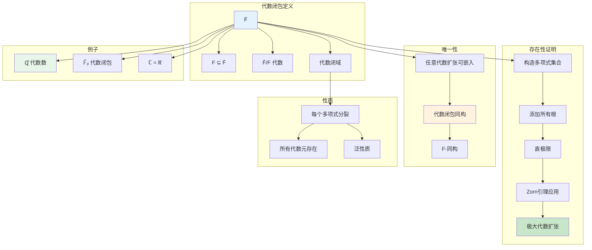
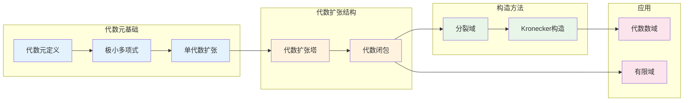

# 代数扩张 - 思维导图

## 概述

代数扩张是域论中最重要的扩张类型，其中每个元素都满足某个多项式方程。代数扩张构成了从有理数域ℚ到代数数域ℚ̄的桥梁，也是理解多项式方程解结构的核心。代数闭包的存在性和唯一性是代数学的基本定理之一，它为研究多项式方程的解提供了普适的框架。

---

## 核心思维导图

```mermaid
mindmap
  root((代数扩张<br/>Algebraic Extensions))
    基本定义
      代数元
        f(α)=0
        f∈F[x]非零
      极小多项式
        首一不可约
        唯一
      代数扩张
        每个元代数
        [K:F]可能无限
    结构定理
      有限扩张 ⇒ 代数
      代数扩张塔代数
      代数元代数
      合成代数
    代数闭包
      存在性
        直极限构造
        Zorn引理
      唯一性
        同构定理
        嵌入性质
      性质
        代数闭域
        每个多项式分裂
    构造方法
      添加根
        F[x]/(f)
        Kronecker构造
      分裂域
        所有根添加
        正规扩张
      代数闭包
        添加所有代数元
        直极限
    例子
      代数数域
        ℚ̄
        可数无限维
      有限域
        𝔽ₚ的闭包
        无限扩张

```

---

## 代数元判定与性质

```mermaid
graph TD
    subgraph 代数元判定
        Alpha[α ∈ K]
        Equivalent[以下条件等价]
        Cond1[α 代数]
        Cond2[[F(α):F] < ∞]
        Cond3[F(α)/F 有限]
        Cond4[F[α] = F(α)]
    end
    
    subgraph 极小多项式性质
        MinPoly[m_α(x)]
        Monic[首一]
        Irreducible[在F上不可约]
        Unique[唯一]
        Divisible[任何以α为根的多项式<br/>被m_α整除]
    end
    
    subgraph 单代数扩张结构
        Structure[F(α) ≅ F[x]/(m_α)]
        Basis[{1,α,...,αⁿ⁻¹} 基]
        Degree[[F(α):F] = deg(m_α)]
    end
    
    subgraph 代数运算封闭性
        Sum[α+β 代数]
        Product[αβ 代数]
        Inverse[α≠0 ⇒ α⁻¹ 代数]
    end
    
    Alpha --> Equivalent
    Equivalent --> Cond1
    Equivalent --> Cond2
    Equivalent --> Cond3
    Equivalent --> Cond4
    
    Cond1 --> MinPoly
    MinPoly --> Monic
    MinPoly --> Irreducible
    MinPoly --> Unique
    MinPoly --> Divisible
    
    Cond1 --> Structure
    Structure --> Basis
    MinPoly --> Degree
    
    Cond1 --> Sum
    Cond1 --> Product
    Cond1 --> Inverse
    
    style Alpha fill:#e3f2fd
    style Equivalent fill:#c8e6c9
    style MinPoly fill:#fff3e0
    style Structure fill:#e8f5e9

```

---

## 代数扩张塔

```mermaid
graph TD
    subgraph 塔性质
        F[F] --> K[K]
        K --> L[L]
    end
    
    subgraph 关键定理
        Theorem1[有限扩张 ⇒ 代数]
        Theorem2[代数扩张塔仍是代数的]
        Theorem3[K/F, L/K 代数 ⇒ L/F 代数]
        Theorem4[代数元集合是子域]
    end
    
    subgraph 证明思路
        Proof2[α∈L ⇒ α在K上代数]
        Step1[m_α,K 系数在F上代数]
        Step2[F(α)⊆有限扩张]
        Conclusion[α在F上代数]
    end
    
    subgraph 应用
        AlgClosure[代数闭包定义]
        Composite[代数扩张的合成]
    end
    
    F --> Theorem1
    K --> Theorem2
    L --> Theorem2
    
    Theorem2 --> Proof2
    Proof2 --> Step1
    Step1 --> Step2
    Step2 --> Conclusion
    
    Theorem2 --> AlgClosure
    Theorem2 --> Composite
    
    style F fill:#e3f2fd
    style K fill:#fff3e0
    style L fill:#e8f5e9
    style Theorem2 fill:#c8e6c9
    style AlgClosure fill:#fce4ec

```

---

## 代数闭包构造



---

## 分裂域

```mermaid
mindmap
  root((分裂域<br/>Splitting Field))
    定义
      多项式f∈F[x]
      K包含f的所有根
      K = F(所有根)
      最小性
    存在性
      Kronecker构造
        F[x]/(f) 添加一个根
        归纳构造
      次数上界
        [K:F] ≤ (deg f)!
    唯一性
      同构定理
        任意两个分裂域F-同构
      根的置换
        同构由根映射决定
    例子
      x²+1 ∈ ℝ[x]
        分裂域 = ℂ
      x³-2 ∈ ℚ[x]
        分裂域 = ℚ(∛2, ζ₃)
        度 = 6
    与正规扩张关系
      分裂域 ⇔ 有限正规扩张
      Galois对应

```

---

## 代数数域

```mermaid
graph TD
    subgraph 代数数
        Qbar[ℚ̄ = {α∈ℂ: α代数}]
        Countable[可数无限集]
        InfiniteDeg[[ℚ̄:ℚ] = ∞]
    end
    
    subgraph 数域
        NumberField[数域 K]
        Def[ℚ的有限扩张]
        Degree[[K:ℚ] < ∞]
    end
    
    subgraph 整数环
        OK[𝒪_K]
        Integers[代数整数]
        Monic[极小多项式整系数]
        Dedekind[Dedekind整环]
    end
    
    subgraph 嵌入
        Embeddings[K ↪ ℚ̄]
        r1[r₁ 实嵌入]
        r2[2r₂ 复嵌入]
        Total[r₁ + 2r₂ = [K:ℚ]]
    end
    
    subgraph 单位群
        Units[𝒪_K*]
        Dirichlet[Dirichlet单位定理]
        Rank[秩 = r₁ + r₂ - 1]
    end
    
    Qbar --> NumberField
    NumberField --> Def
    Def --> Degree
    
    NumberField --> OK
    OK --> Integers
    OK --> Monic
    OK --> Dedekind
    
    NumberField --> Embeddings
    Embeddings --> r1
    Embeddings --> r2
    r1 --> Total
    r2 --> Total
    
    OK --> Units
    Units --> Dirichlet
    Dirichlet --> Rank
    
    style Qbar fill:#e3f2fd
    style NumberField fill:#c8e6c9
    style OK fill:#fff3e0
    style Dirichlet fill:#e8f5e9

```

---

## 重要定理总结

| 定理 | 陈述 | 应用 |
|------|------|------|
| **代数扩张塔** | 代数扩张的代数扩张仍代数 | 代数闭包构造 |
| **代数闭包存在** | 每个域有代数闭包 | 代数几何基础 |
| **代数闭包唯一** | 代数闭包在同构意义下唯一 | 标准构造 |
| **分裂域存在** | 每个多项式有分裂域 | Galois理论 |
| **Kronecker构造** | F[x]/(f) 添加根 | 具体扩张 |
| **本原元定理** | 有限可分扩张是单的 | 简化结构 |

---

## 学习路径



---

## 与后续概念的联系

- **Galois理论**: 代数扩张的自同构
- **代数数论**: 数域、类域论
- **代数几何**: 代数函数域
- **编码理论**: 有限域上的代数几何码
- **可计算性**: 代数数的可计算性理论

---

*文档版本：1.0*
*创建时间：2026年4月*
*分类：代数学 / 域论 / 思维导图*
